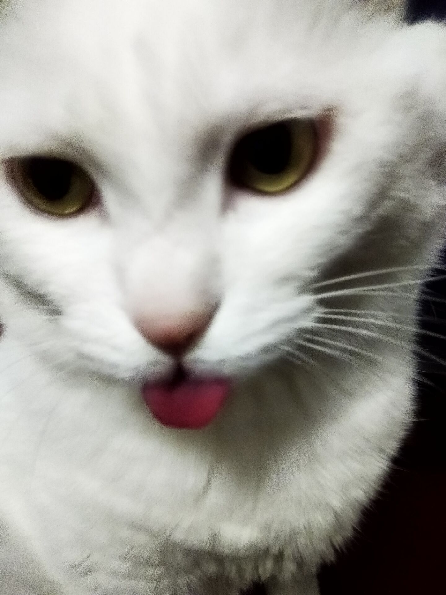

看到博友[椒盐豆豉](https://blog.douchi.space/things-im-not-doing-anymore/#gsc.tab=0)和[Allison](https://thewanderingallison.vercel.app/posts/things-i-dont-want-to-do/?utm_source=blog.douchi.space)写的文，也来凑热闹写一点。

· 不再因“便宜”“打折”而买  
· 不买奢侈品，大牌护肤品。simply no interest  
· 不再想要学会化妆。女人为什么非要会化妆？   男人会吗？   
· 不再以世间的“美德”要求自己，诸如坚持、谦虚、认真。三分钟热情就有三分钟的收获  
· 不再试图“融入”某一社群、团体、国家、文化  
· 不再无视和压抑自己的感受、优先遵守“规则“。speak my mind  
· 不求在公司和工作中交到朋友  
· 也不在工作场合分享个人经历，包括爱好，周末干嘛了  
· 不再试图搞明白别人的想法、心情，不再讨好他人，也不在乎别人怎么看自己。  接受不了我？那就接受不了呗  
· 不对任何国家、地区抱有美好的想法  
· 不再觉得必须回答每个被问到的问题  
· 不再渴望爱情  
· 不再给自己设限觉得很多事做不到  
· 不再有求自己拼尽全力，做到完美。60分足够  
· 不会在起步阶段要求自己达到大师水平。进步一毫米就普天同庆  
· 不看日剧、日本电影和动画。  日剧跟现实都是反的。剧里有多理想美好，现实就有多糟糕  
· 不再刻意限制自己不说脏话，想说就说  
· 不再买优衣库heattech。  又不暖，还容易异味，季抛。纯快消垃圾。美利奴不香吗。  

