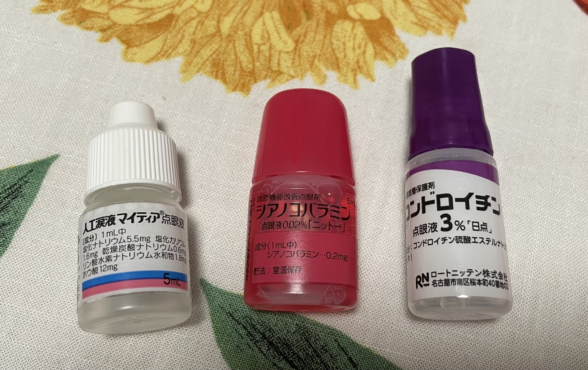

前两天有象友提到干眼症。想想我22年开始干眼症，到现在也有4年，这里分享一下自己的经验，和在日本药妆店可以买到的**无限接近处方药的平价眼药水**。希望可以科普一些相关知识，打破信息差，降低试错成本。

## 干眼症  
干眼症（dry eyes/ドライアイ）这名字一看就懂，具体说是：眼睛的泪腺分泌泪液不足、泪液流失过快导致眼睛表面的泪膜不完整，无法正常湿润和保护眼球，眼睛干、涩、痒、疼，有异物感，看不清。还会有眼睛发红，视物流泪等症状。以上这些在我干眼症最难受的时候都出现过。

以及干眼症跟近视散光一样很难reverse治愈。似乎眼睛相关的很多都是这样？  
但是如果注意用眼，和善用眼药水，症状可以大幅改善。当然如果有人知道确切的案例和方法——有明显好转且症状没有反复，欢迎评论留言，共享信息，共同受益。

干眼症的原因有很多，现在最主要的诱因是长时间看电脑屏幕（包括手机）。为什么专提电脑，因为现在很多人工作都要长时间盯电脑。同样用电脑工作和用电脑看电影，对眼睛的负担是完全不一样的。另外还有长时间开车，和打游戏这种，也是非常专心会高强度用眼，也容易导致干眼症。

有人可能要说蓝光，真的只是蓝光的话，贴个膜，戴个防蓝光眼镜不就解决了？其实比起蓝光来，更主要的原因是：长时间看电脑屏幕，尤其聚精会神的时候，人会不自觉地减少眨眼的次数。眨眼少了，泪液分泌变少，泪液挥发更多，更容易导致眼睛干燥。以及长时间看近处，眼睛焦点一直停在近处，很紧张，很容易疲劳。另外如果屏幕亮度和周围环境的明暗对比差很大，环境干燥之类，也会进一步加重眼睛的负担。 

拿我自己来说，第一份工作给配的显示器也不知是多少年前的，很糊。屋子又矮又暗，日本几十年前的装修风格到处都是暗木调，屏幕光和背景的反差很大。又是用老式的荧光灯管，频闪特别厉害，看一会儿就觉得很刺眼想流泪。还要天天加班到七八点，大概2个月眼睛就不行了。

还有紫外线也有导致干眼症的风险，哪怕是从地上漫反射到眼睛里。所以阳光刺眼的日子记得带墨镜。日本的日照紫外线系数很高，记得做好眼睛防护。  

## 物理干预/舒缓手段

眼药水毕竟有点亡羊补牢的滋味，而且只有一时效果，不会说你用几瓶眼睛就治好了。更多还是平时注意和改善用眼习惯、环境。虽然是个长期的事，感觉很麻烦，以及可能没法彻底告别干眼症，但是可以减轻症状和不适，甚至感觉不到。

### 20-20-20方法  
之前换工作不久眼睛又很难受，公共板请象友支招，许多人都有提到。*感谢象友们。* 具体操作是：每看电脑屏幕20分钟，看远处20米开外的地方至少20秒。  

这个方法的本质是打破持续用眼的惯性，切换远近不同的对焦物，锻炼眼睛的调节功能，帮助放松眼部肌肉，减轻疲劳。同时也会自然增加眨眼次数。

如果条件不合适，不好执行，有象友提到TA每隔20分钟闭眼听歌1分钟，眼睛没有异样。供大家参考。

当然我也没有做的很好，有时按掉闹钟不知不觉又会看屏幕一小时……不过不需要做到百分百，提醒自己多一次break，眼睛就少一点负担。做一次就有一次的效果！

### 多眨眼

废话。这个只能自我暗示了……吧……

### 热敷  
用热毛巾敷眼睛。这个是到处都有提的一个法，但是我懒，没弄过。谁试了有好消息请告诉我激励我一下……

### 加个光  
前面提到的屏幕光和背景明暗反差大，也可以对症改造。

有个东西叫 Monitor Bar，也叫 Screen Bar，字面意思，挂显示屏上的灯。光从上面打下来，照屏幕和键盘以及附近区域。不差钱的可以买明基之类。小米也有做，我自己买了个宜家的，有分档，能调角度，够用了。想经济实惠的，边上放个暖光台灯，垫高点，高过屏幕。

我的理解是，只靠屏幕光不够也不好，光直接进眼里，光谱波段什么的很单调极端，而且毕竟跟周围环境存在亮度反差，夸张点说就像夜里对面车的远光灯一样。看电视还建议你边上加个灯呢。多一个暖光源，相当于把主光源从屏幕变到暖光灯。中和屏幕的光，增加漫反射光，柔和&增加屏幕与背景之间的过渡光，说不定还能平衡一下光谱波段。（自己琢磨的，不一定对，没查XD）

## 干眼症眼药水

很多人可能主要想看这部分，故意写最后hahhh
### 处方药

先说下我自己用的处方药，医用药只能去眼科诊所开，所以之后会写在普通药妆店可以买到的**相同成分或无限近似**的款。
从左到右：
1. 人工涙液マイティア点眼液 5mL  
2. シアノコバラミン点眼液0.02% 5mL  
3. コンドロイチン点眼液3％ 5mL  

3种不是同时用，复诊时医生会根据情况调整，一般是2种，1和2，或者2和3。

先说主要成分和药效。每种药的比例标法不同，所以我把克数和百分比都标上，有需要的请自行转换。

> **人工涙液マイティア点眼液（容量）5mL**（这名字就是My tear…日本人的想象力……）
  ——主成分单纯的**人工泪液**。  

- 主成分（1mL中）  
*——虽然全列出来了，但是找同类的时候只看前两个成分就够了*  
**塩化ナトリウム（Sodium chloride）5.5mg**（0.55%）  
**塩化カリウム（Potassium chloride）1.6mg** （0.16%）  
乾燥炭酸ナトリウム（Dried sodium carbonate）0.6mg  
リン酸水素ナトリウム水和物（Dibasic sodium phosphate hydrate）1.8mg  
ホウ酸（Boric acid）12mg  

一个[药剂使用协会的网站](https://www.rad-ar.or.jp/siori/search/result?n=10972)写戴隐形眼镜可以用作补充泪液（具体请咨询医生）  

-----
> **シアノコバラミン点眼液0.02% 5mL  ——改善眼睛调节远近**  
- 主成分（1mL中）  
シアノコバラミン（Cyanocobalamin）0.2mg  

不要被名字唬到，其实就是维生素B12，只有这个是红色的，其他都是无色透明。  
同理基本上你看到所有红色的眼药水，就可以推测主成分是B12，作用是帮助眼睛调节远近，放松舒缓的。  

-----
> **コンドロイチン点眼液3％ 5mL ——角膜保护** 
- 主成分（1mL中）  
コンドロイチン硫酸エステルナトリウム（Sodium chondroitin sulfate）30mg  

这个比较特殊，我理解是角膜受伤/受损严重时才用，就是眼睛整体机能、状态都很差的状态下医生才会开，不是人人都需要。 
我有次A4纸扎到眼睛里划伤了角膜，明显能感觉到眼球疼，检查了说角膜确实是有伤，加了这个。这个在角膜受损时用，点的一瞬间会非常疼，但也会立刻感觉舒服很多。状态还好时用就感觉不到什么差别。后来有段时间我偷懒不好好注意用眼，也没太用眼药水，眼睛干痒得不得不又去复查，医生又给开了这个，一点就是巨疼哇😭（不要学我，平时好好注意）。

其实角膜表面有薄薄的一层油膜，封住泪膜防止蒸发，是不是应该写在前面……算了，懒得调了。    
当角膜因外力受伤或干眼症发展严重时，眼睛表面过于干燥（还有一种情况是年龄增长眼睛自己分泌油脂不足），油膜不稳定，角膜表面会有很多细小的伤痕（插：我估计异物感和痒跟这有关）。这个有一定粘性，有更长久的保水效果，保障眼睛的基础function，从而保护受伤的角膜，促进伤口恢复。但是这个太特殊了，30mg属于高浓度，也会有副作用，一定要遵医嘱。写出来只是分享信息，也许有人会需要，不是推荐都去买。

因为我只用过这三种眼药水，找市售时也是找一样的。其他的有效成分我就不清楚在什么情况下用、效果如何了。所以戴隐形、眼睛过敏、花粉症之类的情况用什么眼药水，我完全不懂，建议直接看医生。

再啰嗦一下，不要神化任何眼药水，再好的眼药水不对症也只会加重眼睛负担，一定**先听医生的**。

### 市售可买近似款

因为穷，而且干眼症用眼药水属于长期支出，一瓶可能不贵，几年下来也不是小数字。所以主打性价比，介绍的都是便宜但是几乎同样成分/效果&清凉度为0的日本市售眼药水。价格的评价标准也是在数年使用的前提下来衡量。  
**价格均为日元。*

> 人工泪液：

[ＮｅｗマイティアＣＬ‐ｓ 15mL](https://www.senju.co.jp/consumer/products/cl-s.html)  
这个跟处方药主成分配比几乎一样，连药厂都是同一家。  
这个系列最最最最基础的一款，价格链底端。  
15ml税后330日元左右，性价比超高。 

[ソフトサンティア 5mL](https://www.santen.com/jp/healthcare/eye/products/otc/soft_santear)  
参天制药这个系列也不错，没有添加防腐剂，成分比例虽然比千寿略低，但相比其他同类还是好很多。缺点在于贵。  
另外这个系列的设计是瓶身是密封状态，瓶盖内有个戳破瓶口的小尖尖，默认不拧紧。用之前再拧紧，不要手贱去拧（别问）。

> 维生素B12（调节远近对焦，舒缓疲劳）：

[ソフトサンティア ひとみストレッチ 5mL](https://www.santen.com/jp/healthcare/eye/products/otc/hitomi_stretch)  
成分配比相同，还有添加其他同类有效成分（虽然效果估计可以忽略不计）。5mL容量容易短时间内用完。
缺点也是太贵。

[マイティアピントケア４０メディカルマイルド](https://www.senju.co.jp/consumer/products/pintcare40mild.html)  
这个也是跟人工泪液类似的另一个系列，税后¥660左右，性价比要比参天的高很多。  
但眼药水的包装设计都太眼花缭乱~太烂~了，一整个架子里需要仔细寻找，。  

如果有人留意，会发现这款里面有加前面提到的保护角膜的 *コンドロイチン硫酸エステルナトリウム（Sodium chondroitin sulfate）* ，配比是1mL里0.5mg（0.05%），为了写这篇专门去药局翻了一圈，似乎这个比例是市售药可添加量的极限值。这样的话，再高就需要医生来判断了。

所以第三种我就不写了，一来成分特殊需要医生的专业判断；二来我观察大部分添加这个成分主打修复角膜的眼药水，都太贵了，有的甚至近2000日元——有这个钱与其买市售，不如直接去看医生，专业放心更有效。

**如何选购，注意哪些点：**   
个人观点，不听也行。  
1. 清凉度选0。  
医院开的处方眼药水，清凉度——这个日本眼药水常见的似乎很fancy的东西——都是0，非常柔和，没有一点刺激感。买眼药水时最没用的参数就是清凉度了。能带来清凉刺激感的是薄荷脑之类的添加剂，跟牙膏、风油精一样。其实没任何帮助作用，更多是心理作用，类似安慰剂效应。因为会瞬间刺激眼部血管剧烈收缩，对眼睛其实会有很大负担。干眼症眼睛脆弱的时候最不需要的就是额外多余的刺激了。对眼睛温柔点吧。很多年前火的FX，与其说是眼药水，不如说是醒脑丸。

2. 认准主成分，对症最好。不被其他添加成分带跑。  
优先同样成分配比，没有一样的找最接近的。不需要里面加其他五花八门的东西，药局的人虽然穿白大褂但不一定都懂，有些也是为了回扣，别听信多加了有效成分就对眼睛好的话。不对症，十全大补汤也没用，反而增加眼睛负担，还多花冤枉钱。蓝凤凰祖千秋老头子给令狐冲灌那么多灵丹妙药，不对症，也救不了他。

3. 贵不等于好。便宜不代表差。  
贵的，放在架子中间最好拿的，广告做得很大的，不一定就名符其实。我想价格里一大部分是宣传营销和给店铺的推广费用。不否认有一些是有一定效果的，但仔细看看，配比含量并不是很出色，更多的是前面两点的叠加：清凉感+多种有效成分。有任何一点，就可以直接pass掉了。不需要fancy，简单足量对症的，才是需要的。

### 怎么点眼药 
仰头点，回到直立平视前方，闭眼，轻按内眼角——免得立刻流到鼻腔里去。  
参天有个[网页介绍](https://www.santen.com/jp/healthcare/eye/eyecare/eyelotion) 挺直观的。
 
但是我无论怎样眼药水都会流出来，所以会弯腰低头闭眼，这样在重力作用下眼药水会覆盖眼球表面——当年照顾视网膜脱落的同学时学来的。   

不要一直仰着头，大概率要么从眼角流出来，要么渗到鼻子里。  
不要一直眨眼，闭眼。  
用两种眼药水的话，间隔5分钟以上再点第二种。不然第一种就被冲走了。
最最重要的，点完一定闭眼休息，不要立刻急着看电脑，泪眼朦胧看不清，努力对焦反而让眼睛更疲劳。

**最后写下蓝光眼镜**  
蓝光肯定是对眼睛有害的，但是蓝光眼镜能有多少加成，在干眼症方面有多少效果，我个人是持疑的。想想网上的讨论那么多，似乎一直也没见有定论。我以最坏的恶意揣测：或许蓝光和防蓝光用品也只是“制造出来的需求”，目的是为了刺激消费而已。

我有两幅防蓝光眼镜，一幅北京同仁配的，花了2000多人民币，另一幅拿着同仁测的度数网上配的。（这里跑个题，同仁虽然贵，但也确实负责有技术，教会我怎么选适合自己的镜框，现在就不会去追流行买大框奇奇怪怪框了。跑题结束。） 戴（度数合适的近用）眼镜看电脑自然眼睛是轻松些。但我发现自己的实际情况是：如果一整天裸眼看电脑，我可以勉强看清字；如果戴一天眼镜傍晚摘掉眼镜后再看，很多时候反而看不清字了，全是糊的。眼镜到底是帮助眼睛轻松了，还是让眼睛和视力变“弱”了，我也很迷惑。所以对于蓝光眼镜我的想法是，用，但不要过于依赖和相信它能发挥的作用。更重要的还是用眼习惯、用眼环境的调整，有意识地多眨眼，多看远处，以及善用眼药水。

写这篇是分享下自己的一点经验，希望能帮大家少走一些弯路减少试错成本。  

在日本的朋友如果有类似症状，可以一试。觉得眼睛有点干但是还没到干眼症的地步，也可以买来辅助减轻眼睛疲劳。以及断药时可以临时救急用——之前上班没合适的时间去医院，就经常会断药。

其他国家地区的小伙伴如果到日本旅游可以捎带试水，也可以对照成分配比在本地找类似，英文或许有其他叫法，需要自己搜索。  

这些也不算地域特色，医疗水平差不多的地方一定都有。只要不低于前面写的比例，都可以一试。也没必要神化日本的东西。日本的眼药水也是噱头蛮多，喜欢什么都加一点，量呢又抠抠索索。跟他们的基础护肤品一样，用着也还行，整体总觉得差点意思。同样价位，大部分都打不过欧美牌子。干眼症是个长期的事，本地容易买到的、有效的就是合适的。

写得随便，个别地方用词会夸张，不要计较。
  