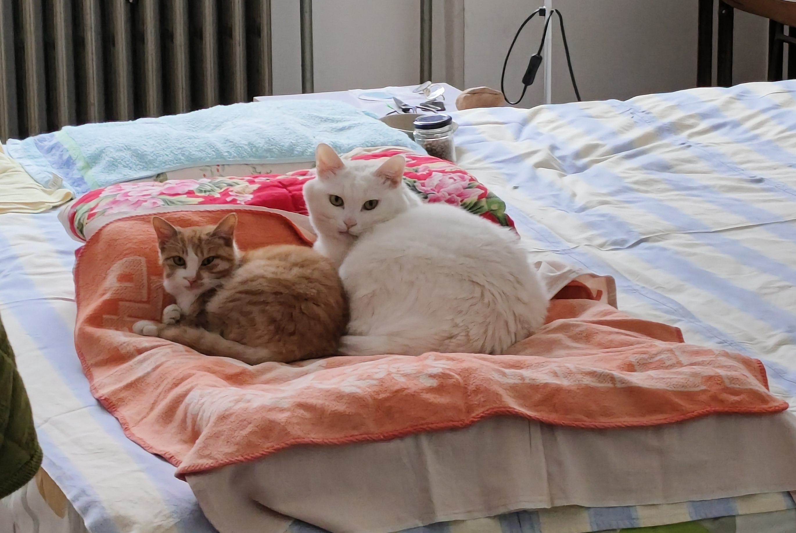

2月底，临时拍板决定回家待一周，说走就走，搜了一圈立马买票。于是隔了5年多第一次回老家&回国。

为什么回去，一来想知道在日本待了5年再回看国内会有什么样的culture shock；  
二来最近跟妈聊感觉好相处了不少，但sns毕竟不是真实的全貌，当试水，看看真住在一起会怎样。  
最后也是最重要的：猫，我想他。

**先说结论：**  
并没有想象中的巨大文化shock。变化当然有，北京继续在飞速扩张，老家也在扩张，更方便更宜居了。物价很奇怪，极端贵和极端便宜，料想普通人的生活会很难。为什么没有感到很大的文化冲击，我想是因为我并没有把很多中国的事情当作理所当然，也一直很警惕日本的观念影响，具体别的文里写。心想如果没有政治因素，在国内会过得更舒服。但哪里能逃离政治呢。 

爸妈比以前温和柔软了很多，亲戚们也这么说，确实有这个感受，不像以前锱铢必较，天天吼。可能也有距离产生美的因素，以及只在家一周，暴躁面还没来得及展现。anyway，确实有变豁达宽容，是好事。  

猫，活动量变小了，每天睡很久。依然记得我，会来找我说话。但是跟我妈建立了坚固的感情，天天睡她被子上，晚上挠她头要吃饭。我一边为猫不亲我了感到失落寂寞，同时也为晚上不会被压得腿麻能睡个好觉而宽慰——两全其美太难了。

## 吃  
到底是回国吃得好。吃这方面欧美比不过亚洲，亚洲里大概中国人的挑剔程度又是顶尖的。二姑家请客敞开肚皮大吃一顿，感觉几年里最好吃的一顿饭了。什么都好吃，小咸菜和炒圆白菜都好吃得不行，巴不得舔盘子——我哥看了肯定要笑。逢人就说，日本饭不好吃，刚开头新鲜吃这吃那，慢慢发现都一个味儿，酱油和盐，无聊得很。

老家的菜便宜。油麦菜心心念念好几年，3块钱3大颗，我爸还嫌贵，吃了两顿。去超市，小油菜特价，1块钱一大袋。心想，农民怎么能赚钱？水果种类多了很多，也便宜。10块钱2个削好皮的大菠萝。蓝莓15块钱2大盒。这个季节老家十八线小县城居然也有芒果卖。砂糖橘10块钱一大袋好几斤，特别甜，吃不完还要送人。又能见到整把的香蕉了。草莓6块钱一盒，但是个头奇大，都说是用药的，颜色也不自然，在亲戚家吃了一个，倒是不酸，但自己是没敢买，宁可自己种。土豆也是奇大，不像正常长的。

萝卜白菜冬瓜这些都不用买，自己种，或者有亲戚送，吃一个冬天。

本来一到冬天就犯愁天太冷，肠道蠕动变慢容易便秘，结果回家一吃拉屎立马无比顺畅，感情是一直吃的不够啊——种类不够，量也不够。

## 住

日本没有集体供暖——大概有集体供暖的国家没几个。老家小区的集体供暖虽然比不上东北，暖气片总是温了吧唧气若游丝，但晚上光着腿出来上厕所&逗逗猫还是没问题的。早晨起床也没有困难。一回日本立刻爬不出被窝，之前还责备自己，这一对比才惊觉是屋里太冷的缘故啊。

爸妈说国内现在房子便宜的不行，都没人买。表哥10年前预付的房子，到现在还没交房，大家都小心翼翼不在他面前提这茬。看了个视频说高盛预测的年度经济情况，房价还没触底，还在清库存，到底如何，我们明年再看。

好几个人问我日本的房子什么样。日本的房子花样太多了，没有一律，我也不好总结，只能说自己住过的见过的——总之都算不上好。这个问法也看出亲戚们的思维和想象力还是一统式的：什么都有个统一的规范和标准，似乎哪里都一样。就像日本人问中国什么样，中国人都很能吃辣。大家的想象力都非常贫乏，严重局限在自己的生活圈子里，拿着刻板印象到处套。

## 行

首都机场是真大真空，北京地铁换乘还是要走老远，不过特别好的一点是，到处都有扶梯，但凡有楼梯的地方，就有扶梯，扶梯is everywhere！！！！！赞美！！所以虽然远但走下来并不觉得累。日本是楼梯千千万，但扶梯直梯一只手数得过来。很多时候你只能硬着头皮爬台阶。这让我非常暴躁。  

安检，并没有感觉特别麻烦。个别地方，比如机场线换地铁，北京西出地铁进站，设计的路线是跳过安检直接进站，合理高效很多。

换乘指示，比日本好找。这点很个人，（不过这个站就是我个人的，我就要这么说，叉腰）我在日本车站经常迷路，迷到没脾气。指路标识难找，或者说很难看懂，很迷惑。反正我看不懂就是设计的错。

短短的一段地铁上，周围没看到睡觉的人，晚高峰挤归挤但也没到前胸贴后背。在日本，无论何时都能看到睡的死过去一样的人，日本人缺觉真是民族问题了——这点不能也怪到外国人头上吧。所有人都在刷手机这点倒是很一致。

**便宜！** 中国的交通费真便宜。或者该说，日本的交通费实在太高了。从北京到老家，高铁400公里二等座才137块，大阪到广岛300多公里，新干线要1万日元了。更别提地铁了，北新桥到北京西才5块钱，难以置信。大阪随便坐几站300日元+。能源全依赖进口就是惨啊。

县城的路基本都翻新了，平坦宽敞。开车骑车都方便了很多。新修了好多3车道的大马路，也不知道修这么多干嘛。还有一条新高速——穷乡僻壤也有高速了。因为修路，姥姥家隔壁村子几乎被碾平，村民们据说被遣散得七零八落，记忆里的路灰飞烟灭。爸开车带着兜风，妈一直说小时候她怎么走怎么拐去看谁谁哪个亲戚。我也有一点自己的记忆。就这么无情地变成了宽宽的马路，什么都没了。路很好开，心情却微妙而复杂。修这么多路，做什么呢？哪里来的钱呢，那些被占掉的地呢，消失的村落和那里的人们的生活，以及人们精神上的联结呢？有人关心过吗？

河边还建了很多新公园，足球场篮球场，还有个小型滑雪场？特别大特别空。像是弥补过去几十的年基建不足似的，一股脑扎堆儿建起来。不像常见的小区里的公园低调接地气，更像为了建而建。不过妈说夏天挺热闹的，很多人在里面玩。

## 买

物价很奇怪。国内到底是通缩还是通胀，还是又缩又胀，我搞不明白了。

在北京西站的沙县买吃的，皮蛋瘦肉粥22元？我的感官里还停留在10块左右，什么时候这么贵了？？姑姑家吃饭那天，爸翻开菜单一直叫：这么贵！！ 肉菜最便宜的好像也要59+，素菜基本39。走前和小达子吃饭，意面一份48到78都有，不太清楚现在各档次的饭店什么价，直观感受是，啧，好贵！

但是回到家听爸妈说又是另一回事了。一分钱的剪刀，一块钱的水杯，一块钱一提12卷5层的卫生纸，家里摆满了他们极低价网购的各种小东西。地上放着一大盆小西红柿，我琢磨日本一盒有几个，算算在日本要几千日元。结果爸说1块钱，说寄过来撞烂了一点，卖家减了5块钱，实际支付1块。我说这买卖可太难活了。爸说是啊后悔不该说的，都挺不容易，而且那1块钱到现在也还没划走。

县城中心一家大商场前年忽然倒闭了，只剩地下一楼的超市还开着。整个楼外墙的招牌全拆了，破烂的墙体就那么裸露着，难看归难看，倒也像县里人的做法。车停在负二的停车场，黑咕隆咚，连个灯都没有。墙壁破破烂烂，地上也乱七八糟，到处脏兮兮，像废墟。客梯坏了，货梯运行时会发出巨大的咔哒咔哒声，真怕它掉了。超市里冷冷清清，没几个人，店员比顾客多。东西倒是摆的很多很满，也新鲜。大瓶可乐5块5，爸说又便宜了。两大排酸奶才16.9？能吃一个月。水果蔬菜种类多了很多，反季节的也有。到底运输是发达了啊。没看到不停搬货补货的店员。想想之前在国内也很少看到店员补货。怎么日本的超市里一直要补货呢？七七八八买了一堆吃的，两人快抱不住，结账46块多。

另一家超市去逛，露天好大一个摊，搞促销，卖纸抽和卫生巾，纸抽4包9.9。进去，货架摆的满满当当，路被挤得只剩窄窄一条。店员簇在一起聊天，我走进去，立刻一群人来问：找点什么呀，卫生巾特价来看看吧！感觉也是顾客没有店员多。找身体乳，看不到常见的强生和其他牌子，问店员给推荐了一个。很实在的人，老老实实说各个味道，还一个个打开给闻。顺便看了眼卫生巾，没看到护肤宝苏菲这种“到处都有”的牌子。大部分像是国内的牌子，感觉被一棒子打晕了似的没了坐标。匆匆撤退。出来外面的人依然大声招呼：做活动来看看吧，纸巾便宜嘞～ 她们一天能挣多少钱呢。

还有一家很大做了很多年的超市——我考完研还去打过几天工——也倒闭了，现在是卖电动自行车的。有点唏嘘，说倒就倒了，残酷。

县里也都是微信支付宝了。走前妈问我微信里有没有钱，我说我有现金，还能拒收咋滴。在北京西站买票，售票窗口只开了3个，诺大的售票厅空空荡荡，惊得倒吸一口凉气。已经没人现场买票了吗。人工窗口萎缩全改线上和自助机了？好在现金还是没问题的，掏出来也没觉得奇怪。

## 爸妈的一些变化

自然是老了，我妈平时会发照片，所以见面并没有什么震惊感。也没有什么内疚感，毕竟有我没我，人都会变老。我也在变老。衰老和死亡并不是应该避讳的事和话题。说不定哪天我先死了。

他俩现在每天沉迷刷手机看小视频，我妈觉得自己在干正事，是学习。那天谁说的，上当受骗的老年人都是栽在一个“老有所学”的上进心上。我也很怕他们哪天被骗。他俩经常在拼多多以及不知道什么软件上下单买各种便宜东西，俩人像大学宿舍室友一样，每天互相打招呼：我去拿快递，你有没有？总之每天好几个快递往家拿——快递太多了，快递员送不过来，现在全都放到代收点自己过去拿——家里一堆快递包盒，垃圾。晚上躺被窝里也看手机，搞得我还要像前几年他们劝我一样：少刷手机吧，眼睛要坏了！

亲子关系这块发现普遍有转好，主要是家长们没以前那么死板教条了。之前说过爸妈都是老师，交际圈子也都是老师。同事邻居熟人我全知道。他们的人生步调和经历也都很一致。我弟这波小孩都惨。赶上计划生育松的一个节点，大家全扎堆儿那几年生。他们这波升学竞争率高就不说了，在家还要各种被折腾。家长们中年得子，又重男轻女，都习惯了当老师，觉得自己是对的，自己最权威，管这管那，孩子这也不行那也不许。小学还好，等到了青春期小孩们一个个都跟家里闹翻了，或多或少都抑郁，不上学的一大批——谁会想去呢。

也不难想象，养大的——我这波的时候，家长们还年轻，教学任务重，没空，管孩子也是想起来了揍两下，孩子多少还有个能喘息的时刻。到我弟这波，家长们从教学一线开始退下来，闲下来有时间精力折磨自己孩子了。中国那种监控式居高临下的教育风格，多年养成的“所有问题都有一个正确答案，不能做错”的潜意识，加上每个人都有多年老教师成绩优异的优越感，什么不同观点都听不进去。结果就是在教育孩子上思维狭窄，做法高压专制没人性。

这次妈说谁谁家孩子，当年高考报名死活不去，爷爷奶奶硬拉出门，一路上杀猪一样地嚎。家里实在没招只能任其自然，结果自己专升本又考了研，过年还给家里发祝福视频。有同样苦恼的人去请教，TA爸说顺其自然吧，不要管那么多，不要挡人家的道。

另一家大的跟家长说：我觉得他挺正常，不正常的是你。你要做的就是，一，给钱，二，闭嘴。给钱，闭嘴，给钱，闭嘴。

还有好多，听下来感觉这帮不服输的强硬派家长们看来是明白了自己的局限性，以及孩子没有自己害怕的那般差，没有自己帮衬孩子也能过得好。人定胜天是胡扯，人控制不了的事太多了。大部分事没有对错优劣之分，怎么喜欢怎么来。很多事搞砸了也没什么大不了。人比自己想象的要capable的多。

妈还交到一些忘年交。一些做特教的年轻人，跟她近乎，什么都说。谈恋爱，男的干嘛了送了啥说了啥自己怎么想的，事无巨细一股脑儿全说给她，像大学闺蜜一样。那天我竖着耳朵听了一下，俩人聊得还挺好玩，主要是对方特别可爱，特别真诚和自然。还说想要认我妈，把自己亲妈气得跳脚。我说现在妈比之前忽然好相处了很多，原来是托这些可爱的年轻人的福，让她了解了些现在年轻人的想法和烦恼。我该好好谢谢TA们。也很开心她的生活里有了没有血缘关系的重要关系。

爸当年手术之后迷上刮痧，自己出钱办免费讲座。新盖的房子还没住先搞起了公益。在家看课件学经络穴位，还挺专心。这个层面是好事。不过他现在反对一切西医是我不赞成的。承认A有效不需要同时诋毁B。说中国好的同时也能说日本也很好。而如果我说中国哪里不好，不等于是说日本好。我骂日本烂的时候，也不等于在夸中国更优越。

## 一点细节对比和其他

刚说不要比这里我就来比较了（我打我自己。

北京首都机场大而空，日本关西机场，小而紧凑，跟各自国家特点很相符，地铁车站也是同理。对我来说哪个都行，并不重要，I don’t care。日本周转效率会更高一些，步行距离相对较短，但台阶多人多缓慢蠕动估计最后也差不了很多。值机，第一次坐国航，没搞明白网上值机，所以还是老方法现场办，拿纸机票。ANA国际航班不清楚，日本国内航班会提前一天手机短信邮件连番轰炸，手机点下值机存个电子机票在手机里到时直接去过安检。但正因如此更容易误事，赶着登机前最后几分钟狂奔（我说我）。

空气，肯定中国不如日本，一落地就是灰蒙蒙的，刚好是大雪过后大雾天。但是比5年前好。比15年前好太多。一周里一半是晴天，一半有雾或霾。以及，没那么大的风。一到日本，吹死了。是不是像日本这么刮风的话中国的雾霾天也能好点？

高铁广播现在特别长，仔细听了下还挺多新内容：不要大声电话，不要外放，全车禁烟，带小孩的不要让小孩在车内吵闹跑跳，孩子哭的时候带到车厢连接处哄劝，脚不要放在前排座椅上，不要躺占多个座位，不要踩座椅，行李不要挡路，车内不卖方便面等味道浓烈的食品，请乘客配合尽量不要食用……侧面说明现在文明程度/宜人性变高，社会规范变多了。人们意识到这些细节并提倡了。然而如果一味地多下去变成日本那样规矩3000万条的话就很无趣了。

差点忘了高铁提供热水，还配纸杯，机场也到处都有热水接，太方便了。对一直要喝水的我来说真是帮了大忙。落地日本出了机场，想喝水只能去便利店，127日元500ml。sad。

二手烟，高铁机场还好。北京市内有一点。老家特别狠。发现自己现在对二手烟真是没法忍，无法呼吸的程度。太呛人了，怎么有人还能在里面喘气的？

厕所，以为自己会遇到窘境，比如忘带纸，或者感觉太脏宁愿忍着，结果并没有。首都机场没大差别，也有纸。高铁站也OK，地上有一点拖过的水渍和脚印的程度。老家就是在家和去亲戚家，真野外尿急了就撒野尿呗，no problem，五台山就那么转下来的。北京，遇到尿急但是地铁站没厕所的情况，然而出了地铁站走几步就发现了一个巨大的公厕，幸运。卫生情况也还好，没有觉得很差。不过我本来就好养，老家村子里还有旱厕，照上。所以这些在我看来都不错，及格以上，日本的厕所是unnecessarily奢侈了。

人，热情实在，更直接更好懂。国航的航班怎么说呢，有点点混乱感，机乘看着没那么“专业”，态度和姿势显得更“随意”。但也没什么慌乱出岔子。机乘很亲切，前排有对南亚夫妻带着小孩，大概因为耳压小孩一直哭，好几个机乘路过时都逗一下小孩，还有一个专门帮小孩按耳朵减轻耳压，立刻小孩就安静了。我感慨这在日本航班上是看不到的吧。

气氛轻松没压力。买东西，售货员的态度都很随意，有的说话还会不耐烦，倒也不觉得被冒犯，只是心想换在日本要被挑剔的顾客大骂吧哈哈。搭话挪车问路什么的都很随意自然，不像是跟人借800万巨款一样难为情。买菜买水果，很多主动说我给你拿里头新鲜的。售货员互相聊天，店员坐门口晒太阳看手机，上班摸鱼不是罪。整体气氛很轻松，没什么压力。

回家打开各种柜子抽屉，看着自己当年的书，以前画的画，颜料，衣柜里的衣服，全忘了。像是猝不及防嘭地遇见平行时空的另一个自己，另一种样貌和精神状态，又像是失忆的人忽然恢复了记忆，沉睡的一部分自己仿佛回来了。翻翻当时画的画，恍然发觉原来之前以为自己很down的时候还那么有热力，那么充满了好奇和动力。在日本感觉是硬生生造了个家出来，个人是割裂的，片段的，回到家里看着所有自己的物件感觉到了内心的连贯。用一个很滥的词是故土感，根。或许无数人无比重视的故土和对故乡的感情是这种个人成长生活的轨迹和记忆吧。

自然很多人旁敲侧击想问中国日本哪个更好。什么时候人们不再比来比去，整个世界估计也会更和平一些。亚洲尤其像中国日本的大城市，生活设施集中，短距离甚至步行范围内可以解决大部分生活需求；而美国加拿大的宽阔小镇大农村，行动全靠车。这都只是当地环境、历史、文化习俗、城市发展等众多因素多年沉淀下来，形成的适合当地的方式而已，并无优劣好坏之分。人的适应性是很强的，有足够的时间，都能调整适应过得好。然而人有不同的喜好和舒适圈，可能更喜欢某种。就像有人喜欢热闹人多，有人喜欢安静人少。但没法因此来判断好坏。没有体验过，仅是出于恐惧以及害怕一旦承认外面好就等于说自己过得不好这种非此即彼的想法，就干脆一律拒绝直接说太差，那真是自己给自己画了个牢。

还发觉，爸妈亲戚似乎潜意识里觉得在国外就得挣得比国内高。没这回事。作为一个30多岁出去的学中文的人，在日本能找到的工作有限，收入也有限。但不同之处在于生活起点变高很多，“普通”“平常”的内涵的丰富程度，无形的barrier少很多，获取各种实物、信息的难易度，购物、上网、看病的方便程度截然不同。比如很多进口食品都可以线下买到。而在国内尤其老家，首先要查找获取这些信息，再到如何购买，都是隐形的操作成本，要耗费大量心神。不是出门一两个小时就能拎回家的程度。瑞士巧克力，德国茶，苏格兰饼干，在老家想买只能海淘，但首先想获得这些信息就要自己主动查很多很多，不是摆在商店里能撞见的程度。——这例子举得很消费主义，想象下，站在100米的山上看到的风景，和站在3000米的山上看到风景的不同。

## 一些好玩的瞬间

回村串亲戚，开车迎面撞上三舅，他头天晚上打麻将睡得晚，刚起来还睡眼惺忪。看清是我，三舅僵在路中间，烟举在半空忘了抽，嘴半天没合拢，愣了好一会儿走到车边，说：今天晌午在俺家吃饭。

去伯伯家，嫂子刚好下班，进门看我坐家里一下子哑巴了没说出话来。后来妈笑说好几遍估计她是惊呆了。

跟妈说，搞忽然袭击也挺好，大家的反应都很好玩，喜气洋洋的，特别自然真诚。而且少了很多应酬，聊聊天就是最好的。

最开心的是猫——我是说我开心。这么久了他还记得我。小的认生立刻躲起来。他窝在沙发上，鼻子一耸一耸嗅了半天，然后像是想起来什么，跳下来走到我面前昂着头悠长地喵了一声，仿佛在说：你可算回来了，你都去哪了。然后过来蹭腿，蹭腿，再蹭。

回到日本后Sarah问我：How are you feeling now。

我感觉chill and warm。

PS：最后要说的是，大阪的水太难喝啦！ Disgusting！🤮