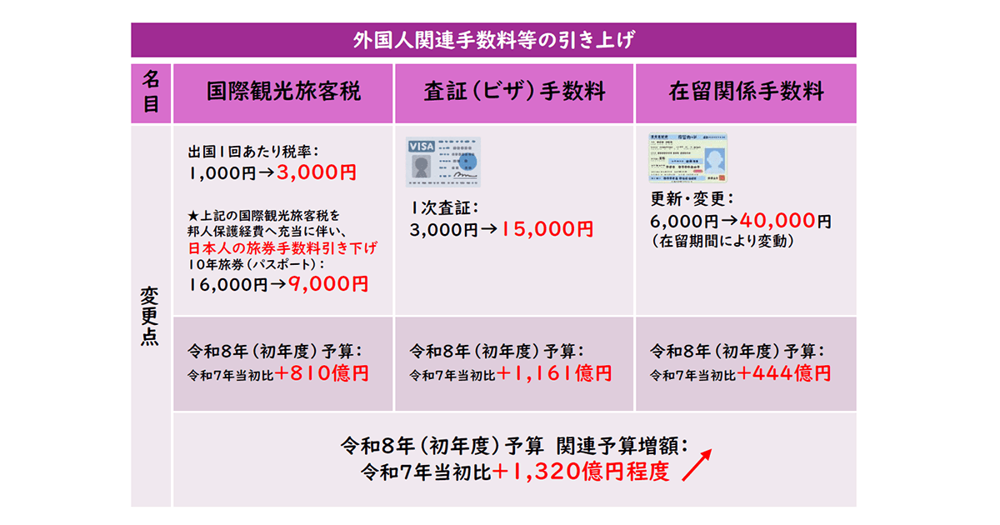
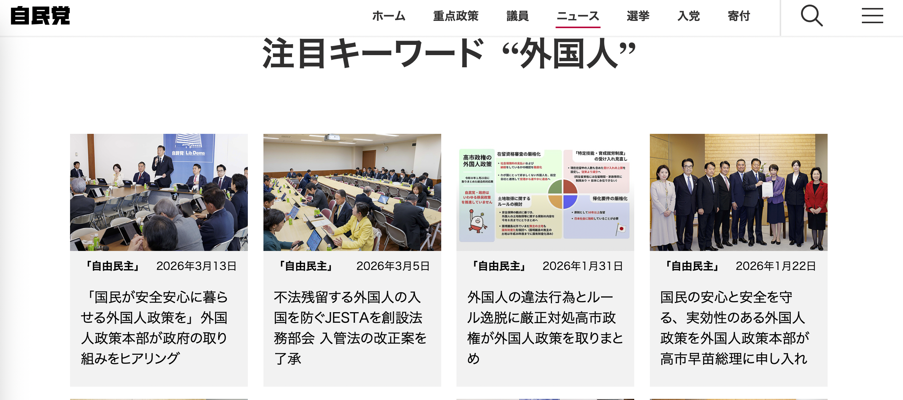

**预防针：会有极端个人的观点**。

这次更新签证，2月20终于收到公司寄来的材料，2月24工作日立刻去大阪入管交了申请——申请的人比领证的人多。之后回国待了一周。回到日本一看邮箱居然寄来了去领卡的通知明信片，邮戳是3月5，心里感慨大阪入管是什么坐了火箭的审核速度！第二天13号下午到了入管，阵势大逆转——申请窗口冷冷清清，领证那黑压压的长龙排到了门外，感情不快点是要出事啊！当天排号560多，也就是说这天有560多人领卡。3月是高峰，估计之后每天的数字怕会更高吧。

等了快2个小时，睡过去好几次，拿到新在留卡一看，只有一年。窗口的人一边递卡一边说：因为你换了工作所以只有一年。

之前没换工作，你们也没给5年啊。

日本不像其他国家，给出明确的标准能申请到几年，而是交上去申请资料，等。申请能不能通过，能拿到几年，只有拿到卡之后才知道。跟日本人做生意有点像，不到送货日不知道订的货能不能如数到。可以说充满了变数，你不知道他们是如何判断的，也无法对之后的生活做长期或详细的规划。

这几年的签证情况是这样：先是2年的留学签，找到工作换签证，技术人文国际业务，简称技人国，申请3年，只给了1年。之后更新，申请5年，给了3年。到现在，申请5年，只有1年。

第一感受是，自己不受信任，被怀疑。继而是愤懑，转而觉得荒唐可笑。按下自我怀疑的念头，分析一下，1年签证，我就不敢轻易辞职换工作，因为换工作没有半年8个月的实在是太紧张。所以工作如果不合适，待遇太差甚至被欺负，也只能忍着不敢动。在日本工作，马斯洛需求图还要多一层，安全续签是温饱之前的第一层也是最基础的需求，一切只为签证服务。是的，失业是可以拿到失业金，但是签证时间永远高于你的其他权利。也不能像日本人一样可以随便打工。因为签证限制只能做某一类的工作，且必须是全职。换不同领域的工作，签证要重新申请，而且有通不过的可能。

这真是人为增加生存困难，每年更新签证不仅非常折腾，还会带来巨大的心理压力。语言学校时遇到一位来自苏格兰的英语老师，当时他在日本近十年，先在东京做英语老师，辗转许多不同学校和地方来到京都，每次更新签证都只能拿到1年，让他非常焦头烂额。签证真是悬在每个外国人头上的一把刀。当居留的合法性超越温饱成为需要考虑的最基本问题时，人是很难有精力去考虑更高层面的需求和自我实现的。

我不惮用最坏的恶意揣测，另一个原因是增加财政收入。

25年签证更新的手续费从4000涨到了6000。还要继续涨。25年11月日本政府预计26年内把更新和变更手续费涨到3万～4万日元。26年3月又通过了法案，预定上调更新和变更手续费上限到10万日元，永住的申请手续费上限变30万日元（25年从8千日元涨到了1万日元）。虽然现在还没有开始实施，但这个方向是非常清晰了。

只给1年签证，那么1年后更新，日本财政又多一笔收入。再加上大幅上调签证费用，财政收入也会翻番。如果对每个外国人都这么一顿操作，财政收入非常可观。毕竟，外国人的钱好赚。不光是在日本生活居住的外国人，对游客收的税也在涨。另外日本公立博物馆美术馆也要开始搞两个价格体系了，对外国游客价格翻倍。你说尼泊尔人家是发展中国家，那么穷，这样搞情有可原，你个发达国家把自己的经济问题内部矛盾全转嫁到外国人头上，好意思吗。自民党年初估计，财政预算收入会涨1千多亿日元。对于日本巨大的赤字，无疑是超好消息。[这个图是自民党自己做的预测](https://www.jimin.jp/news/information/212271.html)，好棒棒哦。

reddit上刚好有个跟我[类似经历的人发帖](https://www.reddit.com/r/japanlife/comments/1rtdk9n/5_year_work_visa_1_year_after_10_years_in_japan/)，评论里有人跟我想到了一起：Government funds needs stimmy so it's 1 year visas with increased renewal fees from now until we die。

还有人提到发1年签证对于避免扎堆申请永住/Permanent Resident/PR的作用，如果已经在日本8年，手中有3年签证，那么在费用真正上涨之前，可以尝试提前申请永住。但通过只给1年签证，就可以避免这类操作，从而确保日本政府还是可以收到大笔的手续费——That's evil!!! 太邪恶了！

但说回来，日本人的anti-foreigner态度也不是什么新鲜事，排外和歧视一直就有，现在不过是连样子都懒得装，毫不掩饰地表现出来而已。

刚来日本的时候，被不同的日本人问相同的问题：为什么来日本？什么时候回去？——似乎默认外国人都要回去，因为“这里是日本”。

这两年逐渐意识到，日本的签证制度本质上是为了阻挡外国人，隔离和排斥外国人进入这个系统。日本政府想要的只是劳动力，是labour，而不是people/citizen。

技能实习生和特定技能1号签就是赤裸裸的证明，这两个签证的人数合起来有近80万（[25年6月底日本出入国在留管理厅统计数据](https://www.moj.go.jp/isa/publications/press/13_00057.html)），仅次于永住的数量。*（注：特定技能2号虽然可以续签，但申请条件要求极高，申请成功的人数比例很低，所以这个签证类别的大部分还是1号签）* 拿这些签证的人，多数是做农业、制造业、看护之类的工作——都是很累且人手严重不足的行业，劳动强度、劳动时间和薪资不成正比，属于日本人都不愿意做的低端劳动力工作。因为签了合同很难换工作。签证上限5年，到期就要回国。现在拿这类签证的很多是来自东南亚的年轻人，越南、菲律宾、尼泊尔，20多岁，人生最美好的年纪用在为日本服务，最年富力强的时候，每天长时间地劳动，透支身体做非常消耗的工作，健康情况大概率会严重受损。有些病痛是一辈子的，只能自己默默承担，日本法律上没有任何保障和补偿。要想留在日本，就得想其他办法。想起老路的口头禅，这真是，臭不要脸。

我的感觉，很多日本人眼中，外国人是局外人，outsider，他们不希望外国人进入他们的system。签证制度是为此服务的，给有限制的条件，keep them outside，keep them working，按照同样的标准交同样的税，而不给实质的resident right。这个机制的目的是淘汰，筛选出因各种原因可以服从日本system要求的，淘汰掉受不了这种做法和日本各种规训的。留下那些觉得日本无限好的人，不会抱怨日本的种种落后或不合理之处，或者即便有抱怨但不会说出来，或受制于各种因素只能苟住，跟日本人一样服从秩序，维护这个系统的运转。

有人会说日本也有永住，跟日本人一样没有就业和具体工作内容的限制，可以自由打工。在我看来，永住申请本身就是一个大型服从性测试——像日本的礼仪、服装等其他规矩和秩序一样——为的也是筛掉那些日本人不喜欢的个性鲜明张扬的外国人，留下能迁就和讨好他们的人。

普通情况下申请，且不说融入日本这种非常暧昧的标准（侧面说明了意图），首先在日本连续居住10年以上，持续工作至少5年。不能有罚款记录（小到交通违章、超速），不能有社保等保险费等漏交、迟交记录。基本上只这两条就非常能说明其苛刻程度了——哪里有完人呢。有罚款记录就是次等人了么？

粗浅了解，英国，申请永居签证的门槛之一是工作5年。新西兰，居住2年后符合条件可以申请永久居留权。有学习、工作的权利，没有条件限制，也可以随时出入境，没有每年至少待多久的条件制约。都比日本的10年低很多。

人有多少10年呢？况且是为一个不确定能不能拿到的绿卡而一直待在一个压力极高的地方？高才积分，拜托，日本这个普遍薪资低下的水准，非IT金融科技相关行业能有多少机会呢。

自民党的公告页面，选外国人的关键词出来的新闻公告是这样的：

请注意，“国民的安全安心”“外国人”和“违法行为”，它们被置于同一水平，无需论证，也无需证据，外国人=威胁，这种暗示通过纯粹的语法形式达到了目的。鲍曼在对底层阶级形象研究时注意到，描述底层阶级形象时用的词汇、句法和修辞，把“犯罪”“领取救济”写在一起，共同归类于“反社会行为”，通过语法完成了认知的诱导，贫穷=领取救济=犯罪=反社会。

通过这种暗示和链接，外国人被宣布为社会的威胁，治安隐患，犯罪的主力，成为迫切需要解决的问题之一，而日本人则理所当然地高居审判席，进行一场单方面的判决。

我只觉得恶臭熏天。

最后只想说，We didn't mess your economy up.

> 肯定有人受不了我这么说日本坏话。我估计他们受不了的不是说日本坏话，而是认为说日本坏话就等于在夸中国比日本好。这太挑战他们的神经了。Anyway，我还是要写。