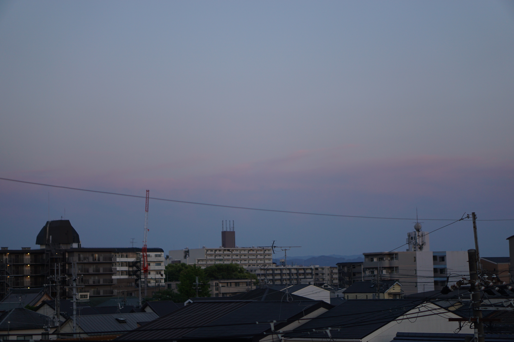
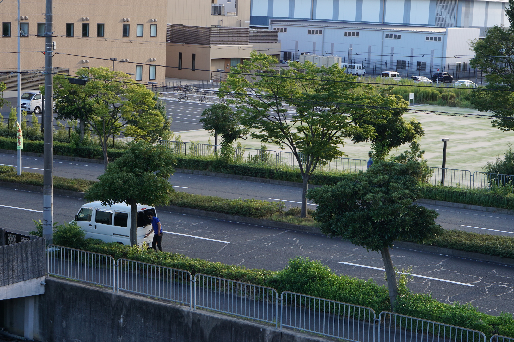
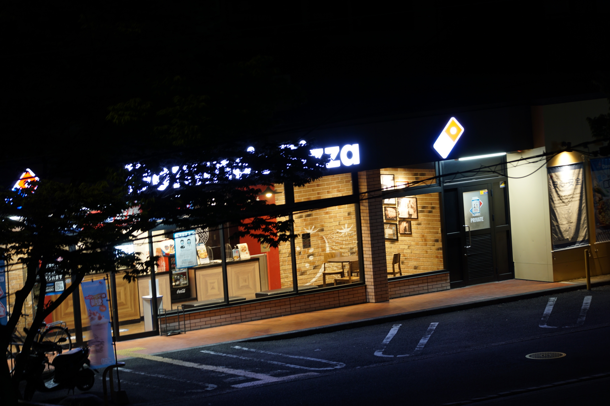
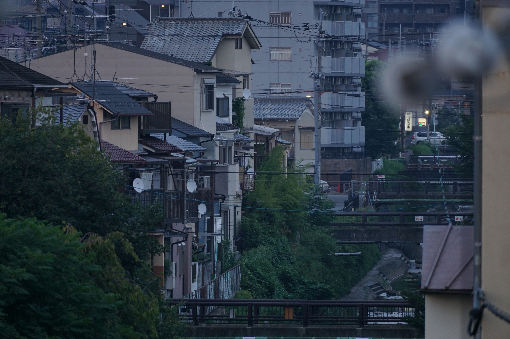

24年秋天确定了新工作，以及要搬家到大阪的现实。每次跟朋友见面总要嚷几句：啊不想搬家——简直成了病。

当时住右京区快3年，京都地铁东西线的终点站“太秦天神川站“附近。附近是先端科学大学。我喜欢找学校附近住，不知道为什么，心理上觉得安静安全，人员成分更单纯一些。

在京都本地人Sunzriver氏的口中，右京区是“什么都没有”的荒凉之地。确实有点那个意思，尤其从上京区左京区这些三步一景、店铺密集林立，文娱活动丰富光鲜亮丽的地方一路走来的话，确实感觉右京“很荒”：建筑稀疏，店铺稀少，景点稀薄，离山很近，还能看到大片菜地——市中心哪能看到菜地？——至于嵯峨就完全是“山里面”了。当时的同事森先生就在嵯峨长大，说他小时候天天跑到山里玩，是个“野孩子”。

虽然“什么都没有”，但住了3年，临搬走前反而恋恋不舍，觉得这地方真是太舒服了，简直称心如意。

日常逛超市，买食材买日用品超级方便，东西南北各有一家超市，都在走路15分钟内，各有特色，无论去哪边，都能顺手逛，四家换着来，从没腻味过。北边life的途中，有一家无人蔬菜销售点，附近农户自己种的，青菜新鲜量大便宜，比超市好吃多了。  

往南一点是京都family，一家中小型商场。除了随处可见的aeon超市，还有非常棒的青果店，精肉店，药妆店，有muji，优衣库，很多市中心大型店卖断货的品这边还库存充足，周末逛一圈基本需求全都满足。买电器就是西院的joshin了，不挤，够看。蓝光播放器，熨斗体重计这样不沉的小东西都是在joshin买了直接拎回来。一般网上价格比店里好，提一句店员都立刻给改成网上价格，没一点不耐烦，感觉里头人特实在，不矫情。  

跟政府打交道，享受公共福利也方便。  
出门走路10分钟，是右京区役所，没有移动成本，搬家、换保险证、问各种手续特别方便，新建筑宽敞明亮，人少地空，一点不挤。  

3楼是区图书馆，安安静静，藏书多，灯光明亮，屋顶高不压抑。桌椅足够，墙边一整列的单人沙发随便坐着看书或者睡觉，悠闲惬意。而且空调开的足，冬暖夏凉，夏天甚至要穿长袖进去。辞职后闲着没事就去逛，走路10分钟，移动难度为零，白嫖看了很多杂七杂八自己永远不会买的图鉴画册。还借到各处缺货买不到的《十二国记》画册拿回家描红。DVD区异常充实，对比大阪贫瘠得荒唐的区图书馆这里简直是天堂。而且常有意外惊喜，重温了李安的《理智与情感》，凯特真美啊。

  

常用的几家银行在几家超市里都有ATM。往北有一家大点的邮局，每个月去转一次房租，挺有仪式感，也不容易忘。

医院也方便，常去的外科和眼科，都是走路10分钟，老式做法，不用预约，直接去，到了坐那等着叫。不用预约就是省心。我现在超烦预约制，麻烦，要守时，压力太大，况且守时也要等，毫无意义。医生护士熟悉了之后也就不在乎你是外国人，跟其他人一样对待。手续有麻烦的不清楚的地方，也很自然地帮忙想办法，大家都省力。日本人的排外在这时候是感觉不到的。感到的是去除一切人为定义的差别外的人对人真诚的关照。

出门坐车主要是地铁，市里和近点的地方都能换过去。出远门像是名古屋就是JR，往北走15分钟，脚程快的10分钟内，是JR的花园站，去京都站分分钟。往大阪走就是到西院坐阪急，先坐公交10分钟，但走路也不过20多分钟，我经常腿过去。

现成的餐饮店虽然不多，但也足够。往南穿过一片住宅区，从小巷子里钻出来是岚电的山之内站，马路对面一家其貌不扬的中华餐厅，除了讨好日本人的定食，炒菜主要是鱼香肉丝、宫保鸡丁这类常见菜。有限的材料做出的味道还算地道，价格极其公道。有段时间我常周末中午过去，点拌海蜇吃。和老板娘说几句中文，感觉很亲切。  
马路斜对面是一家domino披萨店，孤零零立在附近农田里，营业到很晚。domino常年打包半价，也不知道利润能不能cover电费人工。懒得做饭时，就手机上点个餐。下楼从旁边的小路走到马路边，再斜穿马路过去，到了付钱，15分钟正正好。
东边和北边超市附近各有一堆店，里面也有有名店，之前同事还专门跑去吃炸鸡套餐，吃盖饭。

但也不是说这房子就很完美——  
房间狭小，放了床和矮桌后只能勉强放下一张瑜伽垫，左右伸不开胳膊蹬不开腿；东西没处放，喜欢的家具不敢买，极力克制购物，屋里依然满满当当，逼仄。顶楼隔热差，户型设计不利于通风，夏天闷热像蒸桑拿，没一天能睡个好觉，冬天又极度寒冷；不开门永远没有穿堂风，开了门蚊蝇昆虫全扑进来。阳台狭窄，放了洗衣机就只能勉强转个身。  

挨着河，虫多。一年四季比拇指还大的蟑螂四处横行，晚上甚至扑到床上来。隔壁住户深夜发出过几次凄厉惨叫，半夜叫人来除蟑，第二晚继续打蟑螂。失魂尖叫变成绝望大哭，哭声在寂静而空荡的夜空盘旋回荡，半年不到搬走了。夏秋走廊阳台臭虫成灾，臭气熏天，每天出门都小心翼翼，生怕踩到虫。隔音差，能听到隔壁的隔壁的人半夜哈哈聊天。更新契约，各种手续费加起来近10万（据说大阪惯例是免费更新契约，还没到更新的时候不确定是不是真为0）。

虽说不舍，但我观察这种心情大概也是普遍情况，搬离前都会涌出对即将离开之地的喜爱之情。应该是重新发现了因习惯而忽略的美好。但是搬完家，立刻也就忘光光。

大阪这边搬来也有1年了，87年的老破房，年龄比我都大。铁骨，空心墙。大风一吹房子抖三抖。卫浴长满黄色霉斑，屋里弥漫着一股浓重的陈年建材腐朽发霉的味道。阳台纱窗装在窗框外面，一厘米的大缝隙让人没有安全感。厨房窗户没有纱窗。所有门框门把手上厚厚一层陈年油垢。马桶洗手池小得像玩具。走廊通风差，常年怪味弥漫。楼梯爬着累，当然在许多人眼里没有电梯已经是致命缺点了。也难怪整个楼没几个住户，估计其他空房间都是布满霉菌。

凡事都有个但是。

但是，房子大，2间屋子，一间卧室，一间日常起居。睡觉和吃饭分开。有地方做瑜伽了，也可以买书桌椅子了，还能买个单人沙发用来堆衣服。偏僻，安静，晚上睡觉安静到仿佛能听到空气里灰尘漂浮的声音。恐怕以后再难找到这么安静的地方。起居室的墙纸是新贴的，厨房橱柜水龙头是新的，空调热水器卫浴间的水龙头花洒也都是新换的（之前的要破烂到什么程度！）。朝南，西边有两个公寓挡住西晒的狠辣阳光，采光好，又不格外热，下午屋里反而阴凉，夏天终于可以睡个囫囵觉。厨房一个小窗户，夏天阳台厨房窗户都打开，穿堂风一直吹，自然凉快很多，夏天终于可以活。阳台长又宽敞，可以折腾土，种菜！种草莓！天台门没锁，可以上天台吹风，虽然也没上去过几次，但是可以去和去不了是截然相反的两种感受。

搬过来的前几个月埋头做改造，清理卫浴间霉斑，各处的陈年油垢，霉斑太厉害卫浴门把手拆开一看，里面都是霉，就差把门拆了。门铃盒子拆出来1997年的电池。阳台纱窗拆下来换了滑轮装到正常位置。自己做了个纱窗安到厨房窗户上，夏天开窗不用担心蚊子飞进来。各处开关盖拆开加保鲜膜当缝隙风，墙角地面开裂的地方贴胶带挡风挡虫，墙壁里吹进来的建材霉风终于几近消失。

外面也探索了一番。因为房租便宜，附近外国人很多，尤其东南亚南亚，所以餐饮店也多，有家越南粉，好吃价廉，很多越南人吃。尼泊尔人开的假印度菜，还有家缅甸菜。

其实在日本，像大阪京都这样高度发达的城市，各种生活需要的设施资源都非常成熟便利，甚至超过实际需求地多。住了几个月，心情也是——称心如意。我也逐渐意识到，关键不是住哪里，而是我自己厉害：无论住哪里，房子状况如何，我都能住得舒舒服服。就像三毛住到撒哈拉，也能弄出一个美好的小窝来。心底里的自信也更加茁壮坚强，走到哪里我都能活得好。所以想去哪里都可以放心大胆地去，无所畏惧。

>这篇是24年底就想写的，拖着拖着拖了一年多。心里的想法和感受也在变。自然早已不是当时想写的样子了，但写出来总是好的。