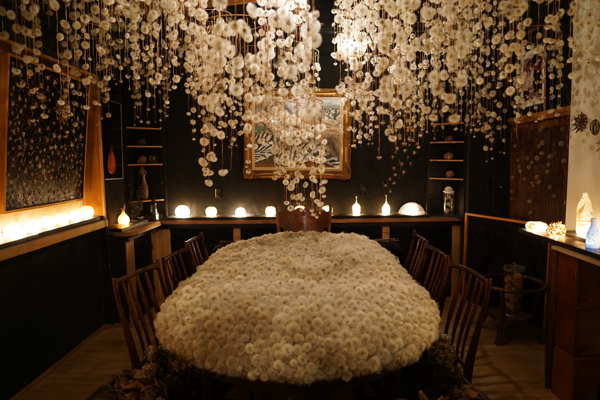

这个照片是23年9月23号那天在金泽市拍的。日子记得很清楚。因为太难忘。

不是那天发生的事情，是那天的感受。到现在我还能清楚地回想起当时的感觉，无法名状，巨大的愤怒、悲伤、无助、绝望、委屈、仇恨。前一天下午我经历了一次惨烈的职场霸凌，到现在还没能很好地梳理好自己的情绪。细节我不想在这里写，不是这篇的重点。

总之第二天我强装镇定按原计划去了金泽，以为自己可以享受旅行，借机消解掉一些情绪。但实际上当我到了金泽市，走在犀川边，到了蒲公英展览馆里，按下快门拍这些照片的时候，我感觉自己像是死了一样，整个人空荡荡的。我的心像是一块沉重的石头，没有生命。我不在自己身体里。我的脑虽然在找角度试着拍出自己满意的照片来，但我的心不在那，没有一点享受。

而之后每当再看到这些照片，我都会回到当时那个状态，所有那些复杂的情绪再次涌上心头，混杂在一起，洪水一样扑过来，胸口和喉咙像被厚重的水泥堵上，眼泪不停地流。我知道这些照片看着很不错，很好看，但拍下它们的同时，感觉我自己的一部分也被定格下来，封进了照片里。每次看到这些照片就会重新打开那个匣子，唤醒沉睡的那个片段，回到当时的我。

我还记得那天坐在兼六园里一处僻静的长凳上，泪流满面。兼六园很绿，很大，但我没有一丝心情去看。不远处人群熙熙攘攘，我只觉得，热闹是他们的，我什么都没有。那天的风也很凉。我假装吹进了沙子，揉眼睛，坐着默默哭了1个多个小时。正如现在打字的我，已经擤了一堆纸巾，眼泪掉在牛仔裤上，湿了又干。

我一点也不享受看这些照片，每次重看都只让我感到心情无比沉重，仿佛回到那个无比绝望无助，感觉被全世界背叛的时刻和感受中。

直到去年10月的一天，突发奇想，把这张照片打印出来，postcrossing寄了出去。这张照片的后面，我写的是，这张照片是我23年拍的，但我在拍这张照片时非常悲伤，因为前一天我的上司bullied我。后来我辞职了。我想做自己真正喜欢的事情，我知道会很难，但还是想要试着去做。

这张照片寄给了一个摩洛哥的女孩子，寄出去就忘了。后来收到她的回复，她写：

I want to start this by saying I'm very sorry for whatever your boss did to you. You didn't deserve any of that, and it wasn't your fault. I'm also glad you did quit and went for another job.

I also believe that one day you'll make your dream come true, it's just about time. I was honestly amazed when you said you took this picture because of how beautiful it is! It looks so good and professional!

打开邮件看到她的回复，当时就哭出声来。那种自己被无条件接纳和肯定的感觉，让我觉得好像死去的一部分自己又活过来一点，有点什么东西忽然卸下来一些，心里轻松很多，我又能呼吸了。

这段话时隔半年再看，依然在给予我力量，我知道我不是一个人。

那些朝夕相处却仍然选择质疑、侮辱我的人，和素未谋面却坚定地选择相信、支持我的人，我选择后者。

现在再看这张照片，我还会感到那些情绪的翻涌，但已经没有之前那么强烈。同时我开始能感到一丝放松，像是一堵冰冷的石墙出现了一个裂缝，漏出温暖的灯光。

那些情绪还在，但我知道，他们会走的。It's just about time.

毁不掉你的只会让你变得更强大。
