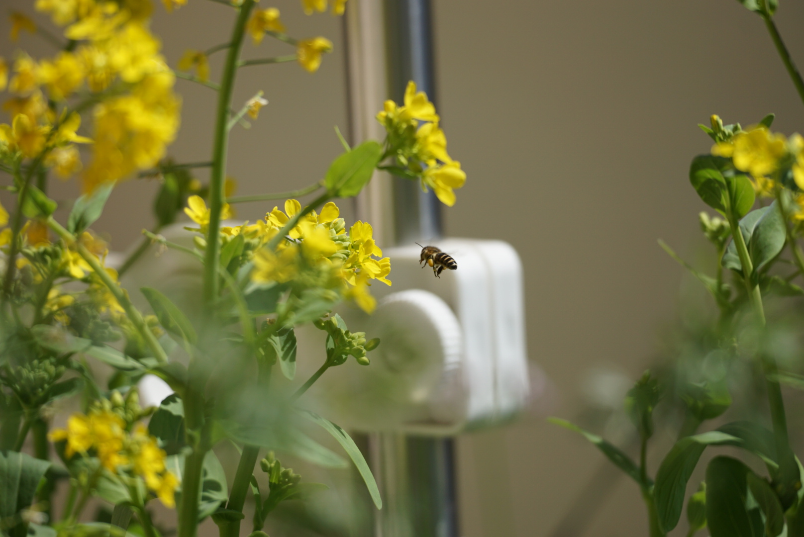

  

回想一下3月过的很“充实”

回家待了一周，很开心。到底乡音更亲切。猫可爱。吃得香，睡得好，拉屎都无比顺畅。

已经5年了啊。怎么就在日本待了这么久呢。在这5年里大部分时间也没有很开心。对日本的看法和感觉越发淡漠。甚至鸡肋都算不上了。预定一年吧。

拿到了新在留卡，只有1年。反应be like：En? Oh… whatever  之后跑役所跑银行一家一家更新信息搞了一周。

阳台的油菜开花了，我才反应过来油菜花就是小油菜的花（废话… 每天有两只小蜜蜂来采蜜，我看了很感到开心。

接着就是新公司入职，研修了。

很繁琐很抠门的公司，各种掉链子。天天跟看热闹似的。没想到居然能有这么多地方可以出岔子，也是突破我的想象力了。

研修时随便问的一些问题，似乎在他们内部反响挺好，对我的评价是：能力很高。——看来我还是认真负责过头了。要再懒惰点。

我是去拿钱的，不是去服务的。

因为这个破工，起早贪黑，睡眠不足，一周就有了黑眼圈。没什么时间做自己的事。

「上班就只做事，主要精力用在自己的事情上」——这个说法真天真。一天只有24小时，从6点起床到10点睡觉都在为上班做准备时，哪里来时间做自己的事。能吃好饭就不错了。更关键的是，精力没法简单地分成两半，预先分给工作只用4成，分给自己的事情6成。就像无法控制手机电量的消耗速度一样，你没法叫它上午只用40%，下午用60%。要么完全不用，那到晚上还有很多电。用，电量就会刷刷掉。精力也是一样，要么不上班，一上班精力就会被消耗掉。等到家剩余电量能支撑你吃饭洗漱按时睡觉就很不错了。

研修7天每天只是坐着听人说话而已，还有很多空闲时间。听着很轻松，自己也感觉不应该很累啊。但实际上每天都又饿又困，累成狗。还是不要自欺欺人妄想能够在工作时只用一半的时间、精力、大脑，一半留给自己的事情。只要上班，这就是会侵占你的绝大部分时间、精力、大脑。想要时间精力大脑用来做自己喜欢的事情，那就全身心扑到自己喜欢的事情里去，啃老也好，要饭也好，不要奢望有一个工作能满足你基本生活的同时，还能有大把时间和体力脑力让你去做自己想做的事。消费社会就是要榨干每一个身在这个系统中的劳动者。

所以前面那个说法，还是工作伦理的伪装，赋予工作一种必然性，人活着必须工作，劳者得其食。工作不开心？那得你自己想办法解决——问题归咎于个人。真是狡诈。

Anyway，3月除了回家那一周，没什么自己开心的时刻。生活虽然重新“上了轨道”，但同时也感到巨大的无聊，真是浪费生命。

目前心情还可以，大概最初就没有期望，所以没什么波动。什么时候辞职，等我再观察一段时间的人间。
