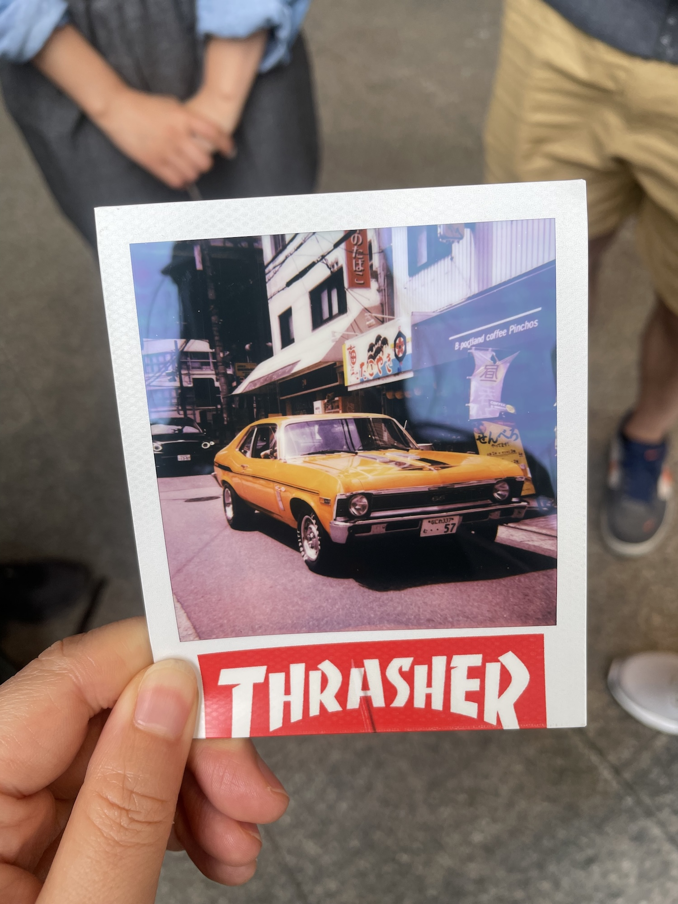
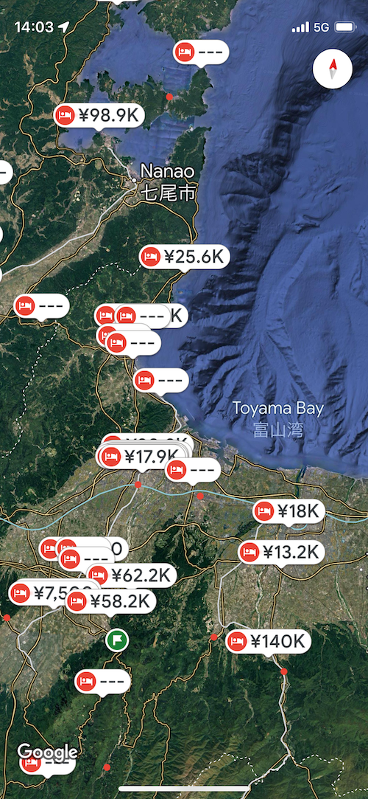
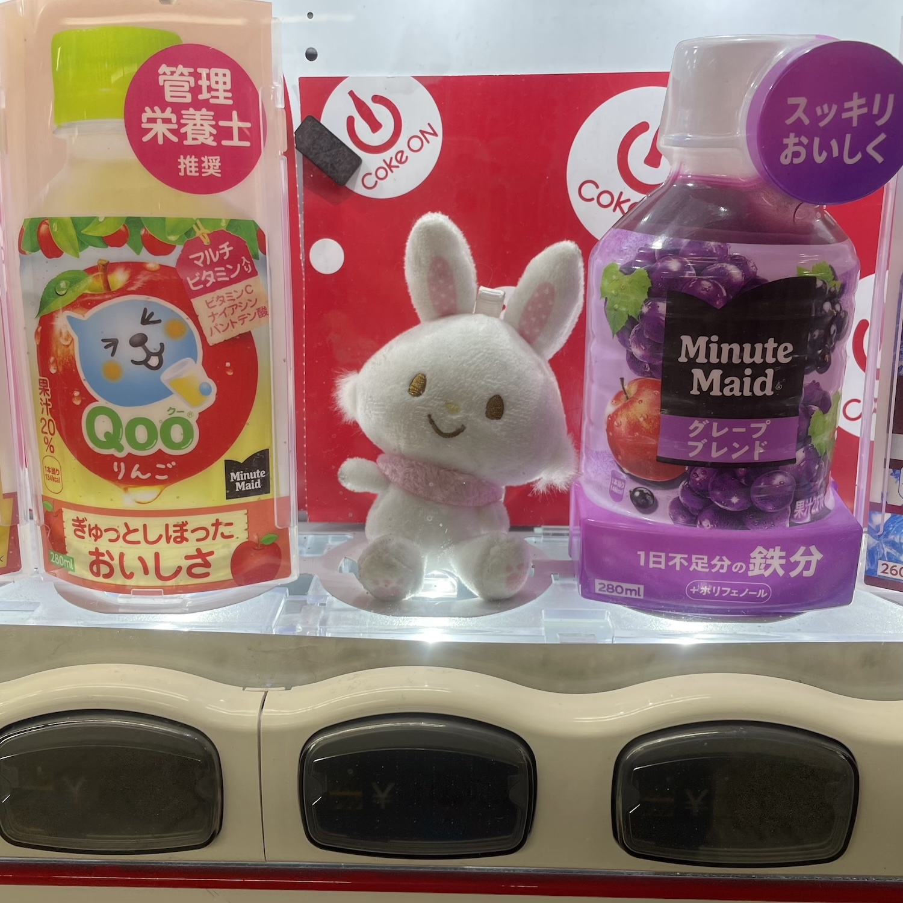

4月整体的感觉就像是Jeremy在第四季开头那样——busy busy busy——喂了猪去喂牛，喂了牛去喂鸡，再去喂猪，喂牛，喂鸡，没有一刻清闲。每天都很忙，很充实（非褒义）。但回头想想，记忆又像是飞走了一样消失了，想不起自己都干了啥。

**玩**

月初在好友Sarah的邀请下参加了一个线下的复活节主题绘画活动。蛮开心的一个下午。画了我自己可能永远不会想去画的东西。

月中去爬了趟吉野山。樱花都落了，但一路上聊天也蛮开心。这次挺快就爬上去了，没有几年前第一次去时那么吃力，挺意外的。

月底久违地去了Paolo的活动，没想到这是我能参加的最后一次了，他签证到期马上要回意大利。之后还会办一次但是我已经人在北陆无法参加了。这天也是去了从没去过的地方。见到来自美国的John，一路聊了很多。舒适。同时也察觉到在表达自己的观点时还是会受到日本的影响而支支吾吾不敢直接说出来。这天也只有我一个女生，好在他们都很绅士且nice。而且大家有很多相似的经历和感受，这就让人觉得更加亲近。提到东京和大阪类似于纽约和芝加哥，很有趣的类比。同时也提醒我，世界很大也很小，不要一直窝在日本这口井里。

定了五一出行的计划，早早买了夜行巴士的票，看一眼住宿，要么无房要么天价。择日不如撞日，干脆决定carcamping了。住车里一直是我的梦想之一。想停哪停哪（当然不可能）的自由。而且日本旅游，移动费用太高了，住宿能省下一点当然更经济。于是上班空隙里查信息，在montbell简单探索一番，买了outlet的睡袋和垫子。其他诸如chair，pocket stove，cooker，lantern，要么amazon要么百元店，简单便宜就好。现在不论哪个圈子，gear都越来越贵，反而国产很多东西功能不逊色大牌，实用价廉，很感人的存在。

因为上班太耗人，没有大块的时间，所以都是见缝插针在弄。行程只是定了个大概，并没有具体到每天哪些地方。反正上次和歌山连住宿都是提前一天才定的，没什么好慌。车到山前必有路。回程票并没有买，拿了JR的半价优惠券等到时候看情况再说。实在是没力气去计划这些。（都是上班的错）

**买**

本来这月没什么开销打算，等发了工资只打算买个sabon浴盐当作奖励，决定carcamping之后支出一下子倍增捉襟见肘。

除了睡袋、睡垫，还新买了一个Nikon镜头。反正早晚都要买，早买早练习！

买了几件衣服（终于还是买衣服了？！），我知道在NOBUY计划中啦。二手外套和T恤——这个纯粹是自己想买，两件西装外套——天气热起来了，黑色外套要热死，不得不自己掏钱买衣服。这锅是日本的，我不背。

同时也体会到上班的困境，上班就只能在假期出行，假期就所有东西都贵，哪里都拥挤，体验极差，极其没有性价比。而且上班后极容易通过消费来发泄和释放压力。感觉上班就是人为制造消费、刺激消费的手段之一？hmm

**书影音**

还是几乎没读书。路上一直在换乘，要么被挤成饼，每天又都很困，没心情看书。

月初两周补完了Stranger Things。好看，好看，没得挑。最近就是在YouTube上看乌克兰小哥锯木头做饭了。内心wild camping的欲火在熊熊燃烧。

**其他**

说说上班，从boring变得boring and tiring。大部分时间都是早出晚归，而且大有越来越早越来越晚之势。偶尔可以不到公司直接去见客户，可以比平时晚出门一点，稍微悠闲一点。心想这也算是个利好之处。这种时候大概是2，其余8都是：这什么狗屎！

博客，努力想写字，但是赶不上。

人间观察，日本的老龄化太严重了也，哪行哪业都在透露人手不够！工资太低！的信号。我作为外国人都不免会想这个国家怕是很快要完？的程度。但也许，他们可以继续发光发热到90岁。所以，not my business。

**Duty**

这个月还有件大事，就是support我弟。他专升本考试考得很好，考得太好了，许多烦恼也就跟着过来了。几乎每天晚上吃完饭都会跟他电话一到两个小时。偶尔也会感到累。但是想起我妈说他几年前说过“我姐去日本不回来了，我想我姐”的话，心里又很痛。感觉这几年我只顾着闷头在日本做牛马，没有好好关心他的感受，在他需要的时候没有陪在他的身边，很自责。

现在我能做的就是听他说出他的感受，鼓励他表达自己的情绪，肯定和支持他的想法和行动，仅此而已。我年轻时，有类似的挣扎和苦恼时，身边没人能帮我分担，也没人倾听。现在他在经历一些事情，我不想让他跟当时的自己一样感到孤单和无助。也想让他知道，很多事情没那么可怕，再大的事情，家人会和他一起面对。

好在这些事情都有一个好的收束，庆幸我有一直陪着他。

5.11补记：昨晚上失眠，想，为什么4月回想起来这么兵荒马乱呢？立刻想到是因为上班。不能按照自己的习惯和节奏来安排日常。做的事情大多也不是自己想做的，享受的。即便是喜欢的事情，比如hiking，也颇有发狠赌气发泄压力的一面，并不纯粹。这就是以不热爱的事为工作要面临的问题吗……