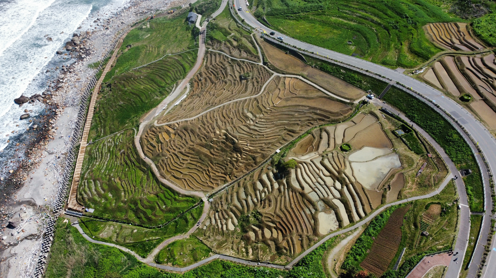
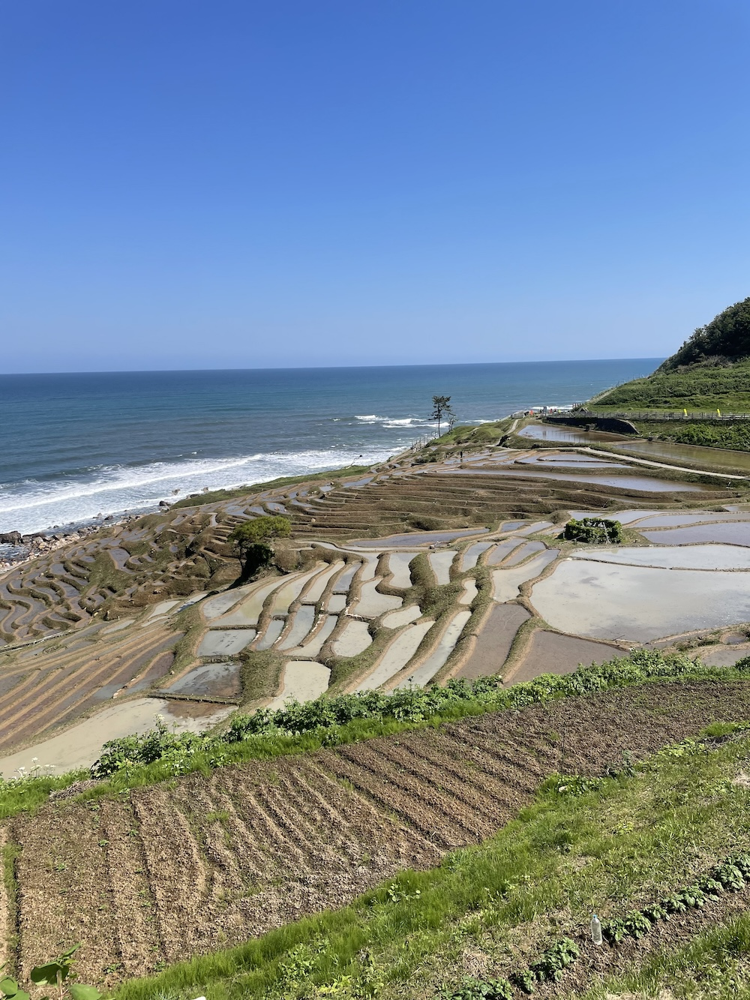
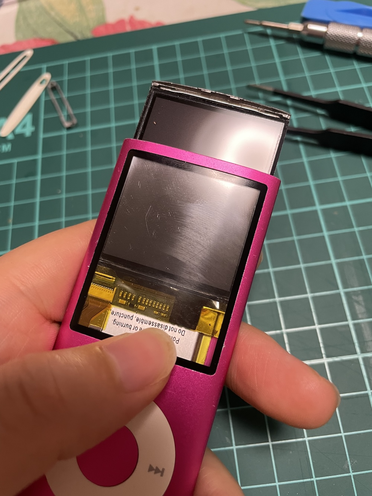
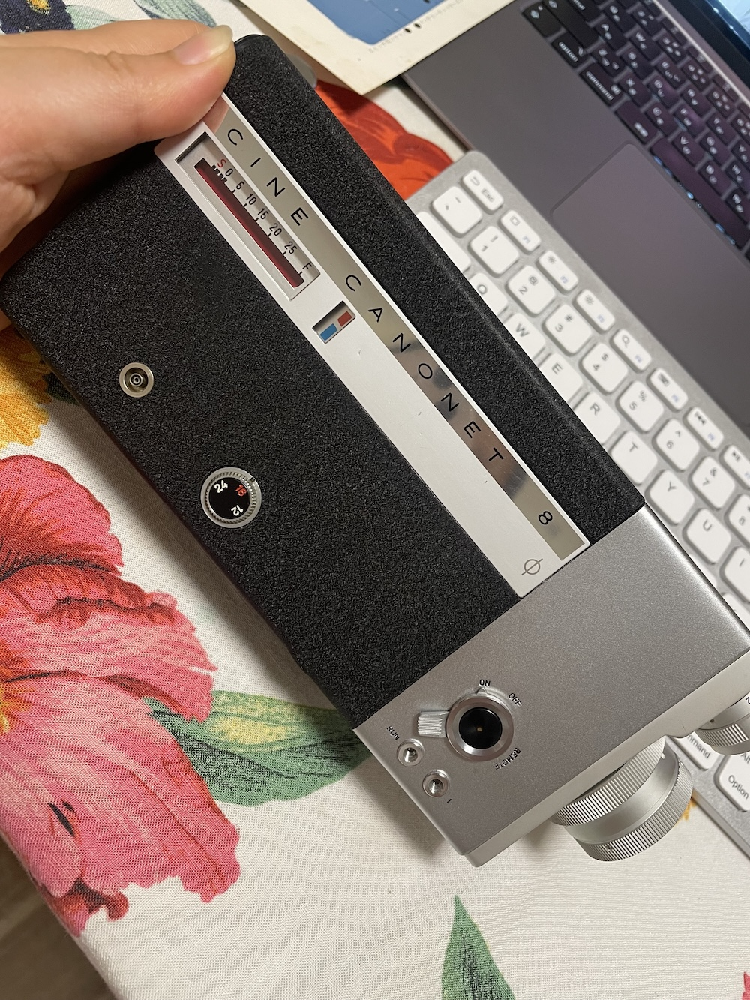

写来惭愧，5月博客只写出了2篇来。

五一的游记在慢慢写，但也是一写就巨长，还没有写完。或许上班没时间更近似于一个借口，但也确实是事实。

五月头一周时间放假，去北陆租车car-camping & roadtrip四天挺开心。做了一直以来想做的八百件事中的几件，同时后续想要做的事情比如整理照片剪视频也增加了三百件吧。呵呵。

   

出去旅游又把无人机搞坏了，一个机翼进了沙子不转了。回来又累又困拖拖拉拉总算月内拿到了换新（买）的机子，但收到一周多了，还没有试飞过。呵呵。

哦，照片至今没有导出，连看都没看，呵呵呵。

我连冬天的毛衣都还没有洗了收起来呢！

剩下的3周真是眨眨眼一样过去了。基本每周上班都是在外出跑营销见客户。具体就打工记里写吧。总之很累，平时下班很难有心绪搞自己的爱好。

——说归这么说，某天去一家二手店淘了两件电子垃圾：一个iPod nano 4th，一个1963年的canon cine canonet8，8mm胶片摄像机。这个月的缝隙时间全用来摸索这两件东西了。

   

把iPod的电池拆了出来，阿里买的替换电池望眼欲穿地等到月底最后一天终于送到了，能不能成功解焊再成功焊接上就请上天保佑吧。不过反正是拿这个试手练习的，还好还好。失败也在预期。

8mm胶片摄像机，日本这缺医少药的地方（？）胶片能不能买到no idea，总之现在确认了是能正常过片。过片的声音真好听！跟胶片相机又不太一样。

因为通勤时间太长而睡眠不足，整个人状态不好。瑜伽做得愈发形式凑合，有时甚至宁愿多睡会儿。也没有继续练headstand，就是简单的拉伸。之前那种迫切想起来做瑜伽的心情消失无踪，做的时候也不觉得多享受，感觉不到和自己身体的连接。偶尔做的时候都要睡过去——感慨做瑜伽这种乍一听有益身体恢复的活动也是有基础的。

这个节奏和趋势跟第一家公司时很像。最怕的是这样的日子一天天多起来、心情强烈起来，之后下班后只能瘫在地上，或早上在最后一秒艰难地爬起来，日复一日，直到某天彻底崩塌。

所以在刻意提醒自己重视睡眠。现在不但手机不往卧室带，iPad也不放床边充电了。发现睡前不看屏幕的话确实睡眠质量不一样。很像体验潘潘说的那种享受睡觉的感觉。

电影，赶着下线前看了最后一场《Un simple accident》。最近流媒体上乱七八糟的片瞎看，好久没看过这么简单有力好看的电影了。真不错。

音乐，也没怎么想，取消了Apple music的订阅，然后把app也删了，反正也不给我留playlist。导了几张cd放手机里听。自己花了钱买的东西自己想怎么弄怎么弄才对啊。

不写了，反正都是碎碎念。明天还要起来上班，还要收拾东西。睡觉。

写于东京深夜
