>哎呀，写太长了，恐怕没人看……没关系啦，主在记录😁

## 缘起/ Decision

今年日本的五一假有5天，4月初蠢蠢欲动想出去玩，四国和北陆。

没坐过夜行巴士，考虑到日本旅游一向来回交通费成本高，也想节省时间，就想坐夜行巴士体验下。两边一查，北陆还有合适的便宜夜行巴士，于是定了北陆。5月1号晚上10点难波发车，第二天早晨5点50到金泽。

再从金泽站旁边的Toyota租车行租了辆车。这时再去看住宿：

 

定睛一看，要么无房要么天价。罢了罢了。

于是一个很早之前就有的想法浮出水面——住车里，想走就走，想停就停。人生第一次car camping，择日不如撞日，永远没有准备好的时候，干脆撸袖子说干就干。

至于具体的计划，嗨，定好日期、最想去的地方，剩下的到时候看心情啦！

## Gears
大概搜一下需要的东西，上班见缝插针搜信息。陆续买了以下东西：

[睡袋](https://webshop.montbell.jp/goods/disp_fo.php?product_id=1121413)   
五一前后石川和富山那温度还偏低一些，且日本海岸一向天气差，风大雨多，夜里温度可以低到5度。没看别的，直接在montbell官网的outlet页面找便宜的旧款，先理解他的记号逻辑，锁定No.2的几款，舒适温度0度，据说3季通用，且compact。然后去店里问了下店员，说女性款更fit，体感会比普通180cm款更暖，而且这款脚部充绒更多一点。我怕冷，没犹豫就决定这款了。折后2.8万日元。

天王寺mio店有专门的outlet区，也有靠谱懂行的店员，购物感不错。跑个题，在日本，日语可以流畅沟通、描述需求细节的话，买这类 **「因存在使用场景差异而需要做选择」** 的东西时会大有裨益，店员也会倾向分享很多细节知识，大多是网上很难看到的，做选择有如神助。PS：montbell很多线下店有outlet区，实地看看摸摸更放心。

[睡垫](https://webshop.montbell.jp/goods/disp_fo.php?product_id=1124953)   
也是montbell。听店员推荐，这款里面有加料，隔热好，R5.0，就是麻烦要吹气。新款自带小型充气袋，旧款没有。不过无所谓。随手加个付费会员卡，比标签价还低了点，1万出头。这两样大头刚需一共4万日元。

[充气泵](https://www.amazon.co.jp/dp/B0DZHSX67F?ref=ppx_yo2ov_dt_b_fed_asin_title&th=1)  
amazon很多款都自带led灯，可以做lantern。选的这款电池容量稍大一些，实际用下来感想是，选个容量小点再便宜点轻点的足够，没多少技术含量的差别。

[Lantern](https://www.amazon.co.jp/dp/B0FS18JNZD?ref=ppx_yo2ov_dt_b_fed_asin_title)   
可以折叠，带调光，type-c口，可以做充电宝。东西都是made in china，价格多一层海运费。淘宝更便宜选择还更多一些。估计用起来都差不多。没必要买牌子，没多少高精尖科技。

[折叠椅](https://www.amazon.co.jp/dp/B0FLCRT4TV?ref=ppx_yo2ov_dt_b_fed_asin_title&th=1)   
amazon看到还算轻便的款就买了。组装容易，拆了如何塞回袋子是门学问，到现在还没搞清楚。整体感觉良好。没有用太多，以后hiking可以揣上。同样淘宝会更多。日本线下实体店，比如conan，komeri，也有很多，还有带扶手cup holder的，甚至更便宜。扛得动的话选择就太多了。

**窗户遮光**  
这个就自己发挥了。没有像网上说的买那些根据车型定制的Fancy and expensive的遮光隔热垫，一来不知道租到什么车，再者也不是多频繁使用的刚需，合理抠门能省就省。百元店买了一片冬天常见的保温铝膜，带把剪刀和masking tape，到时比着窗户剪了贴上去。不够了找个店再买。不想要了就丢掉。实际使用效果很好。

**cooker，foldable stove，fuel，knife**  
这些都是陆续在不同百元店买的，有的还是在北陆逛了一天之后才买。百元店的固体燃料（推荐Seria，比Daiso好），烧水是烧不开的，但烧到95度左右是可以的，煮个面热个牛奶泡个茶也足够。就是需要极大的耐心。这一堆1100日元。试验性质，体验下户外cooking，以及确认自己的需求，所以先买最简单的便宜的。之后还是想买proper cooker和stove。

## Day 1  Sunny
🚌金泽➡️钱汤➡️取车🚗Supermarket shopping🚗千里浜Drive way🚗稲葉山牧野🚗 ⛺️小矢部驿站 

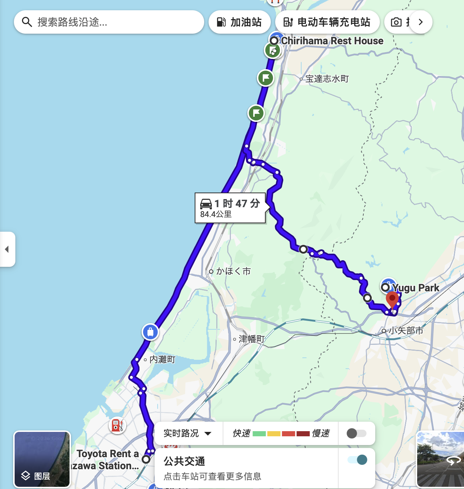
[**路线图**](https://maps.app.goo.gl/JWXp4zKHKqWBANLn9)

5点50左右到金泽站，一站地远的东金泽附近有家钱汤，早上5点营业。先去泡个汤缓解一下疲劳。

（插评：夜行巴士不舒服，躺不平，空间小。即便司机开车稳但还是难免左右摇晃，活遭罪。观察了下坐的都是20左右的年轻人。虽然有看起来稍微舒服点的其他车型which means更贵，但我这把老骨头已经经不起这种折磨了，再也不坐）

这家[和おんの湯](https://www.waonnoyu.com)还不错。8点之后提供早饭，500日元。前台亲切，主动帮我存大行李，感激。泡完出来7点半，已经饿虚脱了没力气出去。饭还没烧好，就先给了厨房老奶奶食券，坐着等。饭一出锅老奶奶立刻给我盛好，笑眯眯地说焼き立てご飯。像是对自己的孩子说话一样，很可亲。食物很简单，章鱼肠一股怪味，估计坏了。但饿急了什么都不挑。吃完又生龙活虎。

回到金泽站去Toyota取车。墨绿色Roomy，不是常租到的Yaris。晚点体会到了这车的好——四四方方空间大，后座可以几乎放平，没有空隙需要填补。

先去一家顺路的超市买补给——2L水，香蕉猕猴桃西红柿，伊藤园蔬菜汁，香肠腊肠，炸鱿鱼圈牛肉饼，还有薯片。


东西种类比便利店多，而且便宜，实惠！
根据自己的喜好和需求买好必需的食物，有粮在手，心里不慌，增加安全感。  
路上饿了渴了随时补给，不需要临时找便利店买高价且有限的东西，节省时间&金钱。  
想去的地方大都偏僻，可能路上前不着村后不着店，买不到。  
日本外食缺菜少水果，容易便秘，备好蔬菜水果，吃了开心，出门不觉得受委屈，也同时照顾好肠胃均衡。  
还能顺便探索下不同的店，观摩下当地人的生活。喜欢。


这店叫LAMU，是家挺大的問屋开的，关西也有，就是偏和少。店铺摆放风格独特，箱子叠起来当货架，节省不少装修和储存成本。特点是便宜——日本人都好这口。现炸的可乐饼天妇罗鱿鱼圈什么的79日元超便宜，味道诱人。实际上这天午饭就是靠是这些解决的。在停车场摸索了下怎么放倒后排座椅。刚开始以为完蛋了放不平要睡椅子了，仔细看了下座椅旁的示意图顺序成功把座椅放倒，略有坡度，问题不大。而且跟前排座椅没有空隙，完美！

当天千里浜沙滩网页显示禁止通行。这真是噩耗。上次冬天来就一直禁止通行。前几天看每天都可以走，偏偏到了就禁止？倔心眼子还是决定开过去看。半路高速上狂风怒号，旁边看到日本海，大浪淘天，那浪翻得特别猛，很恐怖，忍不住想这是要海啸的节奏？

开到一个休息处，下来可以走到沙滩上去，沙滩被浪逼得只有两三米宽——这肯定是不能开车的，脚趾头想都知道太危险了。心服口服，但心情还是选择继续北上，不能开车，能在沙滩上走走也行。一直开到羽咋市的千里浜北口。在沙滩上晃悠一下，逛下旁边的Rest house，点了扇贝自己烤。

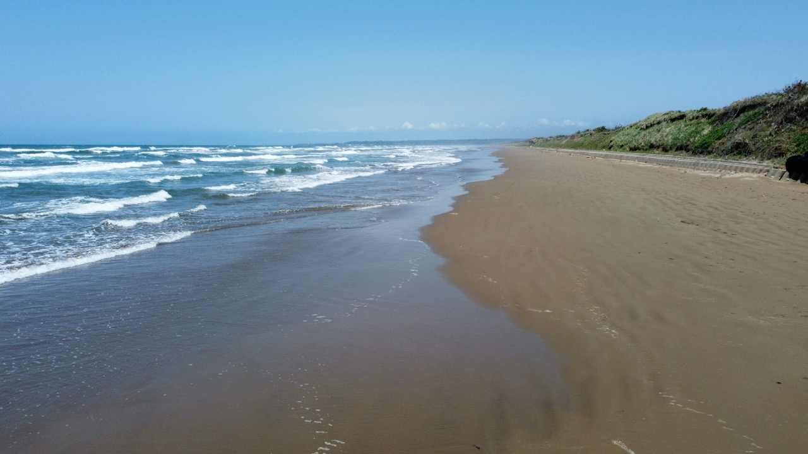

为什么去这里。这是日本官方公开唯一可以在沙滩上开车的地方——当然你在没人的沙滩悄咪咪开应该也行。更重要的是，这是Top Gear当年Japan Race的起点。我来“朝圣”的。在这里找到了James和Hammond确认地点的路口，地图牌子已经换新，但周围的建筑还是一样，没变。事前查的时候很激动，真到了却很平静，想象他们从北口沙滩沿着荒无一人的公路走到这，很微妙的感觉。

拐个题，我猜当年他们是头天傍晚在沙滩拍的开头，隔天才是正式的Race。因为沙滩的镜头是逆光，太阳在西边，已经是下午黄昏了，不可能当天开到东京。

然后开车去稲葉山。上面有小农场，可以看到牛。Clarkson's farm火成这样，谁不想看牛牛呢？山顶风景很好。山不高，但中断山路爬升的坡度很大，很快就开上去。山顶很平坦，四周的山丘连绵起伏，绿油油的，长满高高的牧草。风吹过，划出长长的痕迹。临近傍晚，太阳西斜，山顶的小动物园已经闭园，停车场空空的，没什么人，四处都很安静，只听到风声、鸟声。

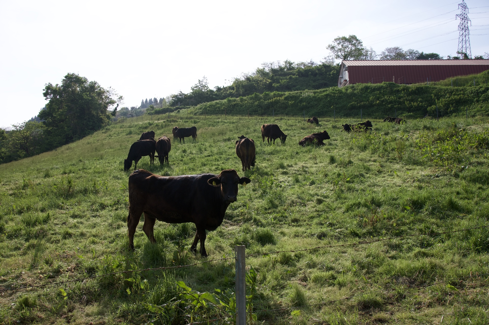  
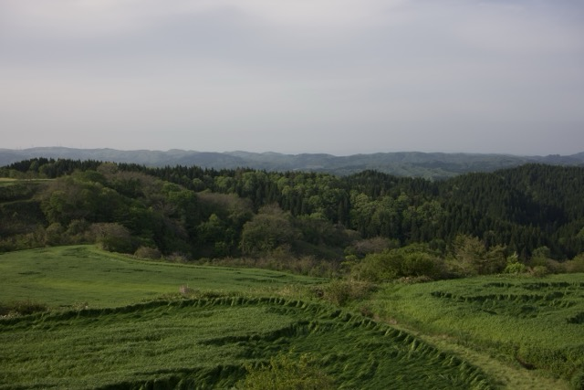

中间有片树林，全是高大的杉树，感觉很适合露营。樱花才开始谢，飘落一地的粉色花瓣。山顶有个小型展望台，旁边是间休息室，很大一间屋，一半是床一样高的榻榻米台，上面摆了两张宽大的矮桌。有Wi-Fi，有插座，有厕所。如果夜里不上锁，直接睡在这里会非常完美。窗户外面，樱花树杈在风里摇摆，躺着看了一会儿，趁还有一点暮光下山去。

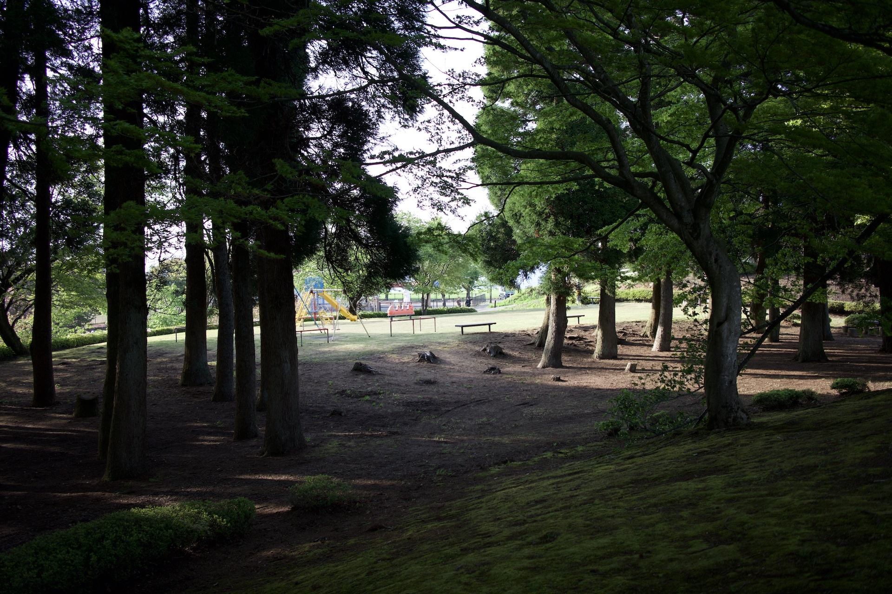  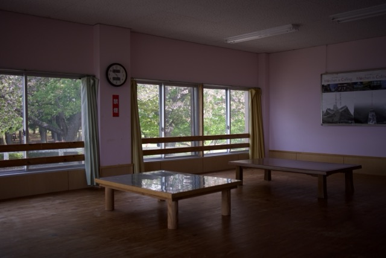

这天就停在山下的[小矢部驿站](https://maps.app.goo.gl/RgjfPxBiC9B4cJLy8)，旁边有家挺大的温泉，停满了车，里面估计爆满。这个驿站临近主干道，交通方便。停车场很大，我观察很多人都停这里过夜，还有好几辆小房车。厕所比我租的房子还宽敞。外面是水田和山丘，晚上蛙鸣四起，甚至觉到聒噪，又反衬得格外宁静。

这晚刚好是满月，初升的月亮黄黄的大大的，天空黑得纯粹，能看到很多星星。

旁边有家三井奥特莱斯，里面许多家餐厅，这晚就在Gusto吃的烤蔬菜和意面。外面还有北陆常见的8番拉面，麦当劳，一家大型超市——去买了泡面和烤鸡肉串——成了第二天的晚饭，罗森，药妆店，komeri。吃完晚饭又开车5分钟去附近的seria买了固体燃料和隔热垫贴窗户，在厕所洗漱下就回车里睡了。

## Day 2  Cloudy ➡️ Rain&Storm  
小矢部🚗 高冈瑞龙寺🚗 高冈古城公园🚗 高冈大佛🚗 ⛺️常願寺川公园  

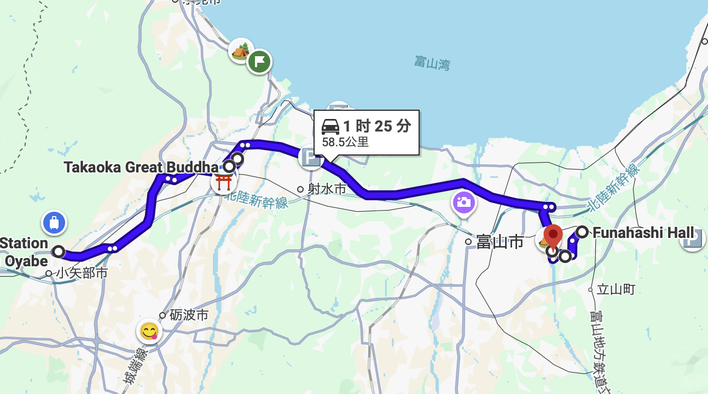
[**路线图**](https://maps.app.goo.gl/3QcSkkYzqmrZGXkb7)

这天主要目的地是高冈，之后有两个方案，一是去雨晴海岸，在附近的camp site过夜；一是去富山的常願寺川公园，那有个免费的河边露营地。但问题是几天前起天气预报就是整天下雨。

早晨不到6点就醒了。连上时断时续的Wi-Fi，富山的Wi-Fi做得挺好，不需要邮箱验证这种烦人操作。在旁边草地做了20分钟瑜伽，感觉醒过来。去麦当劳吃个早饭。回来刚好驿站前卖陶瓷的在出摊。跟常见的日式陶瓷略有不同，画的小鸟蔬果，另有一番趣味。挑了一番，买了两个别致小巧的。回到车边，头天晚上隔壁露营的车都早早开走了，新来的都是遛狗的。搬出椅子坐着看了会儿狗子们，10点出发。

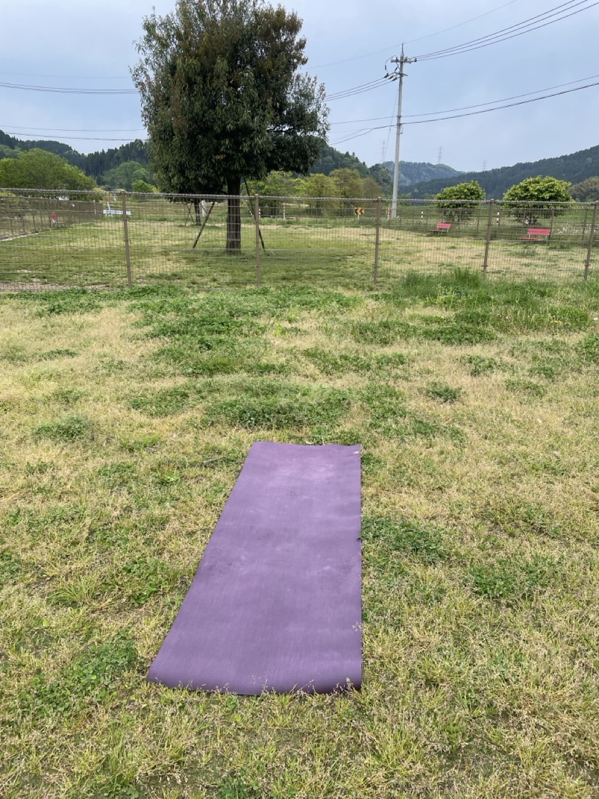   

瑞龙寺也算是是高冈有名的景点，上次来高冈留意到就想看一看。四四方方的，很空。这种感觉全日本人都出动在旅游的日子也不觉得人多，只看到2个金发外国游客在抹防晒。但说实话没多少看头。倒是建筑结构有点意思。晃悠一圈出来，旁边有家店卖冰淇淋，买了吃完去公园。

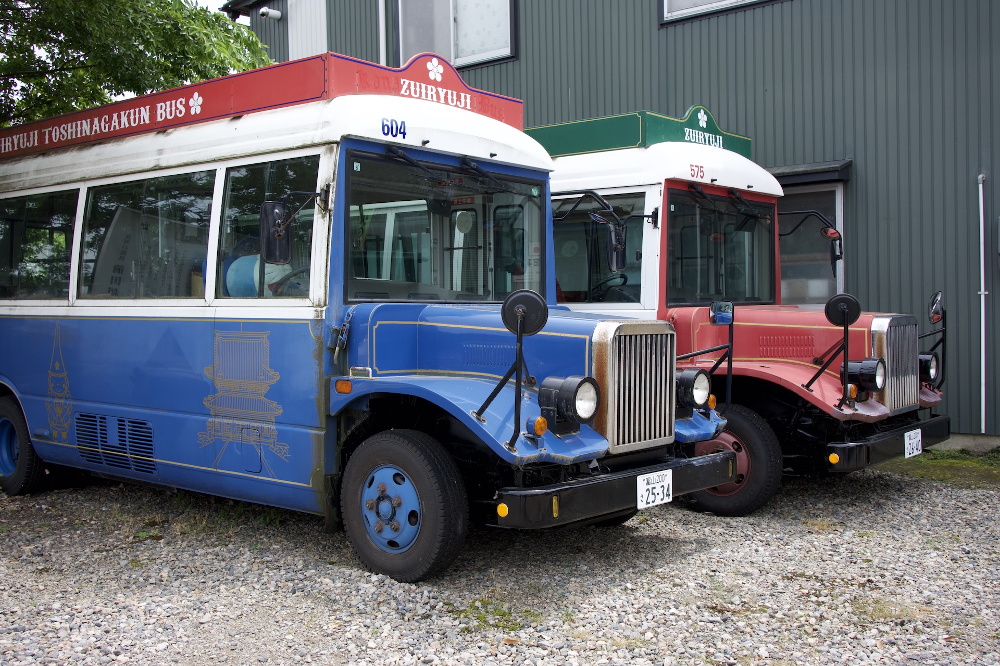 

高冈古城公园，是以前高冈城的遗址。很大，随便散步野餐遛狗都合适。中间有家小动物园，免费进。里面有企鹅。跟椒盐豆豉年初在南极拍的超极可爱小企鹅是同种。还有猴子孔雀两只小ponny一群火烈鸟和其他乱七八糟的动物。逛了下，感觉除了企鹅能在水里游来游去还算开心之外，其他动物都给关在狭小的栅栏或者玻璃水泥、铁网房子里很不开心。有只狸猫一直在转圈，很抑郁的样子。这天中间的空地围了一圈出来，搞petting，里面有两只小兔子和一只大陆龟，可以摸。逛一半我鼻子已经痒起来，怕过敏，赶快走掉了。

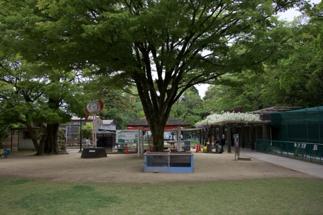

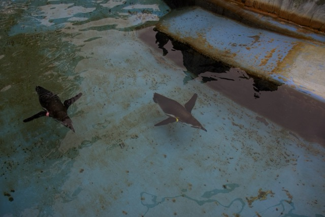  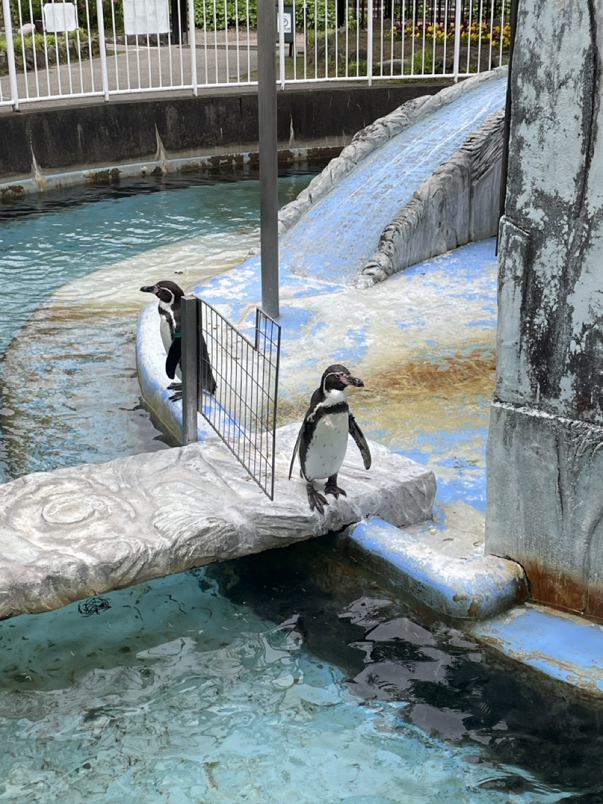

看动物的时候已经开始飘雨点，走到高冈大佛变成小雨。这边也就是10分钟转一圈而已。花坛里新栽的花开得正好，等开完了怕是会立刻被铲掉种上新的吧。倒是走在街里更能发现有意思的东西。随便拍几张照，已经4点，回到停车场，雨开始变大。估计雨晴海岸天气可能更差狂风暴雨，决定去常願寺川河边看看。这个天气河边野营恐怕没戏，旁边的公园里也许可以。

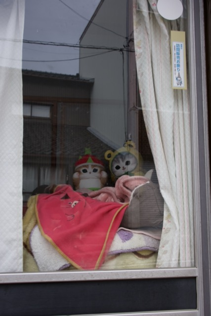  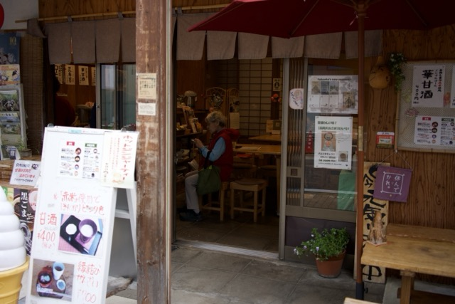

开过去不过1小时，天还微亮，蒙蒙细雨。公园里也几乎没人，BBQ营地亮着灯，停车场里停了七八辆车，旁边有个很大的公共厕所。转了一圈初步决定晚上就停这儿。不远处树下，有人已经扎好了帐篷，摩托车停在旁边。我心里暗喜找对了地方。趁还有时间先去不远处一个便宜钱汤泡澡。

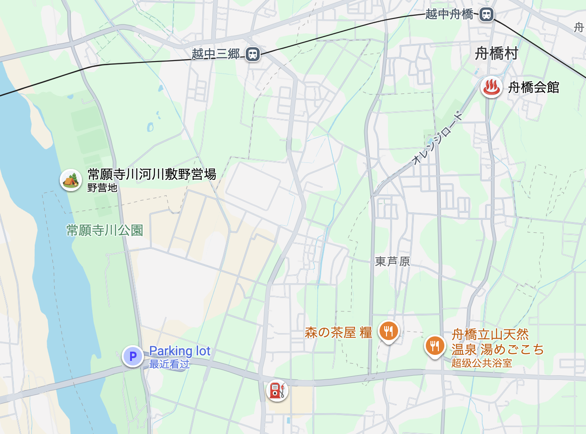

钱汤在舟船会馆里，到的时候刚好有个间隙雨停了，云彩后可以看见一点立山连峰雄伟高耸的雪山尖，不愧被叫做日本的阿尔卑斯，即便只是云雾间一小片也非常壮观。那种不像是日本通常会有的壮阔风景，让人特别特别激动。  

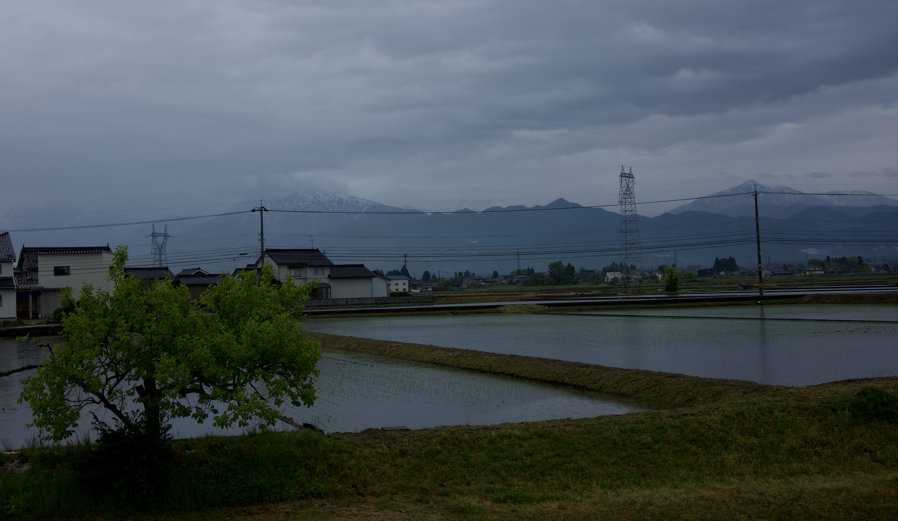

这个会馆是地区福利性质的设施，会办料理讲座之类，有小型音乐会，也提供场地租赁。钱汤最近涨价了，450日元，小小的，泡得很舒服，出来感觉全身都在冒热气。

天已经黑了，风雨交加，能见度很低，两边的水稻田泛着微微的光，不知怎么看起来跟柏油路面竟然是一个颜色，很怕自己一走眼开车一头栽进稻田里。

回公园时路边有家便宜的汽油站，加满油。旁边的すき家大排长龙。风雨很大了，我想赶紧安置好睡觉的地方，不想大半夜还要手忙脚乱铺床。于是直接开回公园。

本来打算在BBQ的棚子下煮泡面，到了发现，deck下面也会溅湿，而且风太大，百元店的工具怕是会立刻被吹灭。而且这个停车场四周没有遮蔽，风太大了，车被吹得左摇右晃。雨点很激烈，噼里啪啦打在车上也很吵。我也不能冒险在租来的车里烧水。总之一切迹象都让我强烈地感到，这里不适合过夜。雨和风把刚泡汤的热乎劲要吹没了。急中生智转到探路时发现的旁边一个高架下的停车场。

这里也在公园内，到了之后发现已经有人在车旁边扎了帐篷，而刚刚树下的那个摩托手的帐篷也转移到桥柱后面了。我可真是天才！旁边有厕所，甚至还有一个自贩机。OK，perfect。

找了个背风的地方点火烧水煮面。没有问周围人可不可以在那里生火。估计9成会是NO NO NO。I don't need other people's permission. I'm a grown woman with free-will. 我决定了那就可以。反正没写不能。周围人看见了也没人说什么。因为如果我问，就给了别人权力；自己直接做，理所当然地做，反倒没人来质疑。

说回来，先烧了热水装进杯子，再烧水煮面，把头天买的鸡肉串和刚才加油时顺便在旁边罗森买的蔬菜也放进去。燃料烧完也没有沸腾，但目测也有90多度，足够了。收拾好东西回到车里，把杯子放好，先把周围收拾好，睡垫睡袋铺好，需要用的东西放旁边，不需要的挪副驾。就慢慢来，也不急燥，并没有发生心烦意乱一不小心抬手打翻了刚煮好的泡面，汤水撒满车内座椅的戏剧化场景。腿套在睡袋里背靠驾座，泡面闻着香喷喷的，iPad里提前下好了Grand Tour，坐着边吃边看——这一刻感觉太滋润了，有比这更享受的事吗？没有！！

这晚幸亏停在了桥下。前半夜狂风大作，呼地一阵风刮过来，像一记重拳打在车上，整辆车抖得像地震一样，不敢想象如果在之前那个停车场会多么危险。甚至睡梦里都担心下一秒车就会被掀翻了——但又懒得理，It's out of my control。继续睡。后半夜平静了很多。明白为什么流浪汉会选择睡桥洞了，是真的相对避风又干燥的好地方。以前知道是知道，和亲身体验来的知道，总是不同的。

## Day3  Cloudy ➡️ Rain  
朝日町🚗 lunch射水驿站🚗 海王丸🚗 ⛺️七尾和仓温泉  

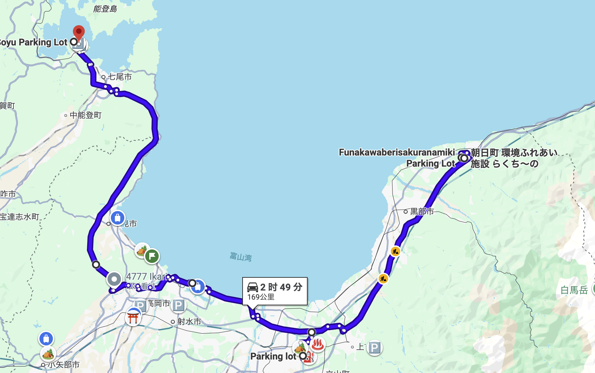
[**路线图**](https://maps.app.goo.gl/Pmy1TEp5A4gYVFe7A)

这天并没有很明确的计划。本来想去立山看雪的大谷，但收费公交要1万多，还不一定能买到票，why bother？ 天气预报一直报雨，于是也是，看心情决定！

早上一看天气大好，阳光明媚，云很多。四周葱翠的树木和茂盛的草丛，都被昨晚的风雨洗刷一新，在清晨的阳光下闪着光。到处都很可爱。

点火烧水，泡了杯红茶，又热牛奶喝。热过的牛奶特别香。在野外，好吧，半野外，热牛奶喝起来格外香。

还是想跟着top gear的路线走，想看立山连峰。但云很多很厚，可能看不到。But still give it a go。开到朝日町去看那个著名的出片地，背后是高耸的雪山，中景是盛开的樱花，前景是层层叠叠的郁金香和油菜花。

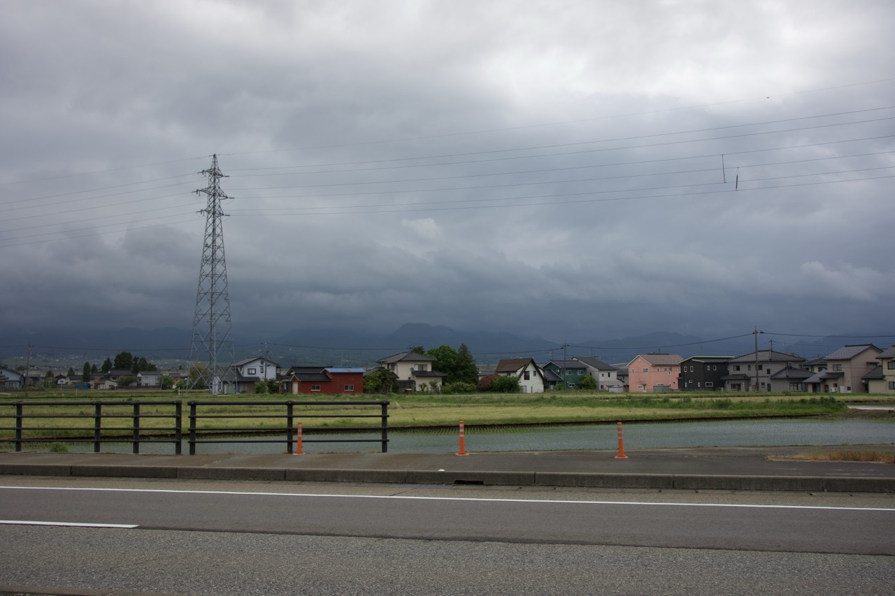

路上开开停停，一边观察两边的景色，阴云密布，果然看不到山峰，甚至不及昨天的视野。开了快2个小时才到，拐到一个当地会馆上厕所，意外发现很不错。跟昨天的会馆类似，一进去发现是个很大的钱汤，还有健身房和游泳池。感慨小地方的这类服务设施真是不错，满足精神需求刚刚好，又没有各种眼花缭乱的mall刺激和诱导消费。出来按地图摸过去，居然很快就找到了。有免费的停车场，空空的没什么人。风很大，仅有的几个人也是拍拍照立马走掉了。听口音中国人挺多，到底国人厉害，专门跑这么远。不过说归说，看看我，不也是？哈！这边樱花已经谢了，郁金香也过季了。只剩油菜花还开得正好。心说这个景色层次确实好，随便拍拍都好看。也能想象盛期该会非常漂亮。

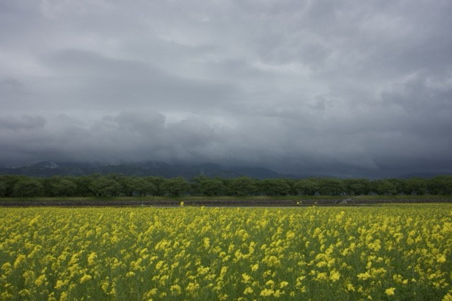

掉头返回高冈方向，往轮岛开，之后准备去白米千枚田。中间还想看下海王丸号，一艘大帆船。如果挂上帆，再加上背后的山会很好看。在射水驿站吃了午饭。这家驿站人多得异常，像是终于发了粮票赶紧去买粮食一样，人人都在抢着往购物篮里塞东西，跟平时没买过似的。

去看海王号——可惜这天没有帆。不过也够了。还有观光船可以坐。这天有个什么表演活动，歌手捏着嗓子又唱又跳。不过我意不在此。时间有限，赶快往北走。但傍晚前铁定是开不到轮岛市了。折中下，在七尾的和仓温泉找个地儿睡。

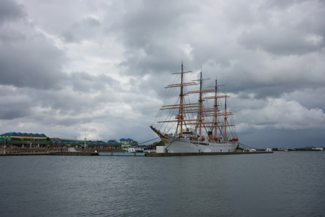

既然叫和仓温泉，那自然要泡一下温泉才行了。停好车天马上要黑。先去看下营业时间确定7点后也不晚。然后附近找地方吃饭。这里就不太舒服了。毕竟小地方，各种招牌都很隐蔽。天又黑，照明差，几乎什么都看不到，两边黑黢黢的建筑物默默地伫立着，了无生气。

看到一家拉面店——现在已经对拉面无感了，汤腻，肉腥，盐太多，吃完第二天肿成猪头——一家章鱼烧。还有家大阪烧，进去一看，典型的职场延伸——居酒屋，一堆人都脱了鞋围坐在桌边大喊大叫。老板娘来问有没有预约，我说没有，她一脸愧疚地说只接待预约客。OK，虽然空桌还有一大堆，咱找别家。谷歌地图在这种小城市没多少可信度，标了营业中的店铺，好几家根本不存在。风很冷，吹在脸上像拉刀子，街上也没人，四处都很冷清，难免焦急。于是转回章鱼烧，发现只能外带不能堂食，这次换我一脸愧疚地道歉了。

最后发现家美式风格的洋食店，从外面看像那种白色沙滩小房。不过天黑了没心情观赏直接进去。里面只有两张桌和很矮的旧沙发，坐下去就陷进去了。墙上贴满了大联盟和美漫海报，电视里在放大联盟，还挂了个玩具一样的飞镖盘。老板是个一脸严肃的老头，冷冰冰地说菜单在桌子的抽屉里，点单要自己到他那去报。菜单是汉堡烤肠之类的，点了个taco rice，量很大，料也多。自己找到叉子，忽然想起来缺点什么，问有没有水。老板说他家所有东西包括水也是要付钱的。又想起来自己杯子里还有点水，刚掏出来，立刻被老板喝止，说他家拒绝自带饮食，语气很凶。OK，把杯子放回去包里。吃完饭，把餐具递回去，走人。倒也不觉得气愤，毕竟这种规矩很多的店在日本很普遍，我又是个“不识相的外人”。我很少因为服务而评判一家店甚至打差评，态度糙点无所谓，东西好就行。但这次明显感到一种居高临下的霸道和欺生。食物是好的，但在这个环境里美味也会减几分。这家店好吃是好吃，但我不会推荐。

泡汤。人超多，冲澡的地方几乎满员。温泉倒是很好。出来买牛奶，号码是14，才按个1，1号草莓味饮料滚了出来。拿着饮料一脸懵逼。然后看到旁边有行说明，每个号码分别对应一个按键，跟密码一样。不甘心去找前台问能不能换，一个清洁奶奶打开机器帮我换了——这件事告诉我们，不要责怪自己，也不要委屈自己接受，厚着脸皮找人解决就可以。

在里面待到9点关门。温泉停车场外面写9点后会关闭，但首先并没有门，到9点20也没人来拉链子的迹象。不过还是先开车去711买补给，再接个热水。到来时路过的一个海边免费停车场看一眼，已经停满了露宿的车。附近开车逛一圈，发现一家似乎可以露营过夜的店铺停车场，一个很大的运动公园停车场，还有若干完全没人的黑漆漆的店铺、酒店停车场。又回到温泉停车场看一下，果然没锁，有一辆车在里面。但旁边的公寓楼照明像是哨塔一样亮，地形也有点倾斜，决定还是出去。各种打量一下，运动公园似乎都是空车，毫无人气，直觉不喜欢。一番折腾，最后停在那个满是露营车的停车场附近的另一个小停车场——这两个停车场共享一个海边公园。附近是一个大交叉路口。快速整好东西立马睡。前半夜能听到一些小年轻在外面痞子一样嚎叫和一些车经过的风声，后半夜就一夜宁静，也算睡了个好觉。

## Day4 Sunny    
白米千枚田🚗とぎ海街道🚗气多大社🚗千里浜Drive way🚗金泽站🚅大阪 

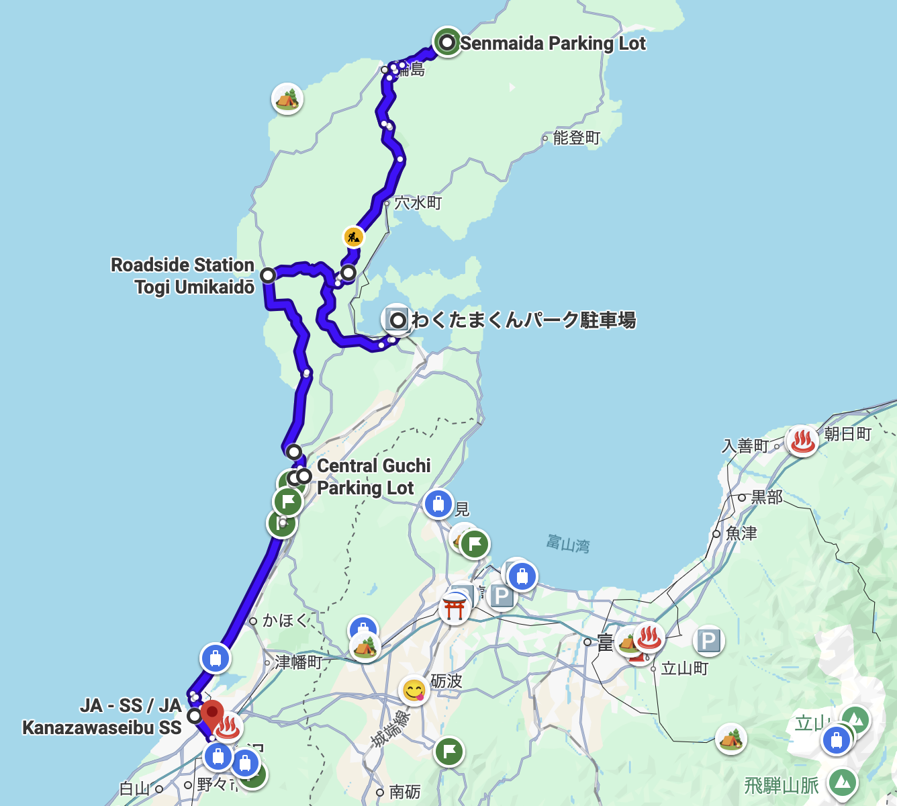 
[**路线图**](https://maps.app.goo.gl/sRHW9KogEZRuhNLB9)

这天的计划是先去千枚田，然后沿海岸去严门附近的一个驿站，再去严门、气多大社、千里浜沙滩。然后回金泽，坐车回大阪。如果有意外，就途中找地方过夜，第二天一早赶在9点前还车。

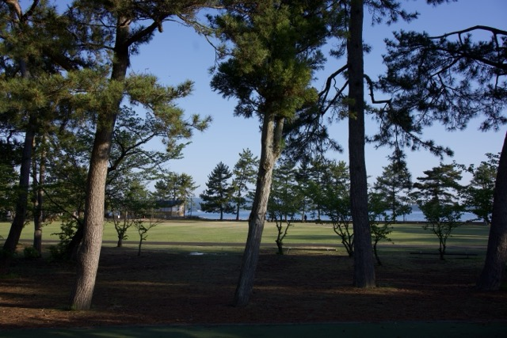

起来天气晴好，收拾一下，去711买三明治坐车里吃。有只乌鸦站在旁边的地上，直直的看，看得我实在没法不给他。有人经过，对着乌鸦指指点点。日本人对喂鸟这事啰嗦得很，大抵嫌恶的多。悄咪咪往远处丢，乌鸦立刻飞过去吃。乌鸦实在是非常聪明的鸟，我怀疑其实在停好车跟他对上眼的那一刻就已经被他看穿并认定会给他食物。一个小提示，如果在日本看到乌鸦叼垃圾袋，不要去赶，据说乌鸦会叫上同伴来报仇，它们会记住你的衣服，还会专门啄人眼睛。

回到昨晚那家温泉，在门口免费的足汤泡个脚舒服下，开车赶路。

前面没提，在七尾已经注意到有很多正在拆除的建筑，整个城市一副倦容，直觉猜想是24年初地震的影响。后来查一下果然当时受灾影响最大、死亡人数最多的城市之一就是七尾了。越往北开，两边的风景更强烈地提醒我，这个地方还活在地震的影响里。高速上许多处还在修，只能轮流单向通行。像是怕人催一样，修的路段都立着超大的标识，写：复旧正在进行中！临近轮岛市，看到一些塌了一半的房子就那么荒着，地面陷了一个大坑，广告牌歪在地上，看来房主是放弃了这个地方。

白米千枚田是个块梯田，有很多块小梯田，面朝大海，5月水田里灌满水，日落时梯田反射着阳光像一面面的小镜子，曲曲折折的边缘线很好看。6月绿油油的稻子长起来，顺着山势而下层层叠叠又是另一种美。我更想看绿色的。

到之前做了下心理建设，这几年转悠许多地方，发现很多景观写得很厉害很气派，实地一看小小一丢丢。果然这个也是一律，看了感想是：哦。

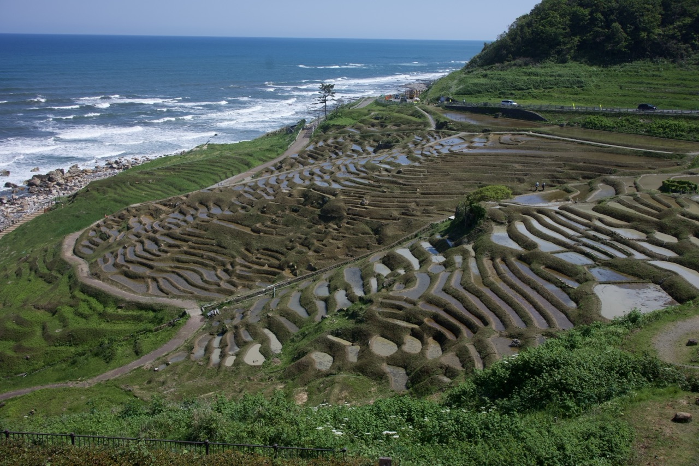 

沿着梯田转一圈，15分钟走完了。面积很小。大致分成3层，最下面看着像是没人种所以没有灌水，长满了草还是野稻子，已经绿油油一片，好看。中间和上边部分都有人在里面劳作，还在犁地，没有开始插秧。他们用那种小型的机器，推着往前走。看着也是很辛苦的劳动。

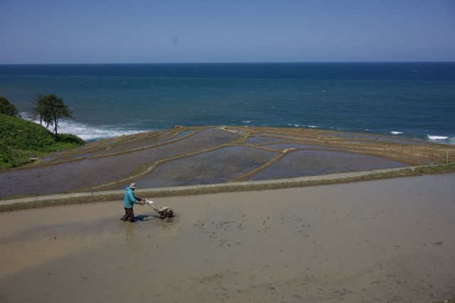

千枚田的驿站小小的，设施和服务却全面且人性，有很多垃圾桶——有些小驿站不提供——小卖部里有很多当地材料或者主题相关的文创手作周边，很有创意，看了让人眼前一亮。有剪纸明信片，插画明信片，有贝壳做的胸针耳坠项链，都很别致很漂亮！很想买一堆来支持这种实打实的创作。外面还有个老奶奶在卖手工编织的挂饰，感慨这边人创作欲这么高！是不是物质限制没有那么多购物中心、各种娱乐活动转移注意力所以更方便专心创作？纠结半天买了一套胸针几张明信片——买太多怕自己不珍惜，也怕沉。

千枚田逛完已经快12点了，赶快开车往严门方向走。这时刚好前面没有轻车压着，振奋精神一路猛冲过去，1点出头到了驿站[とぎ海街道](https://maps.app.goo.gl/yunvzZqtGLtBiLgF6)。这里有个‘世界第一长椅’——没什么意思。沙滩更好看，驿站也很有意思。这家驿站设计很古风，老老的日式风格，给人印象很不一样。最好的是，里面卖超级漂亮的粉色樱贝，各种组合和包装，简直让人眼花缭乱。在小矢部拿的地图里看到这个驿站简介下面挂了贝壳照片，第一反应就是 I want one！

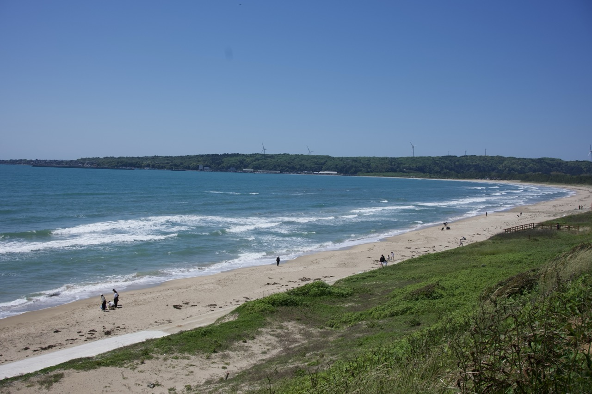  
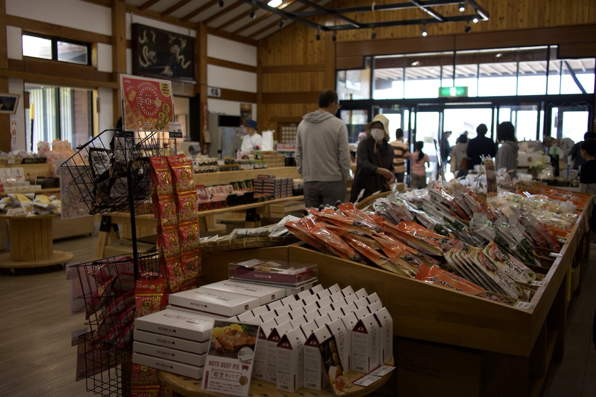

这种粉色贝壳似乎是这边的海岸的特产。特产？Anyway, 冬天会有超多樱贝被冲到沙滩上来，深浅大小不同，非常好看。怎么我一直在说好看。驿站里还有个小而充实的贝壳博物馆，好多好多贝壳。墙上挂着贝壳做成的火烈鸟之类动物画像。展台里是各式贝壳的名称介绍。靠墙一排大柜子，窄窄的抽屉，可以自由拉开看，里面是满满当当的各种贝壳标本。那个纹路，那个形状，和颜色、质感，简直就是我的天堂！搁小时候，我肯定天天来这里泡着琢磨贝壳。

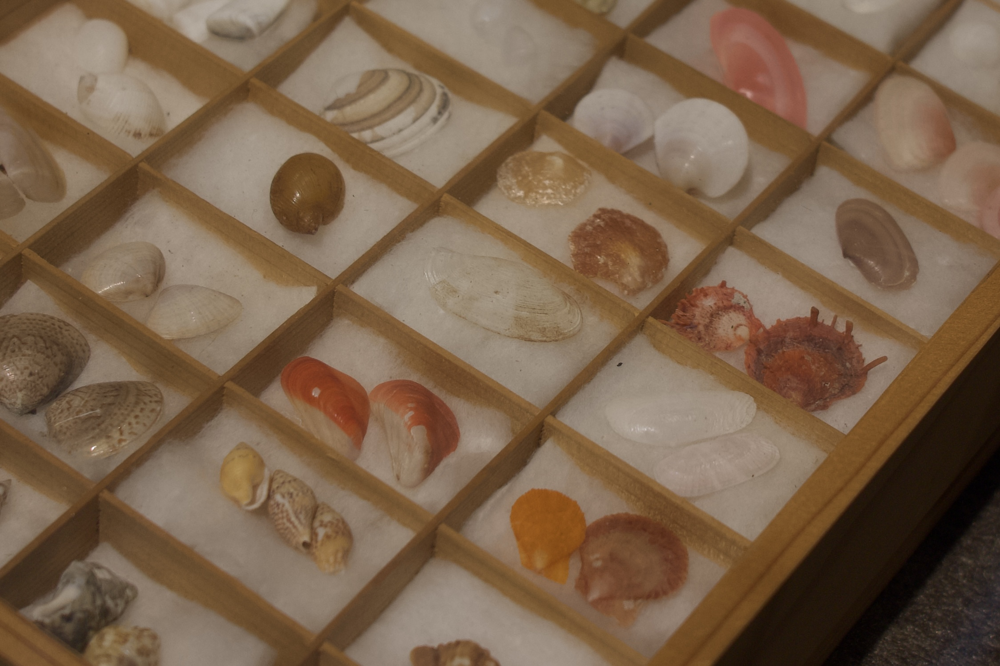  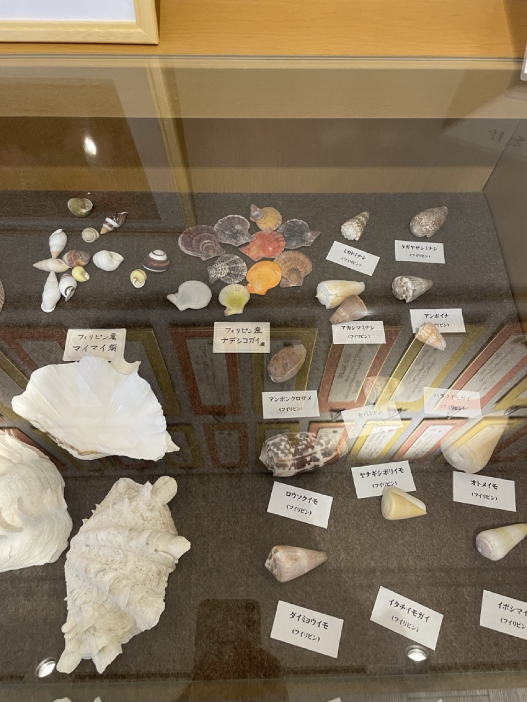

买了点贝壳，收银大叔特别热情，主动打招呼要给我地图和小册子。旁边食堂的点单机意外很现代，能用Apple pay，这可真是头一遭，好评。吃完饭决定不去严门了。一是估计严门要下到沙滩的话需要走一段时间，时间已经很紧张了，而这边沙滩就在旁边只要3分钟。以及比起可看不可看的严门，我更想去沙滩捡贝壳！于是穿着黑色卫衣顶着下午2点钟的太阳在沙滩捡了半小时贝壳。

之后去气多大社。跟着导航走了短一点但更窄的省道，结果前面辆小轻车一直慢吞吞开50kph，开得非常郁闷。吸取经验，以后这种情况都优先走国道。

气多大社也是宣传册照片比较好看，反正你又不能在神社飞无人机！别的跟其他神社没什么差。旁边的寺庙不错。地上种了好多小小的铃兰，正开着，香气弥漫。忽然想起，铃兰全株有毒吧，种这里合适吗？嗨，又不关我事。

草草看一圈立马杀到千里浜，这次有经验了直接开去海边浴场的入口。开到沙滩上立刻好开心。有些车停在靠海那边，很多人。千里浜是靠岸的一边沙子发白，不宜行驶和停车，容易陷进去。这边沙子非常细，且圆，被水打湿后可以很牢固地抱在一起所以能开车。没水变成干沙的地方就不能开了，后面无人机的小事故也跟这干了的沙子有关。

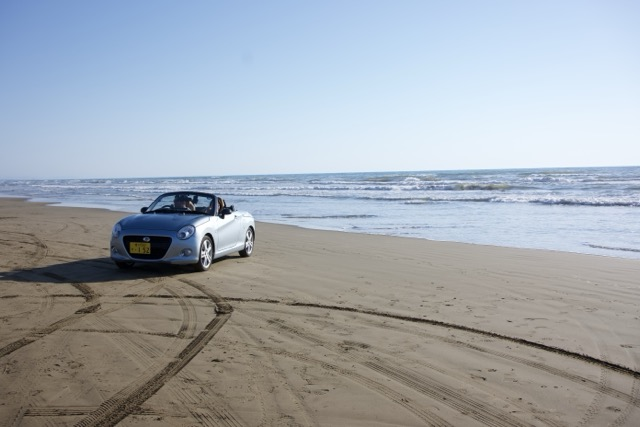

千里浜也是日本寥寥可数的直接声明可以飞无人机（自己玩玩的前提下）的地方，感激。想要车在海边开，drone在边上跟拍的镜头，大海，车，蓝天，虽然这时是下午4点正好逆光……以及从车顶往下拍车开过来、开出去的镜头。实际飞一下的感想是，好难。高度，不敢降太低，毕竟不是自己的车。速度，drone很难跟上车速。也不敢靠太近，所以车都小小的，没有想要的效果和比例。不过，很好的实践。Grand tour和Top gear不是一个人能做出来的，他们真厉害。

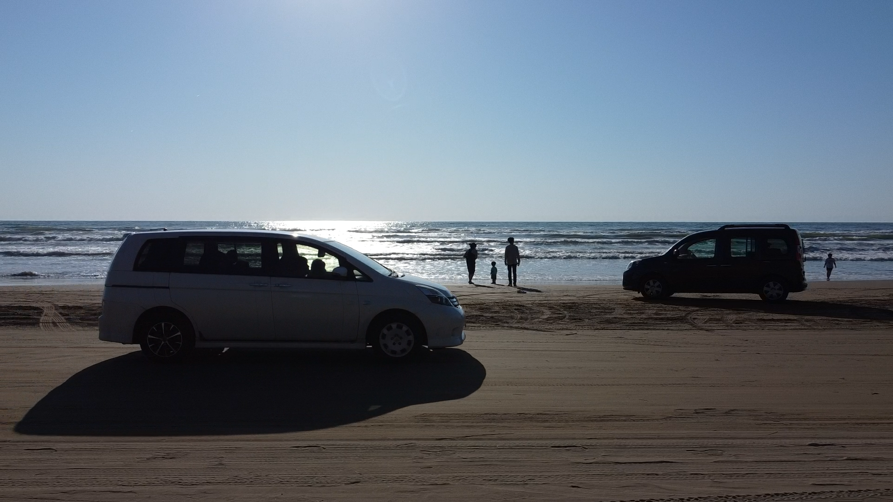  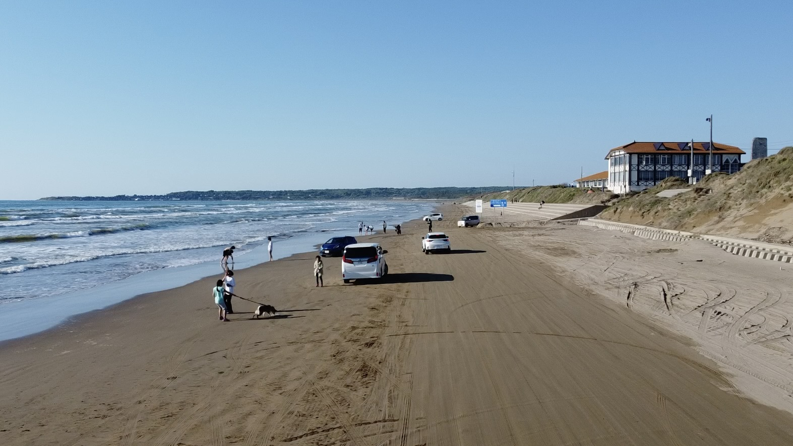 

沙地起飞降落怕进沙，就在岸边一个混凝土台上起飞的。台面很小，降落的时候没落到正中间，机子一歪掉下面沙地上了。一个机翼进沙不转了。飞不起来了干脆就专心享受沙滩开车好了。

在那之前先去羽咋站买金泽到大阪的新干线票。在这买的原因是，免费停车场，停车场离进站口近，人少，不用排队，节省时间。顺便把行李都装好。然后回来沿着千里浜一路开向南。GoPro的卡都拍满了。

往南开人和车更多，人们在海边嬉闹、冲脚，特别欢乐。想起Jeremy在senagal海滩开车时的样子，感觉我们共享同一种喜悦和自由。

## Sources / 信息来源

出发前查信息，无意中发现了这个简陋的[日文网站](https://syachuhaku.fxtec.info/index.php?みんなでつくる%E3%80%80車中泊マップ)，找跟自己相同路线方向的露营地在地图上打点备忘，挺有帮助的。但有些信息很老了，需要再查一下。以及中途发现其实有些停车场可以过夜，并没人来管。这个网站里没标的也可以大胆去探索尝试。

千里浜有[官方网页](https://www.city.hakui.lg.jp/kankou/kankoushisetsu/3168.html)实时更新沙滩的通行情况，虽然简陋看着像没人管，但很准，信就完了。

## How's car camping / 感想

睡车里不舒服。肯定不如住酒店睡床上。头天晚上蜷着腿睡，第二天腿巨酸。后面晚上就斜着睡，我短，勉强能伸直腿。东西没地方放，每天要来回归置行李，贴窗户遮片再拆下来，麻烦。洗漱上厕所都不方便，半夜睡一半有尿意但是一想那个折腾就选择憋着了。还有噪音，震动，以及每天醒来车里都冷得像冰窖，伸手出去，冰冷的空气刺得肉疼。衣服也像从冷柜里拿出来。就算是自家车改造或者直接房车，舒适度也依然比不上酒店。不过睡车里的快乐我觉得是种自在。不需要拥有多少物质，我也能把自己照顾的开开心心，特别提升自我认同感。

car camping的人真多啊，很多是开房车，有的是van。大概因为我去的都是偏僻乡下地方，住宿难找，所以见到的数量可能更多吧。日本规矩很多，凡事都先提manner、rules，car camping也是。停哪儿，乍一想似乎是需要解决的头号难题。但如果你意识到其实你有选择权，可以按自己的想法放手去做——起码先去试下，这些就不会再bother了。放开胆子去做，意外的阻力并没有想象的大。我在说什么。

其他国家没去过不晓得，日本car camping还挺方便的。很多驿站，厕所不是问题。先在超市买好base补给，之后在便利店及时补充消耗掉的，哪怕去深山老林都不用愁。温泉钱汤也很多，找个便宜的，洗澡解决了。如果时间长需要洗衣服，投币洗衣店也还能找到，尤其小地方。只要在人口聚集的地方把这些需求都解决了，我想不到还有什么问题。剩下的就是享受自由。

## 我都带了啥

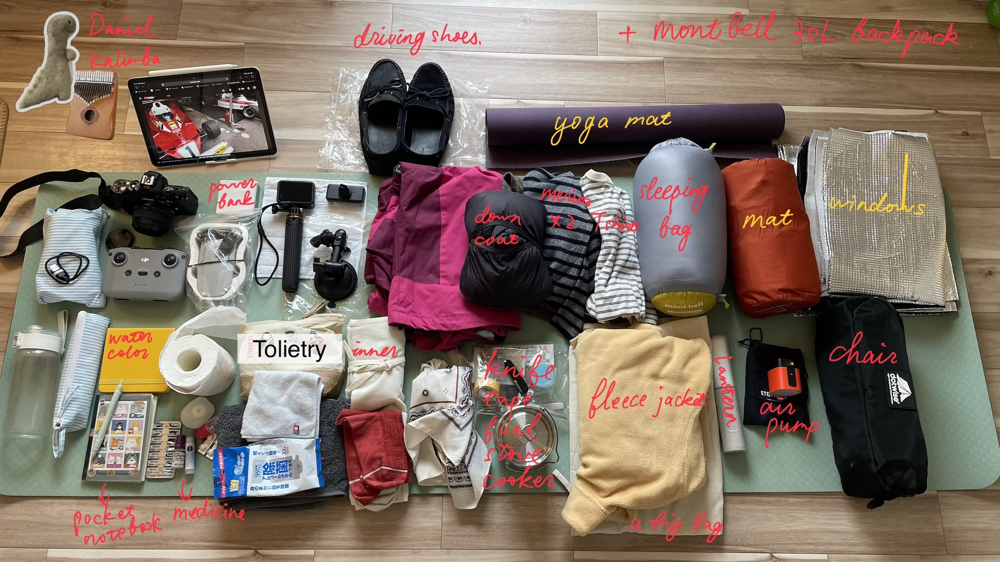   

Electronics：iPad，相机，Drone，GoPro，支架，充电宝，充电线，usb to type-c converter  
文具：笔袋，水彩本，pocket notebook  
洗漱日用相关： towelx2，一卷卫生纸（你不知道什么时候忽然就要用），湿巾，药唇膏牙线眼药水，水杯，伞  
衣服：冲锋衣外套，轻薄羽绒服，T恤，美丽诺羊毛衫x2+打底裤+袜子，fleece外套，内衣，丝巾，driving shoes  
其他：瑜伽垫、卡林巴、丹尼尔

穿的tank top、卫衣、运动裤，登山鞋，手机手表这种随身带的没有拍在里面。

**Must/带对了**  
丝巾，可当围巾可裹头防晒、防风把头发吹得凌乱不堪，一物多用的典范。

美丽奴羊毛袜：羊毛袜晚上睡觉必备品。5月北陆早晚还是冷，带的美丽奴羊毛衫打底裤和袜子，睡觉穿了暖很多，一夜安眠到天亮。尤其是袜子太重要了，暖感提升好几倍，早晨起来也暖烘烘，一生推！（不过羊毛衫一件就够了，美丽奴连穿几天都不会异味，东西和重量能少就少。

Suede driving shoes：不带完全OK，但一开车就2hours+的时候穿这种软软的鞋和穿登山鞋的舒适感是不同的。我任性。

水杯，叉子，塑料袋：水杯拿来泡红茶。叉子适合吃所有东西。塑料袋，随便什么袋子。每天都会出现的需要装一点点东西走动，比如逛寺庙，泡汤，去便利店时，需要装钱包和相关的东西，但又想背上30L的大包，塑料袋这时候就很合适，轻，不占地方，用着还不起眼。用完了破了还可以拿来装垃圾。

**没用到**  
羽绒服&fleece外套：以为会冷，结果并没有那么冷，虽然塞在大布袋里当枕头很合适，但毕竟太大了占地方，I need to improve this。

卡林巴&水彩本：长途一直开车，不开车就在到处逛，结果基本没碰。如果是短途不开车，空闲时间多的话可以带。

## Cost  
4天下来的花销，刚好7万日元。如果订住宿，估计要10万多。

几个大项，首先依然是交通：往返，夜行巴士6000，回程新干线加特急，用了半价优惠券，4900。租车3.5万。汽油+ETC6000。一共5万，4天的移动费用，正好一个月房租。のと里山海道基本上免费，只有走了一小段富山的收费高速。这块算是省钱了，换别地儿，我这来回开的跑法光高速费就小一万了。日本交通不是一般贵，任何移动，都贵。能源全靠进口的结果。

住宿：当然是0。

吃喝，包括各种零食，只要送嘴里的都算在内：1万2。

消费娱乐：买各种东西包括土产，还有寺庙门票和泡温泉，6千。跟以前比这次算花的多了。一是这次心血来潮买东西打算送朋友，二是泡汤多。我现在一般不买所谓的当地特产点心礼盒，都是工厂加工过度包装的添加物垃圾，没意思。沙滩捡一捡贝壳搞点石头更有意思。

4天一共开了567km，开得最长的一次。不过不像之前那么容易累，主要是知道怎么哄自己了，合理分配体力时间，开开停停，不硬扛，随时歇。开下来小累但不像几年前那样透支，挺自豪的。汽油总共加了33.4升，算下来5千多日元，燃费17KPL，天天开冷气暖气又充电的，这燃费我挺满意。

## Tips/ 做得好的几件事&决定

### 超市采买好好好  
针对自己的情况，备好需要的食物。带了一袋煮好的鹌鹑蛋，在超市买水果、腊肠、蔬菜汁、2L水、零食。有熟悉和日常需要的食物带来的安全感太棒了，饿了随手抓来吃，填饱肚子心情好，开车不受影响。蔬菜没缺，正常拉屎太开心。

### minimalist之只带一根充电线，太清爽  
每次出门，相机GoPro的充电器、充电线还有电池就一大堆，超乎想象地沉且占地儿，来回拆包打包还怕落下哪个。这次只带了一根GoPro的充电线，很短，除了手机，type-C的相机、iPad、drone都能共用，轻省。另带一个USB to type-C的转接头，基本所有场合都覆盖了。不但减重，收纳也省力省心。以后继续。

### 泡温泉回血太管用  
泡温泉对恢复体力、解乏真有用，开车一天下来整个人都枯萎了，泡个汤出来又是条新人。也借机接触（偷听）点当地人的生活（闲话）。

### 吃饭很重要，也没那么重要  
依然没有事先查吃饭的地儿。纯粹看心情。  
因为就算我计划了也铁定做不到准点到。还是放过自己轻松点儿。饿了就吃，看什么顺眼、想吃什么吃什么，管它是不是当地名物。真吃麦当劳了。还有家庭餐厅。前不着村后不着店没地儿吃就拉倒，车里的东西随手抓来吃，也没怨念。  
整体上在吃的方面感觉还挺满足，没有因为赶饭点而手忙脚乱或者没玩尽兴，更没有因为错过了营业时间或是想吃的卖光了而懊恼生气。挺好。

## 一点吐槽  
**天气预报信你个大头鬼**  
这次唯一觉得做得失策，或者可以汲取经验的地方，是太相信天气预报，对天气的过度担心扰乱了计划。出门前几天看天气预报，一直显示前面三天会整天下雨，于是把能登半岛放在了后面，第一天没有选择北上千枚田。这个决定对也不对。因为实际天气并没有那么糟，早上都是晴天或者多云，只有中间两天晚上下雨，还没当年鸟取糟呢。所以能登那边感觉没逛够。

感想是，天气预报随便看看得了，尤其现在越来越不准了。先按原计划走，当天看天气变化再调整，足够了。一开头就为了避开恶劣天气的影响而重新规划行程，没必要。

不过，不需要做到滴水不漏的完美，现在这样也挺好！

## What's the next  
心野了，以后都不想订酒店住宿了。hhh  
想去各处car camping。然而现实不允许，首先没假，其次没钱。所以打算先买个帐篷，升级下cooker，周末就去附近camping。

（截止目前6/21为止还什么都还没买XD
