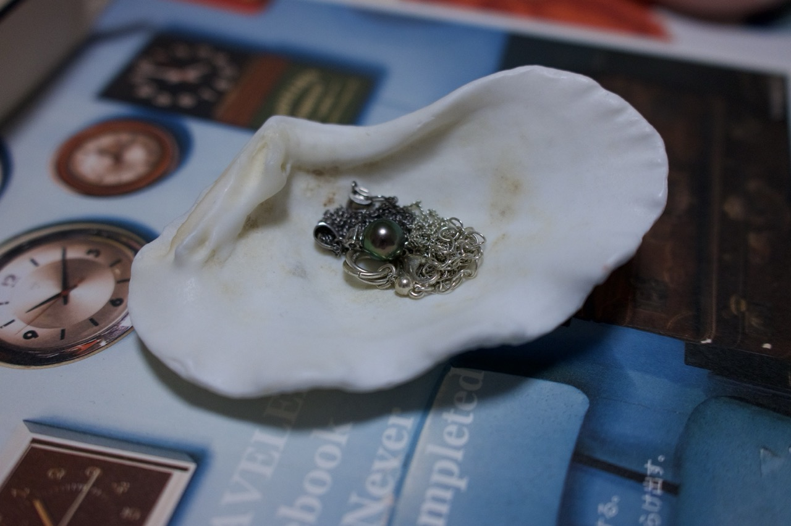
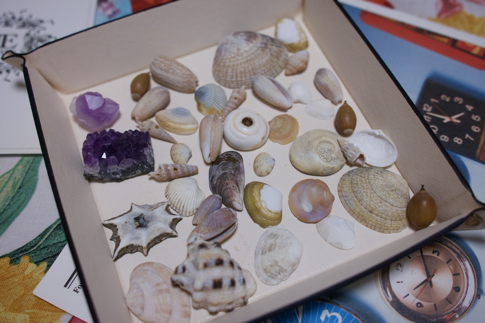
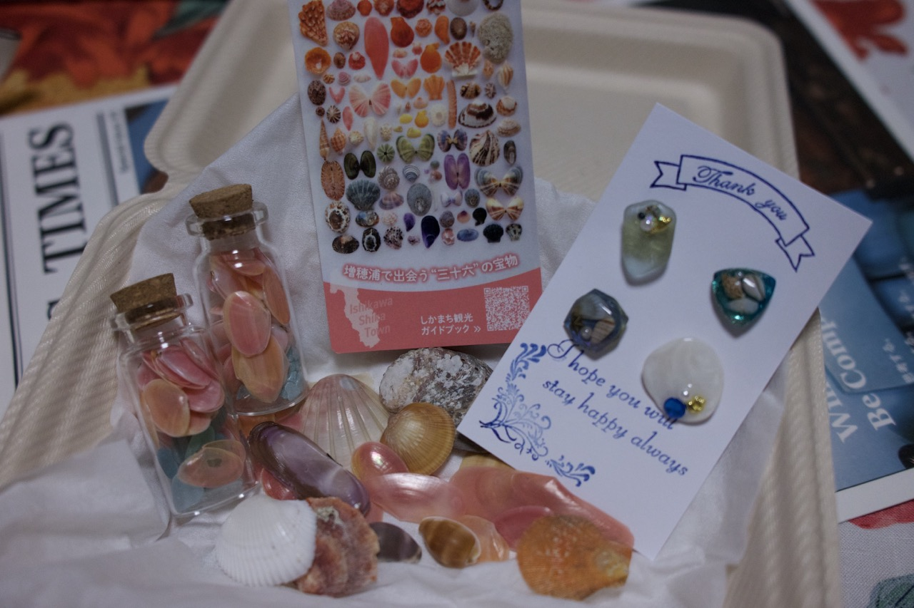
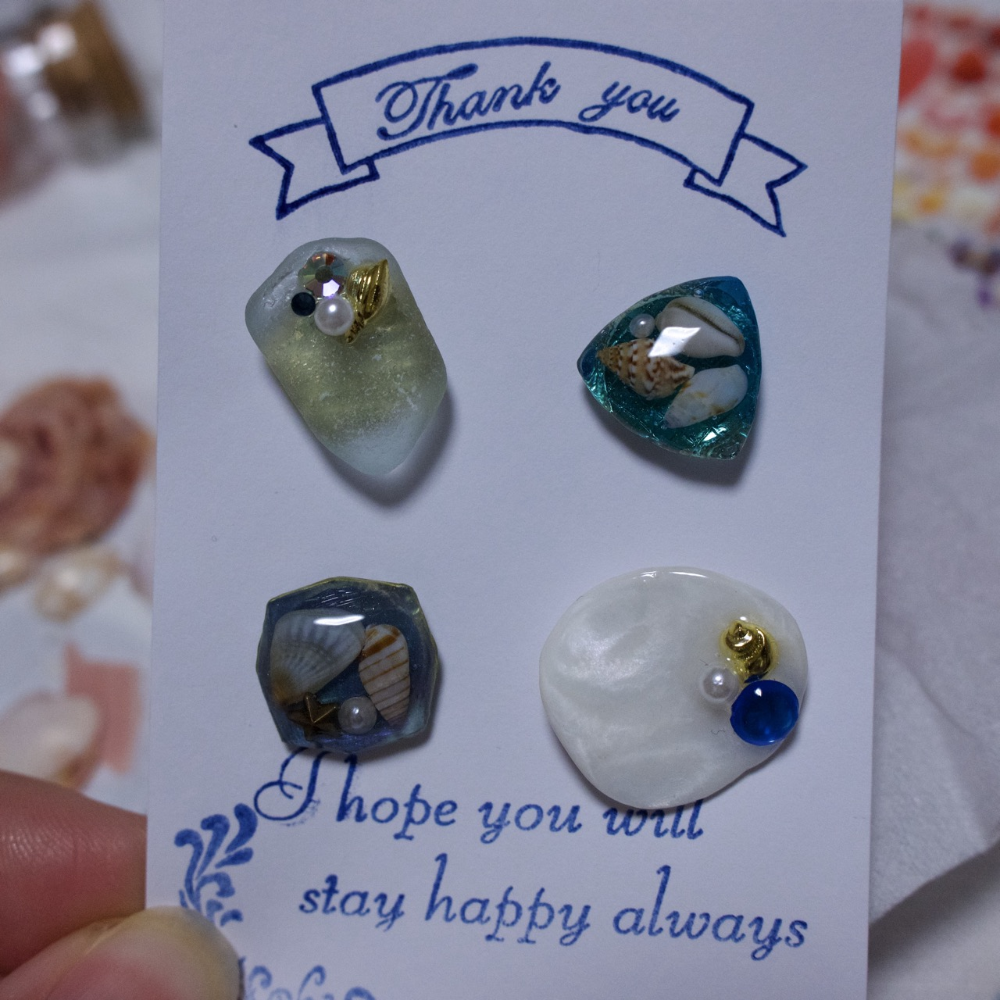
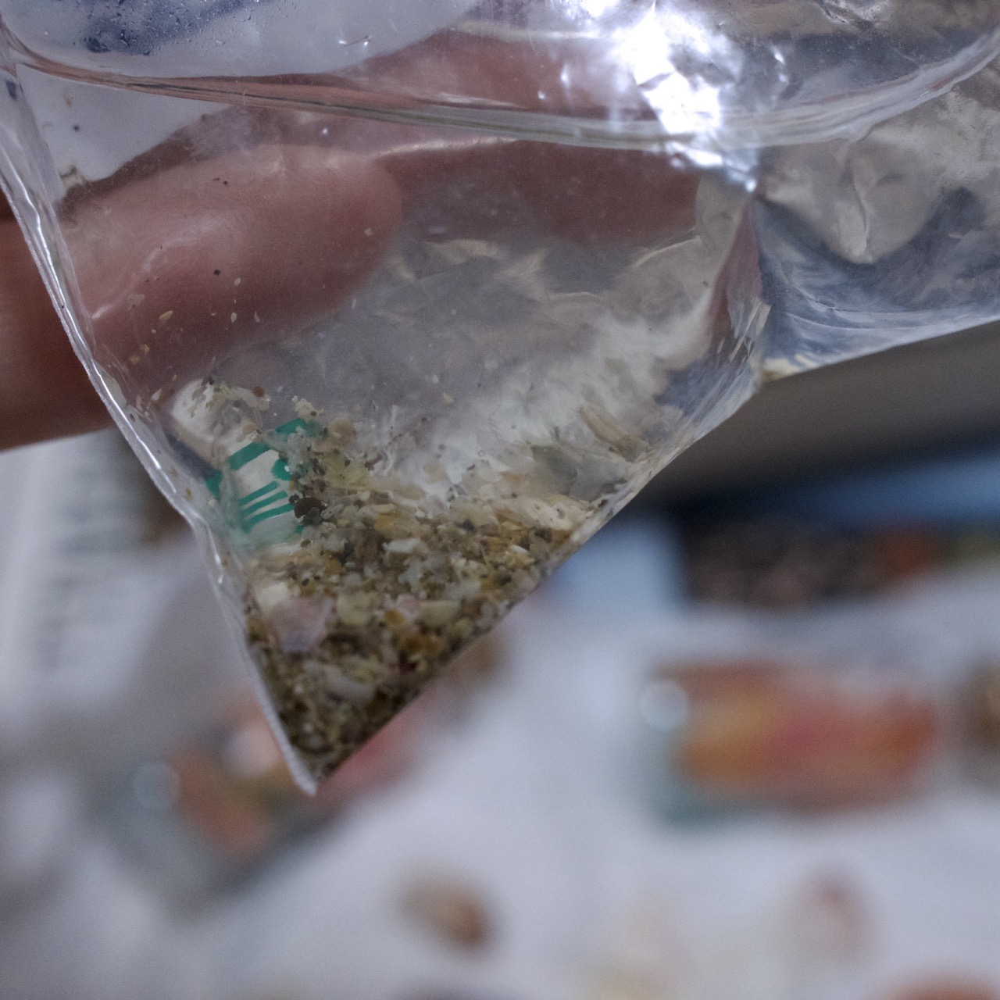
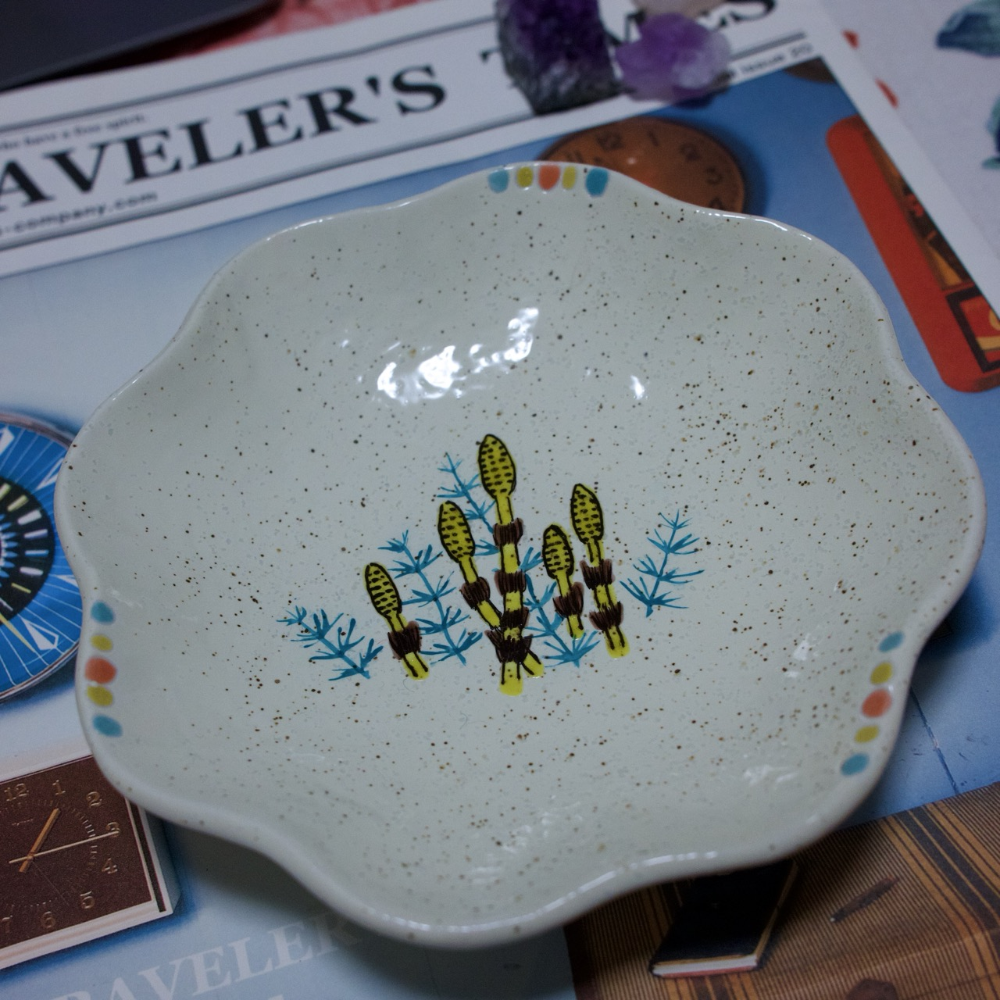
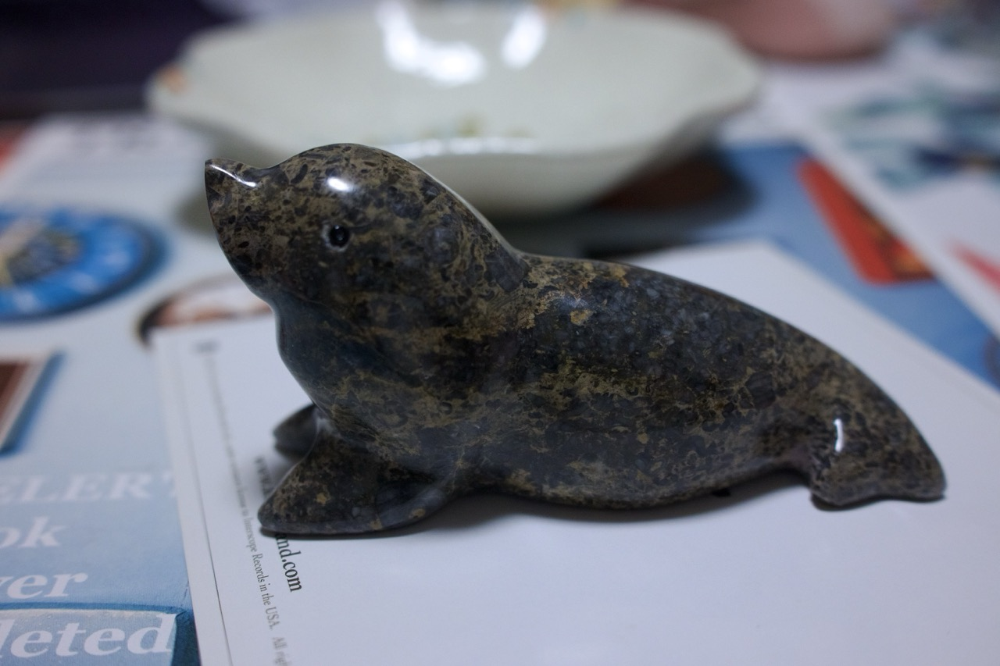
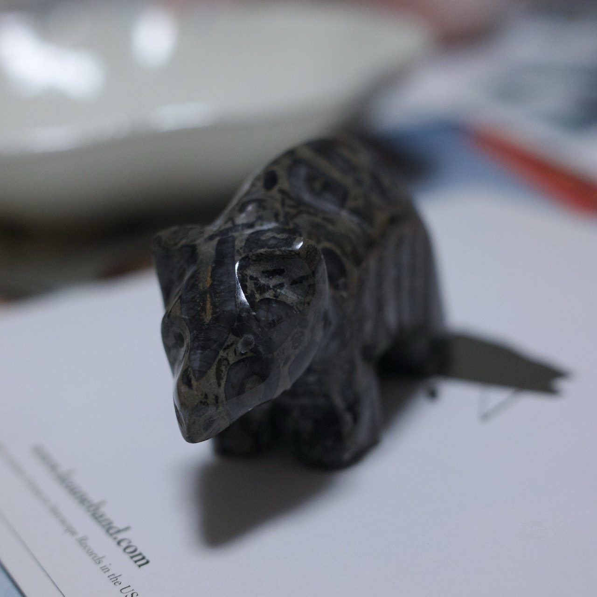
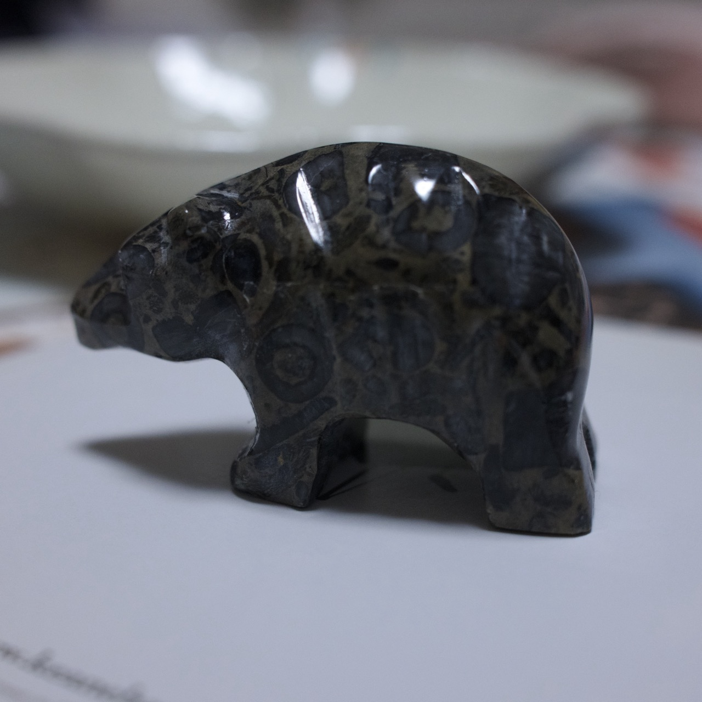

写写我的souvenir们。大部分是出门旅游的时候带回来的，不都是买的。

前面一篇提了一句，现在出门旅行,我已经不买各种当地土产零食、点心礼盒了。因为之前的工作，对日本的食品制造业有了一些了解，做得很光鲜漂亮，写得无比美好&健康，其实都是噱头。大部分是各种便宜原料和添加剂凑一起精加工，吃到肚子里的成本非常非常低，不然加上包装运输房租和人工高，怎么做到千元台售价呢。况且也并不好吃，安慰剂效应罢了。

以及出于对“出门玩/逢年过节必须买礼物送同事朋友，不论亲疏远近，不送就会被批评不懂规矩，被排挤甚至上升到否定人格”的日本潜规则的深恶痛绝。本来是“我”想买的，结果变质了，成了我“必须”买，精神经济双重负担。再好的事，一旦没有了选择的自由，我就要反抗，我偏不干。

好了骂完了。

况且，世间美好可爱的东西那么多，我不可能全部“占有”，也不需要通过“占有”来表示我的喜爱，证明TA的价值。

所以，这几年出门旅游就是，看看就过。

不过偶尔也会有那种灵光一闪而过的瞬间，似乎内心某个隐秘的角落被天使唤醒了，强烈地感到一种 “I want it” 的冲动。其实就是缘分吧。这时候，you follow your heart。这种基本上不论过多久再看也还会非常喜欢。而且每次看到、拿起这个东西的时候，那次出门的回忆和当时的感受会再次浮现，其实是很美妙的事情。

最早的一个souvenir是23年3月去冲绳时捡的，在沙滩随手捡的一个大贝壳。形状并没有多么完好，但我也不追求品相完好，只是留作纪念。回来发现拿来放首饰特合适。现在每次看到这个贝壳，就想起那天绿松石的大海来。

童年的我对于捡贝壳这事，有一种并不少见的浪漫美好的想象，另一个主要原因是小时候这个愿望没被满足过。一下子唤醒了热情。之后走到沙滩上就会想低头翻翻捡捡，看有没有合心意的贝壳。也不为收藏，就是看心情，眼缘。哪怕残缺的，心里有个声音说OK，就会带回来。

每次出门我都会拿个小zip塑料袋装眼药水，这时用来装贝壳特别合适。

第二年辞了职后去广岛玩，在严岛神社外面小小的一片沙滩上翻了一点贝壳，带回来。洗洗晒干，还挺好看。喜欢看贝壳细密的纹路，和微妙的颜色变化。然后是年底在雨晴海岸窄窄的脏脏的沙滩上捡贝壳。都是很普通常见的，种类都差不多。我不贪多，没必要，有几个象征下就足够了。七七八八下来也有一小把。

春天在北九州市逛假化石博物馆，纪念品店里有卖小小的玉石。每个都很玲珑剔透小巧可爱，这些石头倒是真的。做了一番思想斗争最后买了一个小小的、几近透明的淡粉色方形石头。日本人喜欢什么都给按个姻缘啊幸福啊健康之类的说头。我一点不看，只问自己最想要哪个。

今年五一去北陆，这次买的多。光是粉色的樱贝就买了好几种，自己又去沙滩捡了半天。季节不对，沙滩不知已经被翻过多少遍了，并没有特别惊奇的发现，但也捡了些残缺的贝壳回来。谁说残缺的就不能留作纪念了呢。还买了两个小碟子送朋友。一套树脂胸针，贝壳石头打底，上面缀着塑料小闪钻，金色星星什么的，盖上树脂。创意很好，很喜欢。有套里面有一个白色贝壳上缀了一个金色小海马的，特别好看，我也很喜欢，左右为难最后买了这套。

回来洗贝壳，还顺便收集下一点增穗浦海滩的沙子来，这点沙子也加入了我宝贵的souvenir里。

  
    

今天出门，在伊贺国道25号的一个服务区有家古董店，进去走马观花看了一圈，买了这两个动物石像。小熊颇有点古朴笨拙的可爱，海狮打磨得很圆润，乍看像海豚一样可爱。别的玉石雕刻的企鹅、小象、马、兔子、乌龟等还有很多。是那种靠近抽象的现代表现方法，线条和形体都很粗，但不乏童真的可爱。我一般更喜欢淡绿或透明的玉石，但这天不知怎的对这个黑色石头很有感觉。

我想好了，以后做缝纫的时候，可以拿海狮来做镇纸。很合适。

    

6.25补记：
差点忘了我的邮票。我从小集邮，现在出门旅游也好闲逛也好，如果偶遇营业的邮局，都会进去看看有没有什么好玩的邮票。这可比点心零食有意思多了。除了邮票，明信片也可以看看，毕竟是日本，什么季节限定节日限定的明信片很多，联名明信片也常年不断，比如moomin，就没有断过。