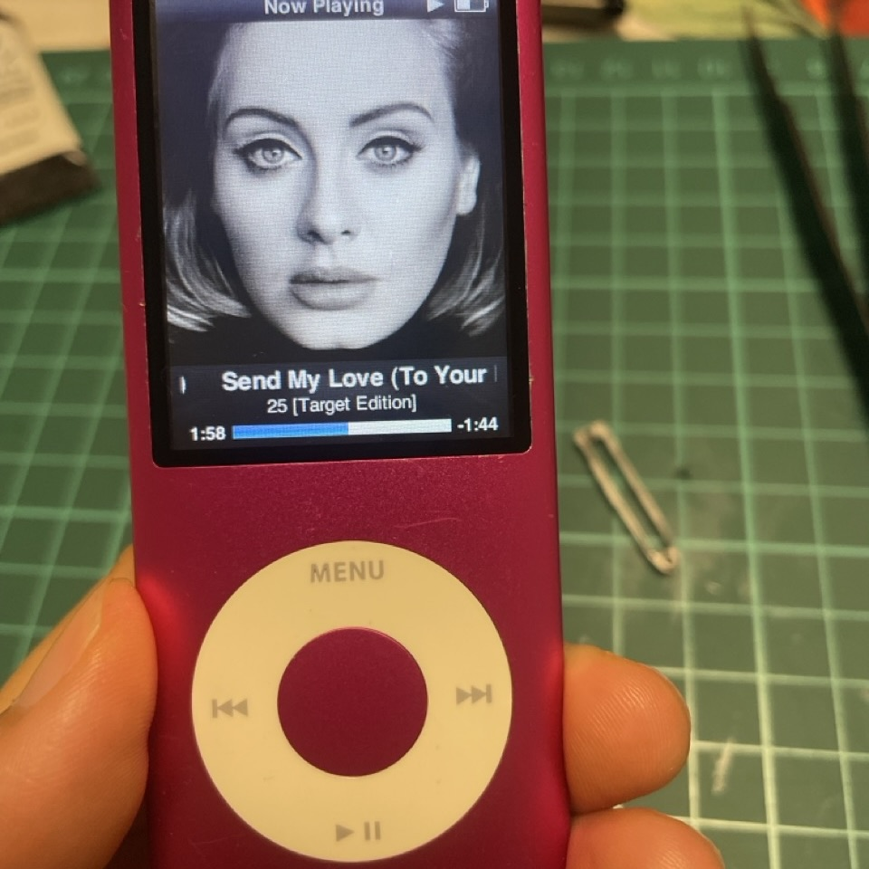

买了个iPod nano。

这几年改造iPod的帖不少。也许是对一成不变的苹果产品线腻了，旧物里淘新鲜。也许是错过了iPod的Z世代发现了以前golden age的好。总之，好改造的iPod classic的价格是跟着一路水涨船高。

我虽然不是00后，但也没摸过iPod。大的东西没力气折腾，小如iPod还是很想搞搞的。尤其现在厌烦了订阅制和流媒体，自己花钱买的东西自己做不了主，没道理。

幸运地在第一家逛的二手店就发现了当电子垃圾卖的iPod nano 4th。说是没法充电。想着先拿这个练练手，搞不好就死心，买了。

买完一查才发现，原来不是所有iPod都像classic那么容易改造。尤其nano第4代，iFixit上写“very diffcult”，搜视频，有个标题写nano是“the most hated iPod”。

造化确实喜欢这么捉弄人，不是吗？不过本来也是练手，并没有太大的失望。

我买的这个nano，8g内存，系统没问题，只是电池死掉了，一拔电源就死机。换个电池就行。

先提醒一下，新电池到了之后再开始拆。不然拆一半电池还没到，等电池到了之前怎么拆的、哪里贴了胶带全忘光，还得从头看视频，说的就是我。

对我最有用的帖和视频：

[iFixit这篇教程](https://www.ifixit.com/Guide/iPod+Nano+4th+Generation+Battery+Replacement/1161)，教怎么拆电池。大体步骤是对的，评论值得一看。细节要参考别的。但没有之后怎么装回去的步骤，很困惑。

这个[YouTube视频](https://www.youtube.com/watch?v=A8q5251XfTY)，比照片视频更有帮助，怎么撬开顶部的盖子，拆显示屏的盖，之后怎么装，多看几遍心里就清楚多了。

还有另一个[换电池的视频](https://www.youtube.com/watch?v=l2eoysyvTnQ)。这个虽然是nano7，但是soldering部分录得非常仔细，很多细节，你能看到每一步他是怎么操作的，非常有参考价值。他的温度设在400度，但他说350～400度之间都可以，再低就只会增加毁掉主板pads的风险——这是我觉得最有帮助的信息了。

我实际设在300～350之间。400度的话我这个电烙铁会氧化得非常快，很难沾锡。实际动手前先在网上看了一堆soldering的视频教程，还拿旧鼠标拆开练了一下。要领就是先撤锡，再挪烙铁头。

soldering这块儿，个人感觉最有用的就是flex和钢丝清洁球了。

flex特别管用，加了之后如虎添翼，导热神速立马沸腾。国内买松香应该就可以，便宜又好用。

钢丝清洁球也是我的必需。黑了的烙铁头蹭蹭就干净了又能沾锡了。用清洁棉会降低烙铁头的温度，整体的节奏会被破坏，搞不好就一团糟。

最后就是耐心吧。先摸清自己的电烙铁的脾气。我的电烙铁加热特别慢，耐心等几分钟，温度上来了再去desolder和solder，整体顺利很多。

soldering这块没把我难倒，怎么装回去把我难倒了。

之前在reddit看帖，还发帖问了下，很多人说他们毁在了soldering这一步，直接把主板给毁了。但也有人说，其实掌握要领后，soldering并不是那么难。现在来看，确实如此。

焊完电池往回装，我才明白为什么nano的改造是very difficult，以及被叫做the most hated iPod了。nano的机身是一体的，特别薄，也就意味着里面几乎没有多余的空间，所有零部件要严丝合缝卡进去，没有容错空间。一步差池，前功尽弃。

先插上屏幕试了下电池连接正常，然后跟clickwheel连起来往回装。要从底下往里面推。但这时问题出现了。前面没写，在拆ribbon cable的时候我不小心把locking lever给弄坏了，卡扣掉了。就是[这张照片里那个白色的小东西](https://guide-images.cdn.ifixit.com/igi/JmnEveiF1JZnfxuP.huge)。虽然cable可以插进zif connector，但只是插进去而已，没法锁定贴合在主板上。往回推的时候cable稍微蹭到一点，clickwheel就会失灵。即便这一步成功，在装上金属底框之后，可能是碰到了线缆导致针脚分离，没有一次成功。

在推进去、拉出来没有50次也有30次，电池顶端橡皮泥一样被我按到开始变形，怀疑电池要被我搞坏之后，最后我的解决方法是：贴了双面胶在cable下面，上面盖上电子用的黄色绝缘胶带（ESD safe kapton tape），推进去，甩晃一番，确认clickwheel还能正常工作，直接拧螺丝，贴白色底盖。金属底框，不装了！**Leave it！**

在翻来覆去重装的时候，另一个纤细的部件也被我弄断了——顶端锁屏键的cable。那条线真的非常非常纤细，在顶端还像折纸一样折两次。虽然想着不要弄断，但忽然他就断了。不过还是要说，被我折腾了那么多次才断，nano里面那些看似fragile的线缆其实还挺结实的。

网上有教程教怎么修复的，道理不难，找细细的电线焊一起就可以。反正有电烙铁。但难的是那么细的电线和细小的部件操作……我懒，就这么着吧，也不是不能用，**Leave it！**

总结下就是：

多看各种视频和教程。操作的时候谨慎小心，都是很小的零件。照明很重要，看不清就搞个Jeremy那样的滑稽放大眼镜。正式soldering前先练练手。nano很纤细，但一定程度上也挺结实的，虽说容错空间小，但也不是完全没有。

最后还有个小插曲。

装完了先用苹果的有线耳机试听，声音不对。还以为耳机孔也坏了呢，换索尼的耳机听，完美。恍然大悟，苹果的耳机是带麦的4节音频插头，而传统的耳机是3节插头，分布不同，这个老机子不能通用。于是借机下单买个铁三角的ATH-CM707，很好。

用了快1个月，感想是，iPod这不错，小小的，薄薄的，握在手里感觉特别好。电池也挺耐用，上下班路上各听一个专辑，用两天吧没问题。比我的手机强多了。8G听着感觉很小，实际还挺能装，9张CD导进去，也才1G而已。导歌用我的老戴尔，12年的机子，win7系统，庆幸装了iTunes。iTunes真好用。

问我还搞吗？

搞。