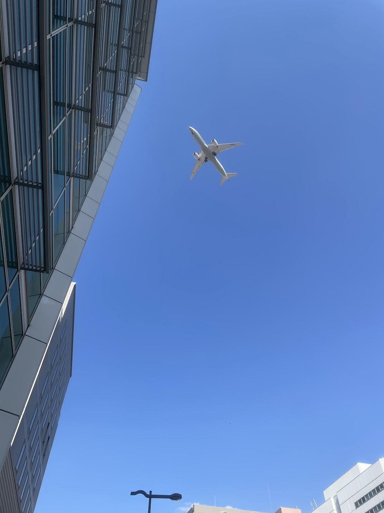
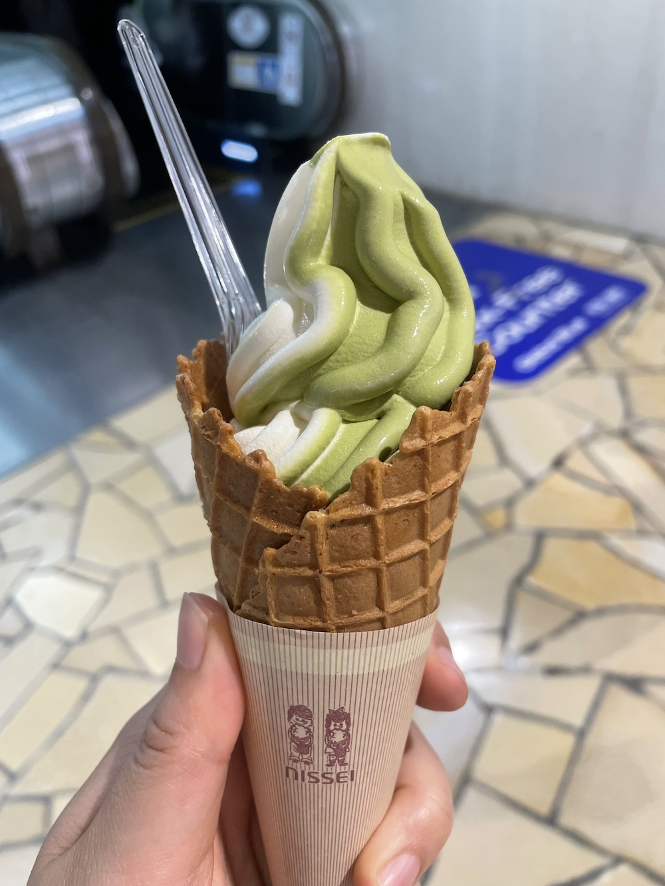

每个周五上午8点半，日本这边会和韩国总部在线视频开每周例会。

早晨6点出头起来，简单做下瑜伽，吃饭拉屎，7点半前赶着出了门。

到公司8点19分。连上公司的网匆匆手机里打下卡，放下包拿起本子直接进了大会议室。

这天缺席的人有点多，东京那边一个部长、一个懂韩语的营销都不在。韩国那边的翻译也没在。韩国社长很生气，用日语生硬地说没有翻译怎么行！

大阪这边紧急拉了旁边部门的韩国人来做翻译。

这天韩国社长明显心情很差，一顿发火，各种难听话劈头盖脸一顿说。临时拉过来的翻译不知道之前的人翻译得有多委婉多照顾日本人心情，就原原本本直接那么翻译过来：

“营销太差了，再这么下去，没有业绩，全开除！都炒鱿鱼！所有人都别干了！”

类似的话实在太多，翻译有的地方直接就说，跟刚才一样的意思在重复。

社长又说，我也不想说这些难听的，但是现在业绩实在太差了！都是赤字！！！现在开始，所有营销都给我出去跑！去找客户！拉单子！上门推销！

翻译跟着吐槽，我也不想说啊。

等开完会，屏幕黑掉，所有人长出一口气。互相面露难色，呲牙咧嘴：话说得也太过分了吧。是啊是啊。

哎这些人真是没被中国家长和老师批评过。我暗想。

跟总部的会开完接着是东京和大阪的会，两个会开完就快11点了。上司说中午12点前直接去一家大公司飛び込み営業（上门推销）。下午2点约好了见一个新客户，之后再去一家公司。

上司是个死脑筋，还固守着见客户必须先邮件约好时间的做法，是发了邮件之后必须要打电话告诉对方“我给你发邮件了，请你查看”的那种人。在他们这类人的观念里，不事先打招呼直接去敲门推销，太不合礼数，无异于烧了夫子庙，造反了。但大社长那么说了，再不情愿也至少做个样子。他就那一脸苦相叹气连天。

刚好人力过来找他，两人咕叽咕叽大半天。然后上司转头跟我说，港区办公室要安新的路由器试信号，他必须过去，叫我自己一个人去跑营销。他告诉我那两家要上门推销的公司名字，嗖嗖嗖收拾好东西刺溜一下背包走了。

——这人也真好意思全推给我。

不过我不介意。反正没他更好办。

搜搜两个公司的网页和地址，出门。

第一家在梅田，漂亮但又不显眼的高层玻璃大楼。才中午11点20，就陆续有人开始下楼买饭了。感慨大公司福利就是好啊，11点半就能午休。上楼，电梯一开正面一个只放了个电话的前台。旁边有说明，找谁直接打那个部门的电话，我不认识任何人，就按了总务的号。

立刻有人接，问找谁。

我学着东京的部长的样子自我介绍，问物流的负责人，然后对方说他们不接受新的合作方，只跟现有的公司合作。然后就挂电话了。

倒也不觉得泄气，反正这种事情在日本很常见。越是大公司这样的越多，某个业务只给现有的合作方，其他一概拒绝。

去旁边上厕所，刚好出来一个女生，脖子上挂着牌，看着像是这公司的人。也没想几秒就过去递名片和资料了。到底是不太懂得当面拒绝的日本女性。说帮我转交相关的负责人。

我就在门外等，很快出来另一个女生，脸上的妆闪闪发光，估计40岁了。一看名片居然是个部长。简单说了下服务，对方说不太匹配，说了一点她们公司的情况，不过也没说完全没戏。

道谢之后出来，心想，我怎么这么厉害！一点不犯怵，该出手时就出手，真棒真棒。要是上司的话，估计那个电话之后就丧气话一百担了。

回公司吃了午饭在桌上趴着眯了会儿，下午1点先看看要去见的客户的公司情况，心里捋一遍想问的。1点半出门了。

没想到对方3个人来谈，有点吃惊。颇缺乏相关信息和经验的样子。我也不装谦虚和资历浅了。知道的都介绍过去。不过到底也是有不匹配的地方。但并不是个死胡同。回去继续琢磨。想问问东京的部长。毕竟这个客户是跟着他一起敲门营销联系起来的，跟着他学到不少东西，对敲门营销的抵触也减少了不少。东京在这方面也是比关西更开放一些，大概到90年代的水平？。

之后去最后一家公司，在新大阪那边。这个就好说了，一个颇小的公司，总务一个无精打采的年轻女孩子进去问了下，出来说我们不考虑用新的合作方。问能不能换个名片，她一脸难色地进去，出来的是总务課長，很日式地笑，递给我她名片，道歉说不会用新的公司。

没有沮丧，反而觉得很自豪。这才一个月，我就开始solo了？ I'm soloing！心态稳稳当当，放以前的自己肯定不敢相信。很为自己骄傲的心情。

出来在下面的超市买到一个香喷喷的芒果，喜滋滋。拎着往回走。当然是回家了。出门营销跑完直接回家的情况不少见，偶尔会很晚，偶尔会早一点。这天是早一点，还不到5点，可以避开晚高峰，晚上从从容容7点就能吃晚饭。

新大阪站到底离机场近，好多飞机，都好大，十几分钟里至少6、7架从头顶飞了过去。如果想拍飞机都话这里也会是个不错的选择。但是太臭了，到处一股下水道味，厕所下水道。也不知道住这里的人怎么想的。

   

另外，如果只是我自己的话，是万万不会来这些地方的。上天似乎是在用这种方式让我熟悉和探索大阪的街道，看更多自己不会主动想去的地方，观察更多的公司和行业，以及人。你看这两个月，已经走了好多地方了，有了很多“哦，原来这里是这样的啊！”的瞬间。现在去梅田已经有点头绪了，不再是一头乱麻。这是这个工作一个我可以接受的点。

回程在梅田晃一下，去日世的直营店买个冰淇淋，不知道为啥，感觉还是直营店的味道更好。

坐在电车里困得很，一直在打盹儿。脑袋里还断断续续地在想上班的事，倒也不觉得压力和紧张。

后记：这是5.15的事，那天是个大晴天，天很蓝，很好看。心情也很好。回想那天跟半个月后的现在，感觉现在的心情像是蒙了一层灰。灰的来源还是跟人有关，那天为止我还把一些人屏蔽得挺好，最近有点受不了一些庸人了，感觉是bore out。
