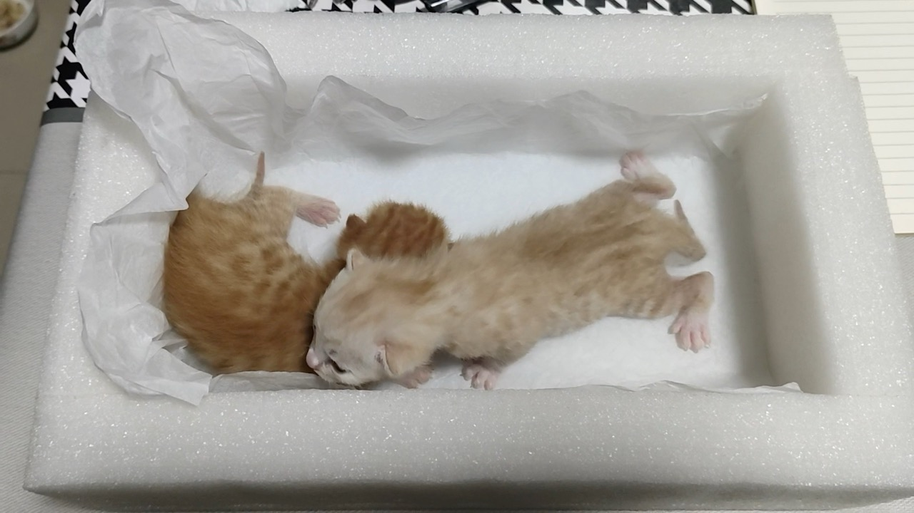

跟5月相比，6月显得格外漫长，没有一个法定节假日，满满当当四周全要上班。还没进6月，心里就开始犯难。

月初头两天在东京出差，还挺开心。东京分社的气氛和观念比大阪开放很多，感到了地域差，加重了关西更封建保守的刻板印象。

换好了iPod的电池，买了新耳机。心里很满意。

买了两块牛皮，小的做了个护照本体验。感想是太小了，不好写。直接拿个A5本更实用。另一块牛皮打算做个大的本子用。还没动手。

缝了一个收纳包，打算以后出门装电子类的东西。不是特别满意，但也可以。

看了sirat，炸得猝不及防。

班越来越无聊，每天被迫做各种弱智事情，除了徒增劳累外毫无意义。一度甚至感到一丝熟悉的抵触和厌恶情绪，像是去年某个时期抵触去公司一样，像是前年抵触去公司一样。我知道这些都是警惕信号。她乡有个帖问怎么算是从burn out里“好了”。我想，我的话大概永远不会“好了”，我只是对各种危险信号更加敏锐，知道该及时抽身保护自己，或者坚持主张不一味压抑和无视自己。

6月过得很疲惫，支撑自己精神和肉体的routine在一片片崩塌、瓦解。睡眠严重不足，早上很难有精神和心思做瑜伽。全身僵硬。完全没心情唱歌。晚上周末只想放空发呆，提不起精神来做想做的事，只想拖延。但通勤时间太长这个事，只是痛在自己身上，立刻搬家也不现实。公司也有些狗屎事，所以这个工作还能做多久，实在是个谜。

但也没有放弃。和朋友去神户一个德式花园里逛了大半天，累却开心且充实。说了一些从没敢在人面前、也没敢在网上说的话。不judge真是难能可贵的事，可以让人变得勇敢很多，直面自己内心隐藏的真实想法。

趁机整理了一点思绪。感觉真的在浪费自己的时间，和金钱。但不体验一下也不会知道，不是么。

小橘生了两只小猫，嫉妒我妈，可以看小猫。

