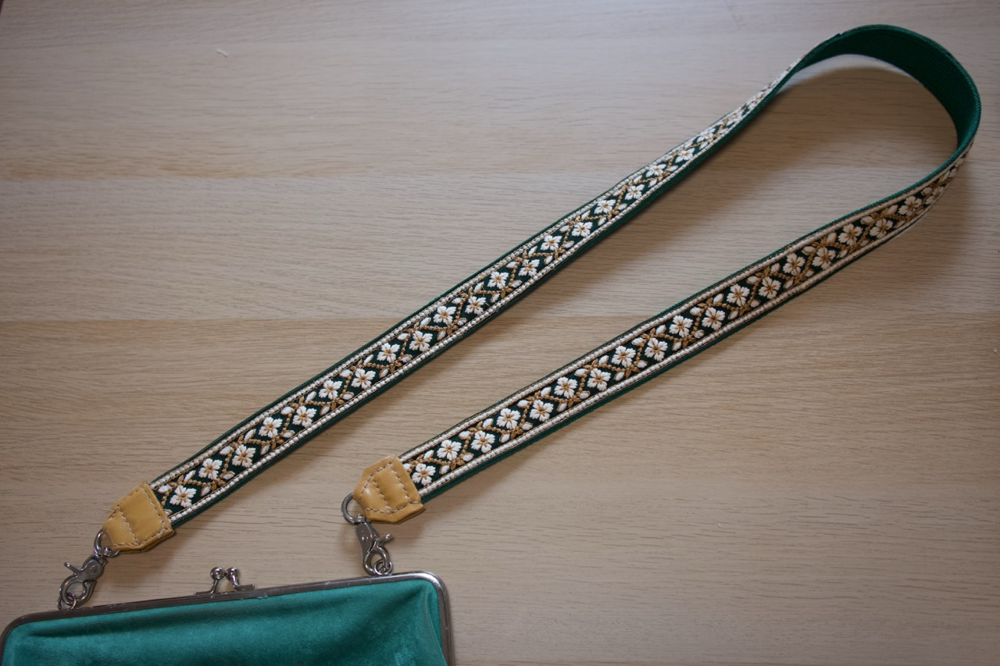

七月感到一种巨大的空虚。

天气特别热，闷热。哪里都像是一个大蒸笼，空气凝固了一样，整个七月，没有一丝风。

比六月好的是，早上起来又能很自然地铺开瑜伽垫做瑜伽了。但不像去年，今年只是做简单的拉伸和唤醒，力量是没有那个心情的。

月初被热得崩溃，想去山里camp凉快下，买了帐篷。到了之后一打包发现居然超过10公斤了。临时作罢，只去爬了下附近的金刚山，当天就回来了。山里也一点都不凉快，热死。有同事对金刚山赞不绝口，立志要爬30次。搞不懂，景色并不出众呀。回来之后盘点下需要的gear，一个个慢慢买。不过camp的火焰暂时是又消退下去了。等着哪天再复燃。

在乡下一家二手店买到品相很好的iPod nano 6。店里按junk卖的，但试了几天发现电池居然还很抗用，上下班来回路上听，能用一周。压根不需要换，省事了。用着方便是方便，往衣襟一夹就行了，但我还是喜欢nano 4的圆形键盘，操作感格外愉悦。

月底去一家综合类的手作材料店买了点布和材料，打算做一条肩带，一条hiking short。这店不错，有好多毛线，纯美丽奴羊毛的，各种颜色粗细，一下子心花怒放。缝纫和针织的念头在心里骚动。回来网上下单一套环形针，先拿前年买的便宜毛线试手打个Sophie scarf，赶个晚集。

做了大点的旅行本，但是用的皮太软了，明显不合适，圆角也没有切好。打算再物色个硬点的皮重做。

工作跟上司分道扬镳了，各干各的。我天天在办公室查搜集信息，打电话，自己摸索，成功搞到一个单。上司天天在外面跑，一周只出现2次。两个中国人同事先后来问候：你怎么又来办公室？——言外之意当然是不该来。跟办公室其他人的交流仅限于“早上好”“我先走了”。非常无聊。每天都在熬，做其他事情的心力也一并消磨掉了的感觉。每周都会产生“干脆现在就写辞职信”的冲动。但是发现同部门的人在频繁办各种聚餐活动，完全没有邀请我的意思之后，决定继续这么耗一段。跟Sarah一样，Play them at their own game。

反正是无聊，上班就偷偷摸鱼，差景点，计划以后去哪玩，不是那种很详细的计划，就是随便看看，先标上再说。

上个月买了滑板，白天太热没法出门，就隔三差五晚上去天台练。庆幸这个公寓没有锁天台，天台也有围栏。有兴致了上去练一下，吹吹风。每次也就10分钟，现在居然也能滑一点距离了。发现这种不对自己设目标的心态的好处了，不刻意逼自己，一点一点自然也会长进。不焦虑，不自责，不会嫌弃自己学的太慢，有一点长进就开心极了。

夏天已经接近尾声了。去年工作每天鸡飞狗跳特别紧张，但心里的自豪感成就感也很高，晚上兴致也很好，有力气想之后的事情。今年像是被抽干了一样，在做我感觉到开心的事情，但同时也感到巨大的空虚，感觉自己空空的，没有动力，没有精气神。这就是bore-out的害处吗。

