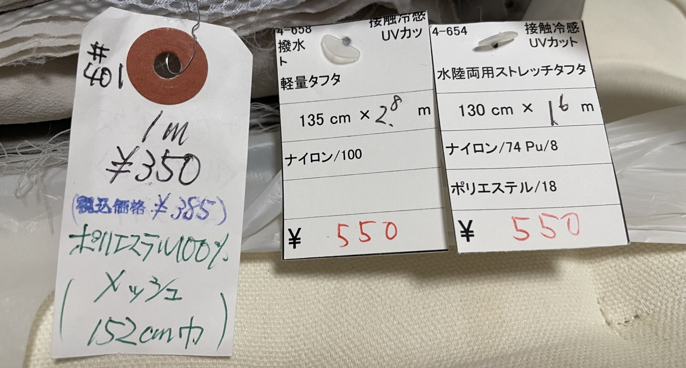
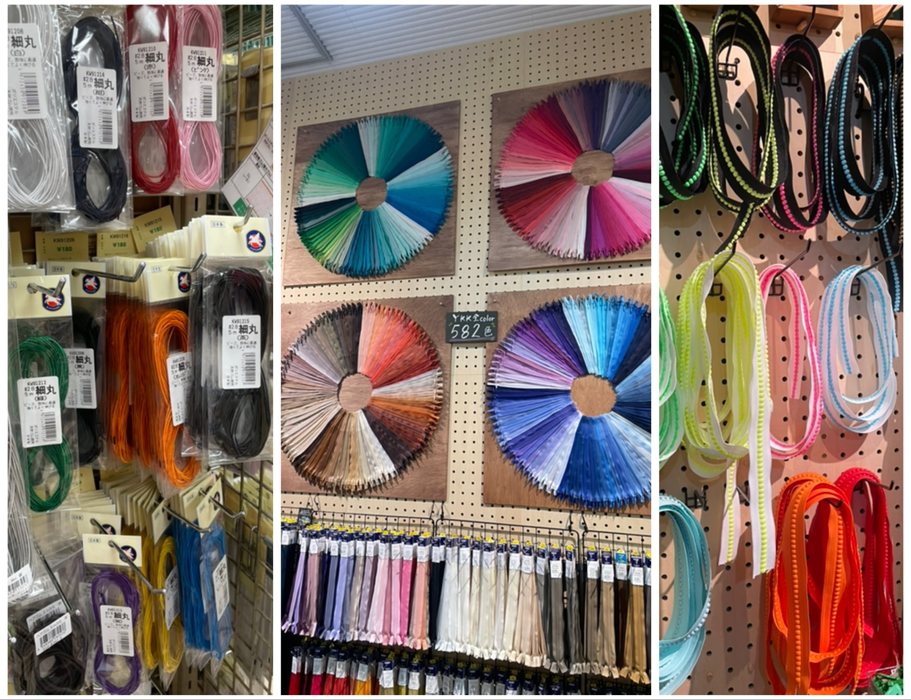

这两个月做东西的欲望大爆发，缝纫、针织、皮具这几个里面来回转。探店逛店积极性也高了不少，这里简单写一下。

**[手芸センタードリーム](https://craft-dream.com)**

名字就是手艺center dream。综合性的手艺中心，香川县发家，连锁店。最早在倉敷JR站外的商场意外发现的，四国也逛过一家，店铺面积巨大，铺货种类非常多。不过在京都大阪店铺的位置会偏一点。他们自称“郊外大型专门店”，挺贴切。京都站AEON三层的这家我去的最多，然而今年8月底关店，之后京都市公共交通能到的就只有在六地藏那一家了，太远了估计我也不会去。所以这两个月频繁去了3次。

Dream的好在于种类多，基本涵盖了我了解的所有手作类型，勾蕾丝的工具和线材这种在手作里也是极小众的东西也一应俱全。分区好，每一种类型都放在一起，京都店小，铺货用推拉挂架，前后一共三层，可以摆巨多货，真是麻雀虽小五脏俱全。这边最好的一点是皮革和皮具工具很多，还有简单明了的步骤示意图和不同尺寸商品的样本，基本上粗略看下就知道需要买什么工具、买几号、怎么用了。皮革是姬路皮革，都是铬鞣皮，整体不贵，买来练手挺方便。想养皮就算了吧。

会员卡一年330，更新要交钱。价格全是零售价卖。但好处是很多有会员价，略便宜，还隔三岔五做活动，个别种类打折，满减，积分优惠，花样很多。有次遇上积分加20%的活动，买了3000日元的东西，8月再去，结账的时候店员告诉我有600多积分，把我吓一跳。时机合适的话还是划算的。

有网店，但是能去线下店还是想去线下。

京都这店8月31号关店，整个8月全场7折，买了一些线和必需的皮具工具。以后去京都就少了90%的乐趣，遗憾。

**[ユザワヤ/yuzawaya](https://nambaparks.com/)**

跟Dream一样属于综合性的手艺用品店。关东起源。大阪难波和梅田各有一家店。对比一下感觉Dream更多点平民气息，Yuzawaya更贵气些，感觉上一个档次。梅田店没去过，一直去难波park这家。五楼占了挺大一片地。

综合性手艺材料店，自然基本什么都有。在我眼里难波这店的亮点一个是印度刺绣，一个是毛线。

印度刺绣还真是从印度运来的，这店各个色系基本都有，样式不算特别多，但也够你挑花眼。最好的是便宜。价格按米算，一米200日元到1000日元都有，体感上300到600之间的多。还有很多剪好的50cm，价格在两百或者三百日元左右，非常划算——为什么说划算，下面要说的另一家店就知道了。我在这买了一点零碎，自己做了条肩带，挺喜欢的。材料成本总共不到1000日元。

毛线专门有一个大区，纯棉、美丽奴、各种混纺、各种粗细，还有日本很多看着名字很有噱头的某某设计师限定xx色，颜色很抓眼球，但是材料嘛，垃圾。也有名字靓丽颜色诱人的进口毛线。这家有个自己的毛线品牌，美丽奴各种颜色各种粗细，选择挺多，价格一团30g五百日元前后。普通的纯羊毛也有，更便宜。

缺点是铺货的逻辑有点乱。比如皮具相关一部分放在一起，其他分散在别处，皮具的麻线跟所有缝纫线放在一起，找起来费劲。

布，棉最多，其他面料虽然选择很少，但仔细翻翻也能找到将就能用的。纯棉布里最令我吃惊的是有类超薄的卡通角色图案，乍一看就是日式小花花，仔细看才能看出原来是热门卡通角色。卖超贵，3800一米，脑子有坑吗。

在这买了块2 way stretch尼龙96%聚酯纤维4%的布，网上买了型纸给自己做出来第一条像模像样可以穿出去的hiking short，心里挺美的。已经买了另一个颜色想做条长裤了。

这类零售店里买布料、丝带、皮筋，通常一米起卖。通常会多剪一点。一般都会多将近10cm，甚至更多。这点我觉得挺良心的。尤其买布，难免两头剪斜了，容易成废料没法用。

会员卡一年550，需要更新交钱，算很贵的了。好处也是有会员价。有网店，可以全球发送。

**[船场center](http://www.semba-center.com/)**

这不是一家店，这是类似国内小商品批发城的地方，一条超长的室内走廊型商店街。最接地气最质朴无华，适合我等普通人淘金挖宝乐在其中的地方。

大阪历史上是各地特产的汇集地，船场附近商业兴隆，现在一进去还能感到一点旧时的影子。从地铁堺筋本町站到本町站间，东西向主路中间建了栋大楼，从东到西一共10个馆。个馆基本有个主题。比如3号馆有很多进口品的店。1层主要是逛的。地下1层一般是服装店——日本人买衣服永远没有止境——话又说回来哪国有呢。地下2层清一色定食屋，工作日为附近大厦的社畜们服务。

跟手艺相关、目前我逛的熟一点的主要是这几个：

2号馆——日本纽扣的别馆店铺，里面主要是布料和丝带，布料主要是进口的美国老粗布，图案也非常美式。丝带是德国kafka。直接机织出的图案，比印度刺绣更结实点，风格也很德意志。价格50cm400到800日元左右，比网上便宜点。也有更贵的，越宽的越贵。整体我挺喜欢。

3号馆和6号馆——印度刺绣丝带店：[心が踊る刺繍リボン屋](https://kokorogaodoru.com/pages/storeinfo#opendate)。一家人开的，不定休，建议去之前先查下营业时间。3号馆主店，女儿在看店。店面大，各种颜色图案挺多，能找到一些单纯几何图形的刺绣带子。6号馆小小的门脸，老父亲看店。两个店的区别，用老父亲原话说就是“3号馆基本款多，白色系选择很多”“比较新和可爱的货会先放到6号馆来”。因为小，摆放整齐，基本全是各种花朵类图案，各种颜色并排摆一起明显更惹人喜爱。换句话说，同质化很高。选品还是挺谄媚的，明显在讨好日本人的口味。

价格很贵。50cm550到680日元居多。跟yuzawaya一比，算翻倍了。下面要说的日本纽扣，整卷卖，9米一卷窄的3000，5cm宽的也才4800，算算只是这边的1/3甚至1/4。不接受现金。老父亲会给剪长一点，给到55cm。女儿只会给到52cm左右。3号馆放了很多样品，比如刺绣带的领口袖口，挺有启发的。最吃惊的是这边也有类似我做的肩带，标价6000多日元，吓人。真有人买吗？我做啊！比她的更好看，来买呀！

继续往本町方向走，其他馆里也能看到有卖印度刺绣的店，这边专门卖印度东西的店真不少。价格跟上面那家差不太多，但是能感受到完全不同的印度风格。有次偶然看到一个小店门口摆了几卷，图案有股浓烈的印度民族风，特别喜欢。

5号馆，几家大的生地（日语布料）、纤维店都在这。这也是我觉得最值得多来逛的地儿。成墙的布卷，还有门口小车、架子上剪好的各种布。大概以前辉煌的时候也是很热闹的吧。

日本人还是崇尚纯棉，布料也是棉麻多。也有尼龙和各种混纺，有防水防uv的，只是要你知道自己要什么，慢慢找。在这里买东西还有一点门槛。需要懂点日语。因为布料的标签一般是这样：

店主一般都在低头忙活摆弄手里一块看着平平无奇的布，乍一看都脾气不大好的样子。但你去问也会很仔细地回答和寻找。价钱自然也比开在高大上的商场里的连锁手艺中心要便宜亲民。比如照片里右边这两块尼龙布，实际店主只要了我880，真好。

6789号馆也有布料和相关的材料店，不过实际走马观花下来的感受是相对少一些，有些还只批发不零售。而且还没认真逛，逛了之后觉得有值得写的再说。

这种店一般营业时间都短，朝九甚至朝十一，晚五大部分就关门了。不定休，任性。周日齐刷刷都歇，是个节都休。有的周六也休。如果想逛，建议工作日来，先别买，逛一圈，心里有谱了，回去，想清楚需要什么，尺寸，哪家店合适，歇好了，再来。

**[日本纽扣](http://www.nippon-chuko.co.jp/)**

老式的综合类手艺批发商。整栋楼都是各种手艺用品。没有yuzawaya和Dream那么fancy，纯粹的老式日本商店——毕竟很老的商店，做了100多年批发零售手艺材料这行了，楼都破破烂烂很旧了。

进门要把大件行李存到门口的储存柜里，小包需要放在透明的塑料袋里才可以进店。会员制，要买东西必须入会。入会手续费100日元，不用每年更新，入会还给个1000减100的优惠券，等于不掏钱。

一共5层楼，每一层不同类商品，从针头线脑到缝纫机编篮子的材料一应俱全。跟Dream和yuzawaya相比，“批发”的性质更突出。打包卖，价基本都比前两家便宜不少。丝带绑带什么的不剪，都整卷卖。也不贵，一千多日元。买了按米卖，很快就赚回来hhh。拉链特别多，不同材质长度颜色。打包卖，一包3条5条，甚至更多，比外面单买划算很多。还拆开了卖，可以自己DIY拉链，拉链也能DIY哎！！如果有明确的会批量制作的东西，会是个好选择。

还有就是同样的东西，这里颜色、粗细、型号选择会更全。前两家店有的可能你只能找到一个品一个颜色，这家也许就能发现好几个品、十几个颜色。也能发现很多别家店没找到但你就是想要的“那个”东西。比如我就在这找到了磁铁式的腰带扣，1mm细的皮筋。

营业朝九晚五，周日不开门。也有网店。

也是一家需要大量时间和明确计划再进的好的店。

**[999+1](https://999plus1.com)**

终于写到最后一家。这家最现代新潮。开在普通街边，从外面看会误以为是什么小众文艺咖啡厅或者工作坊。

其实是卖拉链和各种配件珠子扣子的店。想不到吧。另一边有卖手工做的衣服和小装饰品，确实也算工作坊啦。

日本拉链自然是YKK的天下。这家特色就是拉链，颜色、材质、长短不同选择尤其多，挑花眼。最喜欢的是里面角落的墙上挂了整卷数米长的拉链，按需裁剪购买。还有种拉链非常独特，乍一看像是一串小珠子的装饰物，拉链齿咬在一起一点看不出来是拉链，颜色也非常甜美可爱，还夜光。感觉很适合做独特亮眼的撞色设计。

整体价格在合理的范围内，可以放心买。

还有边角料的植鞣革卖，买了2块了，练手很合适。

不需要办会员，营业周一到周六下午6点。说有网店，我没找到。

日本很多店办会员卡，只是填一下姓名住址电话信息而已。如果来旅游，但买的多感觉办卡更合适的话，不用愁，写酒店地址电话未尝不可。或者直接写自己国内手机号。反正他们也不会核对。

还有一些别的店，像是大塚屋，似乎也是很大的店，但是我没去过。之前去过一些小一点的地方独立店，每家都很不错，但陆续也都倒闭了。做手工的人越来越少，这些年关门歇业的手艺店越来越多，以上这些店也不知还能再开多久。且快乐且珍惜。

26.8.30-9.1