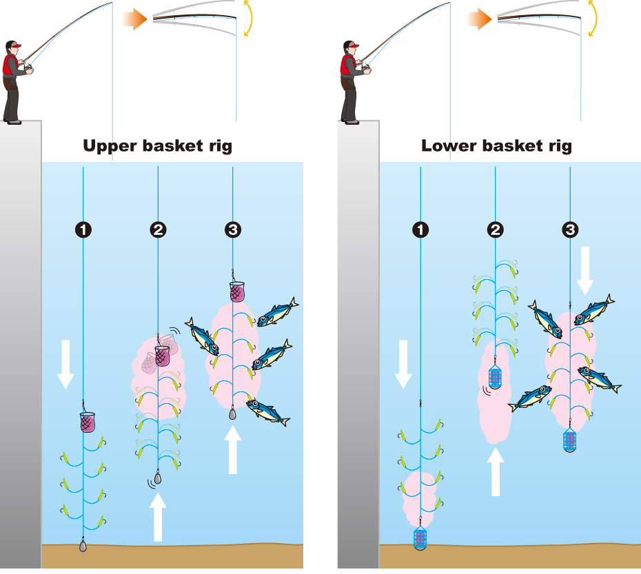

早上做瑜伽，又看到角落里靠着的鱼竿。

那还是2年多前买的。

那时经常玩的一个日本男生A问要不要去钓鱼。我一来对这个男生很有好感，二来从来没有钓过鱼很想体验一下，自然立刻答应。我天真的以为是白天出发傍晚回来，结果人是晚上出发早晨到海边，一直到第二天晚上才返程。超长行程也就罢了，上了车才知道人还叫了他的另外两个朋友——好吧，为什么不能一开始就告诉我呢？

到了海边，他自顾自地支好鱼竿甩出去开始钓鱼。另一个男生B也有钓鱼经验，他俩就闷头钓。最后一个男生C跟我一样完全是新手，但这个男生跟他们很熟了，多年同学加好友，很自然地靠过去问鱼竿怎么弄，怎么甩出去。A立刻放下他手里的鱼竿很耐心地教他，全然没有理会我也是他带来的新手，也需要他教。

当时那个对比真的太强烈，我的问题，他就回答得很潦草含糊，态度冷漠，而对男生C他就非常细致耐心，笑着手把手教。我感觉自己被无视和差别对待了，很生气。对他说：你难道不教一教我怎么钓吗！

这个反问让他有点不好意思了，才开始从头教我。男生B也来打趣圆场。

那段时间他们钓鱼热情高涨，说是钓鱼，其实是钓鱿鱼。秋天是钓鱿鱼的好季节。但当时已经是12月底1月份，太冷了鱿鱼们都缩到深海里去了，很难钓到。但这人还是不顾一切地要钓。

我跟着一时冲动买了这套鱼竿和鱼饵之类配套的东西，花了也蛮不少钱。

但实在是时机不对，很难钓到鱿鱼。我自己在网上查新手钓鱼入门之类的教程，开始试着用sabiki的方法钓近岸的鱼。

sabiki是日语里的叫法，我没查中文。就是鱼线上有好多鱼钩，最下面挂个带重锤的鱼饵兜（鱼饵兜也可以挂上方），上下晃动鱼竿，鱼饵会化开一片呈雾状诱引鱼群来吃，鱼误咬中鱼钩就钓到了，成功率很高。

放张网上的示意图

 
用这个方法钓鱼真的立竿见影，很难失败。我还记得鱼上钩时鱼竿忽然变得沉甸甸，在手里扑棱扑棱晃动时带来的那种巨大的喜悦、刺激和满足。那种感觉真的非常令人兴奋，也立刻理解了为什么那么多人沉迷于此。

然而这个方法很看运气，天时地利，像我们这群门外汉，既不了解海洋也不了解鱼群，连鱼都认不得几种。钓到什么就全看运气了。

我记得那次我钓到很多小小的鱼，掌心那么长，大概有十条吧。我问旁边一看就钓鱼经验丰富的大叔这是什么鱼有没有毒，大叔说了个名字我没记住，但他说可以吃就是刺比较多。

第一次钓到鱼自然非常激动，我也没多想就把鱼都放进男生A的鱼箱里——只有他有。回程前，他还专门把鱼都重新洗了一遍。后来他问我鱼怎么办，我的重心是体验钓鱼的快乐，对鱼并不在乎，就问他能不能收下——他家人多，还有猫——他答应了。

又过了一阵，再次见面，他装作不经意地把话题拐到鱼上，说有些人，不懂就不要瞎添乱嘛，净做多余的事情给人添麻烦，像是那种小小的鱼，给猫吃都嫌处理起来太麻烦的，钓到了就直接丢回海里面嘛。

我愕然。心里顿时涌起一股巨大的负罪感。我给他添了太大的麻烦，太对不起他了，想来是他爸妈这样说了他吧，他在家得有多大的压力啊。那股愧疚感萦绕在我心头很久很久。

但是现在我不这么想了。他当时明明可以当场直接告诉我，并且有很多次机会拒绝把鱼带回家，事后却来埋怨我。即便当时他也不知道这种鱼通常应该放回海里，那之后也可以选择用不伤害人的方式来告诉我，偏偏他选择了把责备全都推到我身上。

因为我是女？因为我是外国人？不重要了。这个男生并不尊重我，在他的眼里我只是个挂件，并不是跟他同等的人，一切都是看他的心情来。回头看，其实之前已经有很多红灯了。既然这人看不见我的存在，无视我的感受。我也没有必要为他花费力气。远离看不到自己的人，这些人只会消耗自己而已。

写着忽然又想起另一桩膈应我很久的事：他曾屡次三番地暗示，不要发很长的消息，因为很难读，凭空增加人的压力，没人想看长文。那么改成短消息分多次发呢？他会说，怎么发这么多条消息啊，看到那个红色的消息数字提醒会给人很大的压力好不好，你能不能节制一点，不要总来打扰人？——这让我惴惴地至今还有心理负担：怕自己说话太多太烦人，怕自己说话不到位让人误解百口莫辩etc，总之说与不说，我都很纠结及惶恐不安。

现在我当然明白了，不是我做错了什么，单纯是这人不喜欢我，以及这人太幼稚，并不是精神成熟的人。不论我做什么，他都能找到理由来指责。想想真是好笑，明明不在乎我，却又经常来约我玩，还口口声声说我是他的好朋友，太虚伪了。

至于这套鱼竿，我想我还是会继续留着，除了本身的价值，也还因为它是另一位内行友人帮忙挑的。也许将来的某一天，我会带着它开始一段新的令人激动的旅程。那时，它会承载新的旅程的记忆。