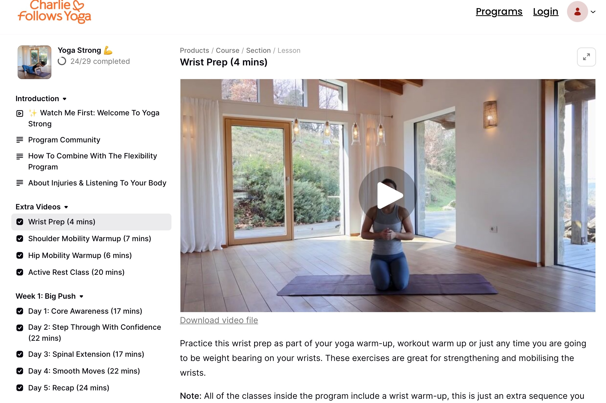
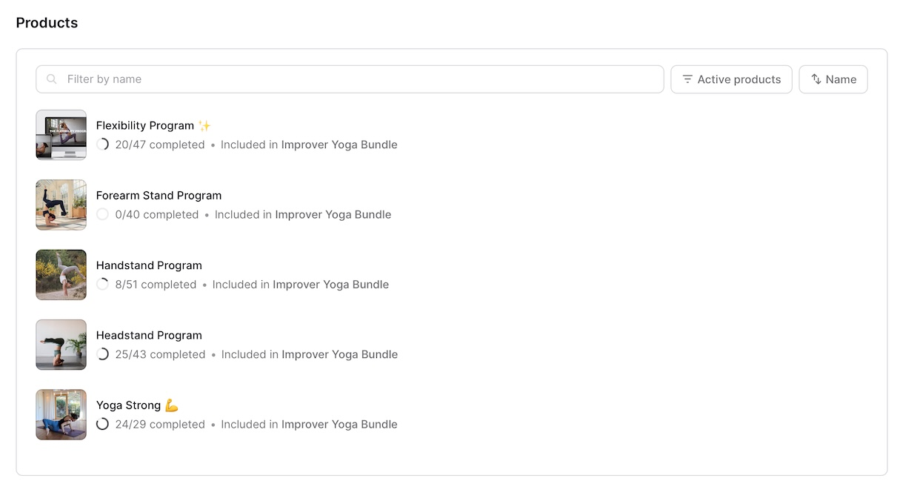

之前写了[瑜伽六个月]()，现在一转眼已经一年零两个月了！（至少）

说说这后半年的情况。

5月和6月也还是每天跟着YouTube视频来做，但渐渐感觉有些不够，重复练习过的视频很多，想试试新的不同的练习，同时自己也感觉像是进了停滞期，或者平台期——总之已经习惯了这个强度，练完身体没有什么感觉。刚好Charlie7月份有优惠，付费课程打折。纠结了好几下，因为以前买的各种网课都没学下来，感觉钱白花了，更糟糕的是助长自我否定情绪，担心这个也会是同样的结果。

但是又一想，不试试永远不知道会怎样，而且她提供30天免费退款，还能分两次付款，于是优惠的最后一天，176英镑，咬牙下单了。

结果就是：买对了，真香！

我开始很怕是那种每周一次每次一小时起+定时上课的模式（要我坚持定时定量做某件事，完全不可能的）。进入页面之后发现是不同的课程，预录好的视频，自己按照自己的节奏和时间自由选择想要练习的视频，简单说就是付费版的YouTube频道。我的担心一下子全消失了。

于是先从strong yoga跟起，20天下来，明显感觉自己的身体比以前有力量许多，以前做不到的姿势也能做到了，之前能做到的姿势更stable了——明显地感觉到自己在learning，身体在变好，特别开心。那种结束后浑身微微出汗的感觉特别好。有时练完腿，第二天会屁股或两腿酸痛——谁说瑜伽只练柔韧，照样练力量！

  

记得有天早晨照镜子，发现身体线条居然变好看了！

不仅变紧实匀称了还可以看到肌肉。以前我的腿肉嘟嘟的就是个浑圆的柱体，现在居然变得立体了些，虽然还是肉嘟嘟的，但可以看到一些阴影和线条！甚至还能看到一点点腹肌的线条——我很满意！感觉四肢充满了力量，身体有了力量感，就会打心底里自信起来。即使现在事实上比去年重了近10公斤，但毫无疑问我更喜欢自己现在的身体。以前不喜欢照镜子，因为觉得自己不好看。现在每天早晨起来到镜子前面撩起衣服看自己肚子上隐约可见的线条，心里可美了。

现在strong 和 flexible都跟完了两轮，考虑到腰椎，headstand以及更难的handstand暂时不打算强跟，先继续增加身体的力量，尤其是核心和背肌的力量比较重要。做瑜伽是为了与自己相处，关照自己，不是跟人比赛，不需要push自己，而且也不是push就能做到。所以也不着急练。现在每天早上YouTube视频+strongyoga，或strongyoga+flexible 各一个，看心情搭配着在做——还是那句话，关照自己的感受。

外科医生也有教我怎么增强腹肌和背肌——为了保护脊椎——但更像是健身房项目，A动作每天30次起，B动作每天30次起，目标每天100次。

我真的做不到，真的，太枯燥了，每天固定做重复的动作。即便我知道这是需要的，对自己有益，但依然做不到，太无聊了。这是我的ADHD特性决定的。我不需要违背自己的天性让自己不痛快，找到适合自己的方式就行，哪怕乍看是绕远也无妨。

总的说来，现在每天早上做瑜伽对我像是喝水吃早饭一样不可缺少的事了，像是呼吸，像是空气一样，就那么自然而理所应当地存在。

**感谢瑜伽，感谢Charlie。**

PS：教授夸我的早晨好健康，开心❤️

补记：付费的课相当于”专项练习“，重点突破。她的YouTube也有很多不同侧重点的视频，并且也有免费的30天跟练合集，也非常推荐！！祝大家都健康。

